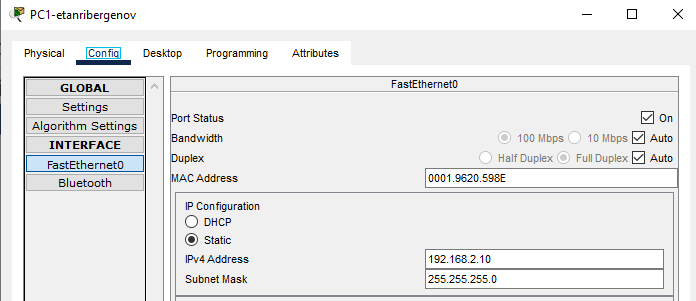
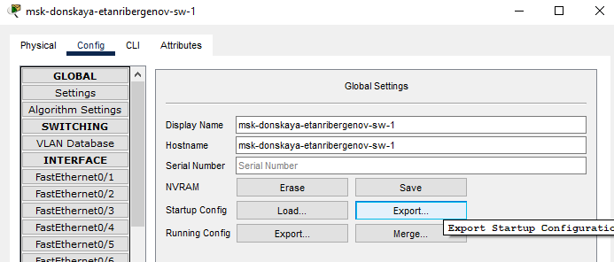

---
## Front matter
title: "Отчёт по лабораторной работе №2"
subtitle: "Дисциплина: Администрирование локальных сетей"
author: "Выполнил: Танрибергенов Эльдар"

## Generic options
lang: ru-RU
toc-title: "Содержание"

## Bibliography
bibliography: ../bib/cite.bib
csl: ../pandoc/csl/gost-r-7-0-5-2008-numeric.csl

## Pdf output format
toc: true # Table of contents
toc-depth: 2
lof: true # List of figures
lot: true # List of tables
fontsize: 12pt
linestretch: 1.5
papersize: a4
documentclass: scrreprt
## I18n polyglossia
polyglossia-lang:
  name: russian
  options:
	- spelling=modern
	- babelshorthands=true
polyglossia-otherlangs:
  name: english
## I18n babel
babel-lang: russian
babel-otherlangs: english
## Fonts
mainfont: PT Serif
romanfont: PT Serif
sansfont: PT Sans
monofont: PT Mono
mainfontoptions: Ligatures=TeX
romanfontoptions: Ligatures=TeX
sansfontoptions: Ligatures=TeX,Scale=MatchLowercase
monofontoptions: Scale=MatchLowercase,Scale=0.9
## Biblatex
biblatex: true
biblio-style: "gost-numeric"
biblatexoptions:
  - parentracker=true
  - backend=biber
  - hyperref=auto
  - language=auto
  - autolang=other*
  - citestyle=gost-numeric
## Pandoc-crossref LaTeX customization
figureTitle: "Рис."
tableTitle: "Таблица"
listingTitle: "Листинг"
lofTitle: "Список иллюстраций"
lotTitle: "Список таблиц"
lolTitle: "Листинги"
## Misc options
indent: true
header-includes:
  - \usepackage{indentfirst}
  - \usepackage{float} # keep figures where there are in the text
  - \floatplacement{figure}{H} # keep figures where there are in the text
---

# Цель работы

Получить основные навыки по начальному конфигурированию оборудования Cisco.

# Задание

1. Сделать предварительную настройку маршрутизатора:
– задать имя в виде «город-территория-учётная_запись-тип_оборудования-номер»
– задать интерфейсу Fast Ethernet с номером 0 ip-адрес 192.168.1.254 и маску 255.255.255.0, затем поднять интерфейс;
– задать пароль для доступа к привилегированному режиму (сначала в открытом виде, затем — в зашифрованном);
– настроить доступ к оборудованию сначала через telnet, затем — через ssh (используя в качестве имени домена donskaya.rudn.edu);
– сохранить и экспортировать конфигурацию в отдельный файл.

2. Сделать предварительную настройку коммутатора:
– задать имя в виде «город-территория-учётная_запись-тип_оборудования-номер»;
– задать интерфейсу vlan 2 ip-адрес 192.168.2.1 и маску 255.255.255.0, затем поднять интерфейс;
– привязать интерфейс Fast Ethernet с номером 1 к vlan 2;
– задать в качестве адреса шлюза по умолчанию адрес 192.168.2.254;
– задать пароль для доступа к привилегированному режиму (сначала в открытом виде, затем — в зашифрованном);
– настроить доступ к оборудованию сначала через telnet, затем — через ssh (используя в качестве имени домена donskaya.rudn.edu);
– для пользователя admin задать доступ 1-го уровня по паролю;
– сохранить и экспортировать конфигурацию в отдельный файл.

# Выполнение лабораторной работы

1. В логической рабочей области Packet Tracer разместил коммутатор, маршрутизатор и 2 оконечных устройства типа PC, соединил один PC с маршрутизатором, 
другой PC — с коммутатором. Соединил устройства двумя кабелями.

{#fig:001}

2. Проведите настройку маршрутизатора в соответствии с заданием, ориентируясь на приведённую часть конфигурации маршрутизатора

- Перешёл в привилегированный режим (*enable*), далее - в режим глобального конфигурирования (*configure terminal*)

{#fig:002}

- Изменил имя хоста в соответствии с соглашением об именовании

{#fig:003}

- Перешёл к конфигурированию интерфейса FastEthernet 0/0, активировал его (*no shutdown*) и задал IP-адрес с маской

{#fig:004}

- Перешёл к конфигурированию виртуальных терминалов (*vty 0 4*), задал пароль и запрос на ввод пароля (*login*)

{#fig:005}

- Перешёл к конфигурированию консольного подключения, задал пароль и запрос на ввод пароля (*login*)

{#fig:006}

- Задал пароль (команда *secret*) на переход в привилегированный режим

{#fig:007}

- Подключил шифрование паролей

{#fig:008}

- Добавил пользователя admin с уровнем привилегии 1 и паролем (*secret*) - cisco

{#fig:009}

- Установил доменное имя donskaya.rudn.edu

{#fig:010}

- Сгенерировал rsa крипто-ключ для подключения по SSH

{#fig:011}

- В конфигурации виртуальных терминалов задал транспорт приёма (протокол входящего подключения) - SSH

{#fig:012}

3. Проведите настройку коммутатора в соответствии с заданием, ориентируясь на приведённую часть конфигурации коммутатора

- Перешёл в привилегированный режим (*enable*), далее - в режим глобального конфигурирования (*configure terminal*)

{#fig:013}

- Изменил имя хоста в соответствии с соглашением об именовании

{#fig:014}

- Перешёл к конфигурированию интерфейса vlan2, активировал его (*no shutdown*) и задал IP-адрес с маской

{#fig:015}

- Перешёл к конфигурированию интерфейса FastEthernet 0/1, сделал порты нетегированными (access)

{#fig:016}

- Задал IP-адрес шлюзу по умолчанию

{#fig:017}

- Перешёл к конфигурированию виртуальных терминалов (*vty 0 4*), задал пароль и запрос на ввод пароля (*login*)

{#fig:018}

- Перешёл к конфигурированию консольного подключения, задал пароль и запрос на ввод пароля (*login*)

{#fig:019}

- Задал пароль (команда *secret*) на переход в привилегированный режим

{#fig:020}

- Подключил шифрование паролей

{#fig:021}

- Добавил пользователя admin с уровнем привилегии 1 и паролем (*secret*) - cisco

{#fig:022}

- Установил доменное имя donskaya.rudn.edu

{#fig:023}

- Сгенерировал rsa крипто-ключ для подключения по SSH

{#fig:024}

- В конфигурации виртуальных терминалов задал транспорт приёма (протокол входящего подключения) - SSH

{#fig:025}

4. Проверьте работоспособность соединений с помощью команды ping.

Для этого задал ПК статические IP-адреса с маской /24

{#fig:026}

{#fig:027}

Проверка работоспособности соединения ПК0 и маршрутизатора командой *ping* - успешно

{#fig:028}

Проверка работоспособности соединения ПК1 и коммутатора командой *ping* - успешно

{#fig:029}

5. Попробуйте подключиться к коммутатору и маршрутизатору разными способами: с помощью консольного кабеля, по протоколу удалённого доступа (telnet, ssh).

**Маршрутизатор**

a) Попытка подключения к маршрутизатору по консольному кабелю. Был запрошен пароль и подключение успешно.

{#fig:030}

b) Попытка подключения к маршрутизатору по протоколу удалённого доступа ssh. Подключение успешно после ввода пароля.

{#fig:031}

c) Попытка подключения к маршрутизатору по протоколу удалённого доступа telnet. 

{#fig:032}

Подключиться не удалось, потому что транспортом входящего подключения на маршрутизаторе был установлен протокол ssh.

**Коммутатор**

a) Попытка подключения к коммутатору по консольному кабелю. Был запрошен пароль и подключение успешно.

{#fig:033}

b) Попытка подключения к коммутатору по протоколу удалённого доступа ssh. Подключение успешно после ввода пароля.

{#fig:034}

c) Попытка подключения к коммутатору по протоколу удалённого доступа telnet.

{#fig:035}

Подключиться не удалось, потому что транспортом входящего подключения на коммутаторе был установлен протокол ssh.

6. Экспорт конфигураций в отдельные файлы

Маршрутизатор:

{#fig:036}

Коммутатор:

{#fig:037}

# Ответы на контрольные вопросы

1. Консольный кабель, протоколы удалённого доступа (telnet,ssh).

2. Оконечное оборудование пользователя к маршрутизатору следует подключать с помощью перекрёстного (кроссового) кабеля, если я верно понял, то из-за того, что маршрутизатор и оконечные устройства однотипны, а этим кабелем соединяются именно однотипные устройства.

3. Прямым медным проводом, потому что он предназначен для соединения устройств, работающих на разных уровнях модели OSI.

4. Коммутатор к коммутатору подключается перекрёстным кабелем (сross-over), ибо работают на одном уровне модели OSI.

5. Терминальное подключение с рабочей станции через консольный кабель, telnet/ssh.

6. Telnet, SSH, Remote Shell (rsh). SSH, ибо SSH обеспечивает шифрование и аутентификацию по умолчанию.

# Выводы

Я получил основные навыки по начальному конфигурированию оборудования Cisco.

