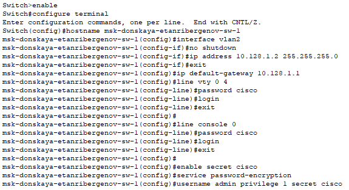
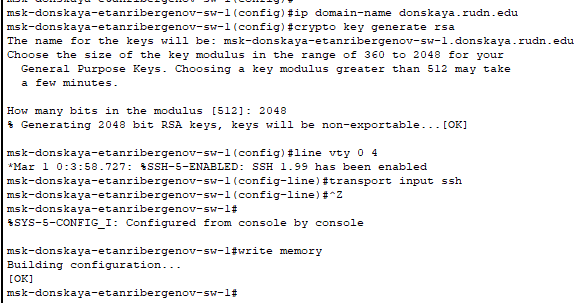
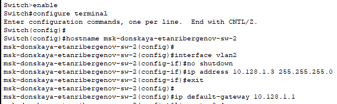
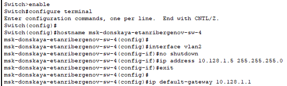

---
## Front matter
lang: ru-RU
title: "Лабораторная работа №4"
subtitle: "Первоначальное конфигурирование сети"
author:
  - "Танрибергенов Эльдар"
institute:
  - "Российский университет дружбы народов, Москва, Россия"
date: 2024 г.

## i18n babel
babel-lang: russian
babel-otherlangs: english

## Formatting pdf
toc: false
toc-title: Содержание
slide_level: 2
aspectratio: 169
section-titles: true
theme: metropolis
header-includes:
 - \metroset{progressbar=frametitle,sectionpage=progressbar,numbering=fraction}
 - '\makeatletter'
 - '\beamer@ignorenonframefalse'
 - '\makeatother'
---

# Цели и задачи

## Цель лабораторной работы

Провести подготовительную работу по первоначальной настройке коммутаторов сети.

## Задачи

1. Cделать первоначальную настройку коммутаторов сети, представленной на схеме L1 из предыдущей ЛР. Под первоначальной настройкой понимается указание имени устройства, его IP-адреса, настройка
доступа по паролю к виртуальным терминалам и консоли, настройка удалённого доступа к устройству по ssh.

# Выполнение работы

## Размещение и соединение устройств

Использовано оборудование: 

- 4 коммутатора Cisco 2950T
- 1 коммутатор Cisco 2960
- 6 оконечных устройств типа ПК
- 3 оконечных устройства типа Сервер

## Размещение и соединение устройств

{#fig:001}

## Настройка коммутаторов на территории "Москва, Донская"

Коммутатор 1

{#fig:002 width=80% height=80%}

## Настройка коммутаторов на территории "Москва, Донская"

Коммутатор 1

{#fig:003 width=80% height=80%}

## Настройка коммутаторов на территории "Москва, Донская"

Коммутатор 2

{#fig:004 width=80% height=80%}

## Настройка коммутаторов на территории "Москва, Донская"

Коммутатор 3

{#fig:005 width=80% height=80%}

## Настройка коммутаторов на территории "Москва, Донская"

Коммутатор 4

{#fig:006 width=80% height=80%}

## Настройка коммутаторов на территории "Москва, Павловская"

Коммутатор 1

{#fig:007 width=80% height=80%}

# Результаты

## Результат

- Коммутаторы сконфигурированы и готовы к дальнейшей работе

# Вывод

## Вывод

Я провёл подготовительную работу по первоначальной настройке коммутаторов сети.