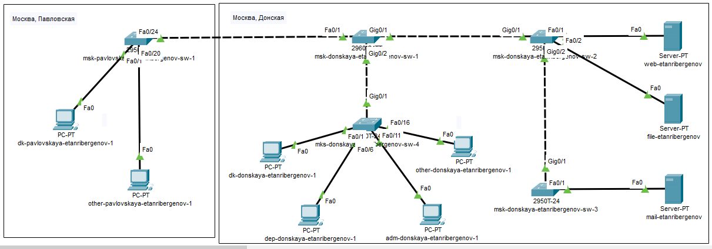
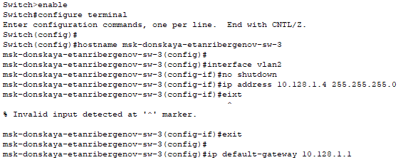
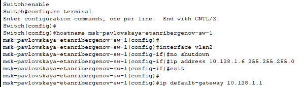

---
## Front matter
title: "Отчёт по лабораторной работе №4"
subtitle: "Дисциплина: Администрирование локальных сетей"
author: "Выполнил: Танрибергенов Эльдар"

## Generic options
lang: ru-RU
toc-title: "Содержание"

## Bibliography
bibliography: ../bib/cite.bib
csl: ../pandoc/csl/gost-r-7-0-5-2008-numeric.csl

## Pdf output format
toc: true # Table of contents
toc-depth: 2
lof: true # List of figures
lot: true # List of tables
fontsize: 12pt
linestretch: 1.5
papersize: a4
documentclass: scrreprt
## I18n polyglossia
polyglossia-lang:
  name: russian
  options:
	- spelling=modern
	- babelshorthands=true
polyglossia-otherlangs:
  name: english
## I18n babel
babel-lang: russian
babel-otherlangs: english
## Fonts
mainfont: PT Serif
romanfont: PT Serif
sansfont: PT Sans
monofont: PT Mono
mainfontoptions: Ligatures=TeX
romanfontoptions: Ligatures=TeX
sansfontoptions: Ligatures=TeX,Scale=MatchLowercase
monofontoptions: Scale=MatchLowercase,Scale=0.9
## Biblatex
biblatex: true
biblio-style: "gost-numeric"
biblatexoptions:
  - parentracker=true
  - backend=biber
  - hyperref=auto
  - language=auto
  - autolang=other*
  - citestyle=gost-numeric
## Pandoc-crossref LaTeX customization
figureTitle: "Рис."
tableTitle: "Таблица"
listingTitle: "Листинг"
lofTitle: "Список иллюстраций"
lotTitle: "Список таблиц"
lolTitle: "Листинги"
## Misc options
indent: true
header-includes:
  - \usepackage{indentfirst}
  - \usepackage{float} # keep figures where there are in the text
  - \floatplacement{figure}{H} # keep figures where there are in the text
---

# Цель работы

Провести подготовительную работу по первоначальной настройке коммутаторов сети.

# Задание

Требуется сделать первоначальную настройку коммутаторов сети, представленной на схеме L1 из предыдущей ЛР. Под первоначальной настройкой понимается указание имени устройства, его IP-адреса, настройка
доступа по паролю к виртуальным терминалам и консоли, настройка удалённого доступа к устройству по ssh.

# Выполнение лабораторной работы

1. В логической рабочей области Packet Tracer разместил коммутаторы и оконечные устройства согласно схеме сети L1 (из предыдущей ЛР) и соединил их через соответствующие интерфейсы.

{#fig:001}

2. Используя типовую конфигурацию коммутатора, настроил все коммутаторы, изменяя название устройства и его IP-адрес согласно плану IP.

### На территории "Москва, Донская":

{#fig:002}

{#fig:003}

Далее на снимках только изменённые части конфигурации

{#fig:004}

{#fig:005}

{#fig:006}

### На территории "Москва, Павловская"

{#fig:007}

# Ответы на контрольные вопросы

1. show running-config — показывает текущую конфигурацию устройства; show startup-config — показывает стартовую конфигурацию устройства; show version — показывает модель устройства, версию Cisco IOS, серийный номер и другую информацию об устройстве; 
show ip interface brief — показывает статус интерфейсов коммутатора или маршрутизатора; show ip route — показывает таблицу маршрутизации; show cdp neighbors — показывает соседей по протоколу CDP;
show inventory — показывает сведения о «железе», установленном в устройстве, дополнительных платах, модулях, SFP-транссиверах; show mac address-table — показывает MAC-таблицу устройства;
show processes cpu sorted — показывает загрузку CPU на устройстве.

2. При помощи команды show startup-config можно посмотреть стартовый конфигурационный файл оборудования.

3. При помощи команды show running-config выводим данные о конфигурации и копируем вывод в новый файл .txt или .cfg. Также есть кнопка "Export" в графическом интерфейсе настроек устройства.

4. В графическом интерфейсе настройки устройства есть кнопка "Load". С её помощью можно импортировать конфигурацию из файла.

# Выводы

Я провёл подготовительную работу по первоначальной настройке коммутаторов сети.

