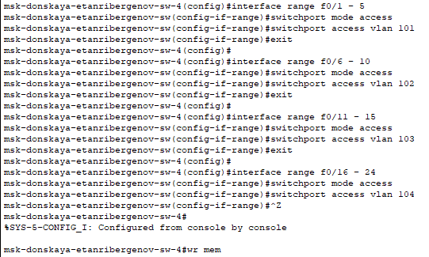

---
## Front matter
lang: ru-RU
title: "Лабораторная работа №5"
subtitle: "Конфигурирование VLAN"
author:
  - "Танрибергенов Эльдар"
institute:
  - "Российский университет дружбы народов, Москва, Россия"
date: 2024 г.

## i18n babel
babel-lang: russian
babel-otherlangs: english

## Formatting pdf
toc: false
toc-title: Содержание
slide_level: 2
aspectratio: 169
section-titles: true
theme: metropolis
header-includes:
 - \metroset{progressbar=frametitle,sectionpage=progressbar,numbering=fraction}
 - '\makeatletter'
 - '\beamer@ignorenonframefalse'
 - '\makeatother'
---

# Цели и задачи

## Цель лабораторной работы

Получить основные навыки по настройке VLAN на коммутаторах сети.

## Задачи

1. На коммутаторах сети настроить Trunk-порты на соответствующих интерфейсах, связывающих коммутаторы между собой.
2. Коммутатор msk-donskaya-etanribergenov-sw-1 настроить как VTP-сервер и прописать на нём номера и названия VLAN.
3. Остальные коммутаторы настроить как VTP-клиенты, на интерфейсах указать принадлежность к соответствующему VLAN.
4. На серверах прописать IP-адреса.
5. На оконечных устройствах указать соответствующий адрес шлюза и прописать статические IP-адреса из диапазона соответствующей сети, следуя регламенту выделения ip-адресов из предыдущих ЛР.
6. Проверить доступность устройств, принадлежащих одному VLAN, и недоступность устройств, принадлежащих разным VLAN.

# Выполнение работы

# Настройка режима работы интерфейсов, связывающих коммутаторы между собой

## Примечание

- Режим работы интерфейса переключается командой *switchport mode \<режим\>*

## Настройка коммутаторов на территории "Москва, Донская"

{#fig:001 width=70% height=70%}

## Настройка коммутаторов на территории "Москва, Донская"

{#fig:002}

## Настройка коммутаторов на территории "Москва, Донская"

{#fig:003}

## Настройка коммутаторов на территории "Москва, Донская"

{#fig:004}

## Настройка коммутаторов на территории "Москва, Павловская"

{#fig:005}

# Настройка VTP-сервера и клиентов 

## Примечание

- Создаётся VTP-сервер/клиент последовательностью команд:

- vtp mode \<server/client\> //переводит режим работы устройства в VTP-сервер/клиент (по умолчанию - сервер)
- vtp domain \<домен\> //указание домена (задав домен серверу, клиенты автоматически устанавливают этот домен себе)
- vtp password \<пароль\> // задание пароля

## Коммутатор msk-donskaya-etanribergenov-sw-1 - VTP-сервер

{#fig:006}

## Коммутатор msk-donskaya-etanribergenov-sw-1 - VTP-сервер

- Прописал VLAN-ы на VTP-сервере

{#fig:007  width=70% height=70%}

## Перевод других коммутаторов на территории "Москва, Донская" в режим VTP-клиента

{#fig:008}

## Перевод коммутаторов на территории "Москва, Донская" в режим VTP-клиента

{#fig:009}

## Перевод коммутаторов на территории "Москва, Донская" в режим VTP-клиента

{#fig:010}

## Перевод коммутатора на территории "Москва, Павловская" в режим VTP-клиента

{#fig:011}

# Указание принадлежности соответствующим VLAN интерфейсов коммутаторов

## Примечание

- Для настройки нескольких интерфейсов сразу пользуется команда *interface \<f/g\>0\<начало диапазона\> - \<конец диапазона\>*
- Перевод интерфейса в режим "Нетэгированный" (Access) осуществляется командой *switchport mode access*
- Принадлежность интерфейса определённому VLAN задаётся командой *switchport access vlan \<номер VLAN\>*

## Настройка коммутаторов на территории "Москва, Донская"

{#fig:012}

## Настройка коммутаторов на территории "Москва, Донская"

{#fig:013}

## Настройка коммутаторов на территории "Москва, Донская"

{#fig:014  width=70% height=70%}

## Настройка коммутатора на территории "Москва, Павловская"

{#fig:015}

# Настройка оконечных устройств типа "Сервер"

## Настройка сервера Web

{#fig:016}

## Настройка сервера Web

{#fig:017}

# Настройка оконечных устройств типа "ПК"

## Настройка устройств типа "ПК" на территории "Москва, Павловская"

{#fig:022}

## Настройка устройств типа "ПК" на территории "Москва, Павловская"

{#fig:023}

## Настройка устройств типа "ПК" на территории "Москва, Донская"

{#fig:024  width=85% height=85%}

## Настройка устройств типа "ПК" на территории "Москва, Донская"

{#fig:025}

# Результаты

## Проверка доступности устройств из одного VLAN

- Доступность устройства проверена командой *ping*

{#fig:026 width=70% height=70%}

## Проверка доступности устройств из разных VLAN

{#fig:027 width=70% height=70%}

## Результат

- Настроены интерфейсы, соединяющие коммутаторы между собой
- Настроены интерфейсы, соединяющие коммутаторы с оконечными устройствами
- Настроены VTP-сервер и VTP-клиенты
- VLAN созданы и распределены по интерфейсам коммутаторов
- Настроены оконечные устройства для соединения
- Проверена доступность устройств из одного VLAN и недоступность устройств разных VLAN.

# Вывод

## Вывод

Я получил основные навыки по настройке VLAN на коммутаторах сети.