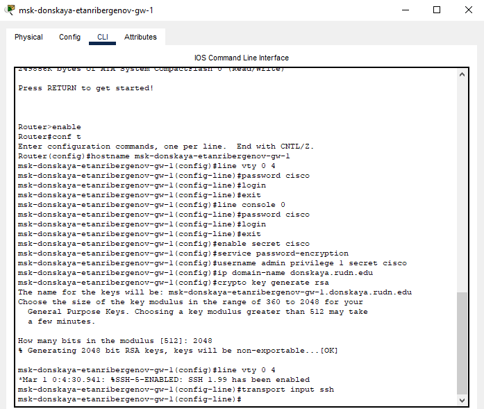
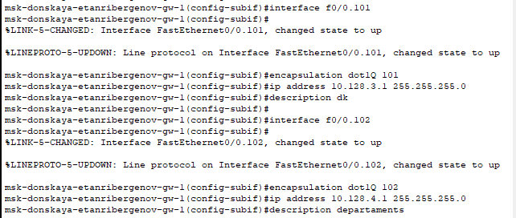
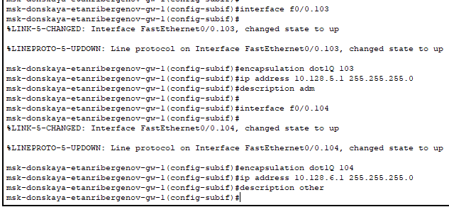
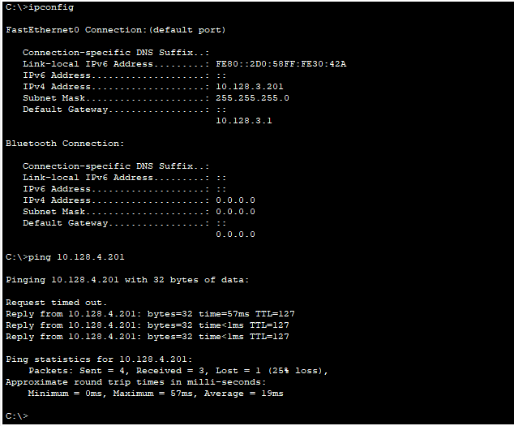
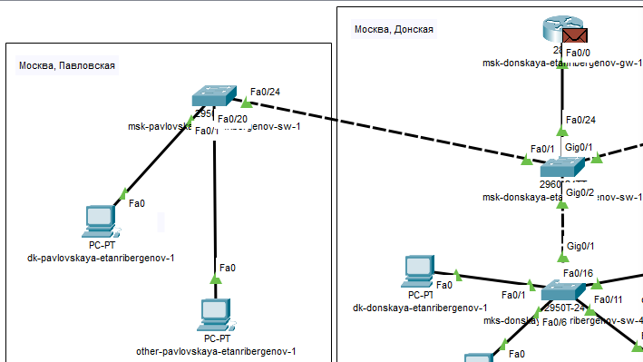
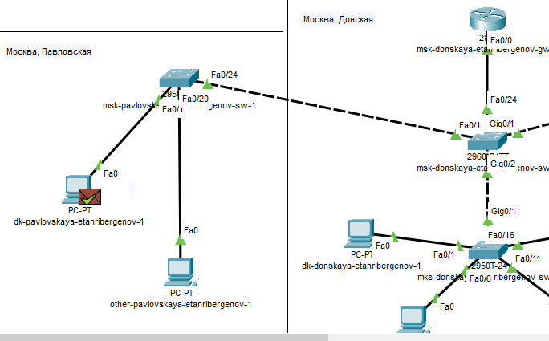
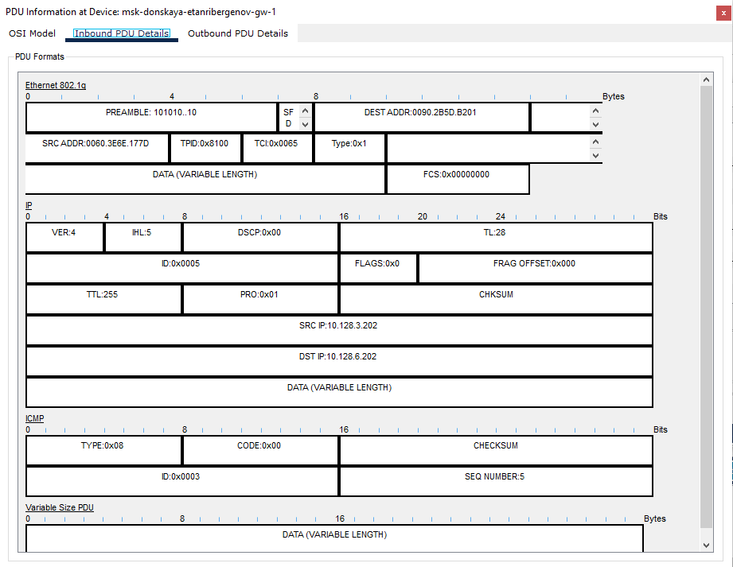

---
## Front matter
title: "Отчёт по лабораторной работе №6"
subtitle: "Дисциплина: Администрирование локальных сетей"
author: "Выполнил: Танрибергенов Эльдар"

## Generic options
lang: ru-RU
toc-title: "Содержание"

## Bibliography
bibliography: ../bib/cite.bib
csl: ../pandoc/csl/gost-r-7-0-5-2008-numeric.csl

## Pdf output format
toc: true # Table of contents
toc-depth: 2
lof: true # List of figures
lot: true # List of tables
fontsize: 12pt
linestretch: 1.5
papersize: a4
documentclass: scrreprt
## I18n polyglossia
polyglossia-lang:
  name: russian
  options:
	- spelling=modern
	- babelshorthands=true
polyglossia-otherlangs:
  name: english
## I18n babel
babel-lang: russian
babel-otherlangs: english
## Fonts
mainfont: PT Serif
romanfont: PT Serif
sansfont: PT Sans
monofont: PT Mono
mainfontoptions: Ligatures=TeX
romanfontoptions: Ligatures=TeX
sansfontoptions: Ligatures=TeX,Scale=MatchLowercase
monofontoptions: Scale=MatchLowercase,Scale=0.9
## Biblatex
biblatex: true
biblio-style: "gost-numeric"
biblatexoptions:
  - parentracker=true
  - backend=biber
  - hyperref=auto
  - language=auto
  - autolang=other*
  - citestyle=gost-numeric
## Pandoc-crossref LaTeX customization
figureTitle: "Рис."
tableTitle: "Таблица"
listingTitle: "Листинг"
lofTitle: "Список иллюстраций"
lotTitle: "Список таблиц"
lolTitle: "Листинги"
## Misc options
indent: true
header-includes:
  - \usepackage{indentfirst}
  - \usepackage{float} # keep figures where there are in the text
  - \floatplacement{figure}{H} # keep figures where there are in the text
---

# Цель работы

Настроить статическую маршрутизацию VLAN в сети.

# Задание

1. В логической области проекта разместить маршрутизатор Cisco 2811, подключить его к порту 24 коммутатора msk-donskaya-sw-1 в соответствии с таблицей портов.
2. Используя приведённую ниже последовательность команд по первоначальной настройке маршрутизатора, сконфигурируйте маршрутизатор, задав на
нём имя, пароль для доступа к консоли, настройте удалённое подключение к нему по ssh.
3. Настройте порт 24 коммутатора msk-donskaya-sw-1 как trunk-порт.
4. На интерфейсе f0/0 маршрутизатора msk-donskaya-gw-1 настройте виртуальные интерфейсы, соответствующие номерам VLAN. 
Согласно таблице IP-адресов задайте соответствующие IP-адреса на виртуальных интерфейсах. 
5. Проверьте доступность оконечных устройств из разных VLAN.
6. Используя режим симуляции в Packet Tracer, изучите процесс передвижения пакета ICMP по сети. Изучите содержимое передаваемого пакета и заголовки задействованных протоколов.

# Выполнение лабораторной работы

1. В логической области проекта разместил маршрутизатор Cisco 2811, подключил его к порту 24 коммутатора msk-donskaya-etanribergenov-sw-1 в соответствии с таблицей портов.

{#fig:001}

2. Сконфигурировал маршрутизатор, задав на нём имя, пароль для доступа к консоли, настроил удалённое подключение к нему по ssh.

{#fig:002}

3. Настроил порт 24 коммутатора msk-donskaya-etanribergenov-sw-1 как trunk-порт.

{#fig:003}

4. На интерфейсе f0/0 маршрутизатора msk-donskaya-etanribergenov-gw-1 настроил виртуальные интерфейсы, соответствующие номерам VLAN. 
Согласно таблице IP-адресов задал соответствующие IP-адреса на виртуальных интерфейсах. 

{#fig:004}

{#fig:005}

{#fig:006}

5. Проверил доступность оконечных устройств из разных VLAN при помощи команды *ping*.

{#fig:007}

В начале пинг не проходит, потому что коммутаторы получают информацию и пополняют таблицу MAC-адресов, а затем устройство пингуется.

6. Используя режим симуляции в Packet Tracer, изучил процесс передвижения пакета ICMP по сети.

{#fig:008}

{#fig:009}

Изучил содержимое передаваемого пакета и заголовки задействованных протоколов.

{#fig:010}

В заголовке Ethernet есть тег, идентифицирующий VLAN.

# Ответы на контрольные вопросы

1. IEEE 802.1Q - открытый стандарт, который описывает процедуру тегирования трафика для передачи информации о принадлежности к VLAN по сетям стандарта IEEE 802.3 Ethernet.
Так как 802.1Q не изменяет заголовки кадра (фрейма), то сетевые устройства, которые не поддерживают этот стандарт, могут передавать трафик без учёта его принадлежности к VLAN. Поскольку данный стандарт является открытым, он используется для построения «транковых» портов между оборудованием различных производителей.
802.1Q помещает внутрь фрейма тег, который передает информацию о принадлежности трафика к VLAN.

2. Формат кадра IEEE 802.1Q:  адрес назначения, адрес источника, тег (идентификаторы протокола тэга TPID, канонического формата CFI и VLAN VID; приоритет), тип протокола, данные, контрольная сумма.

# Выводы

Я получил навыки по настройке статической маршрутизации VLAN в сети.

