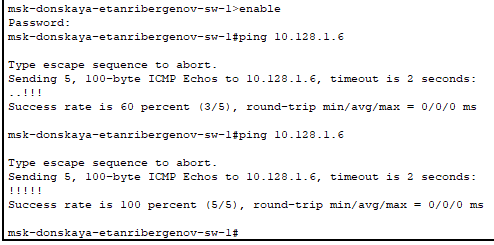
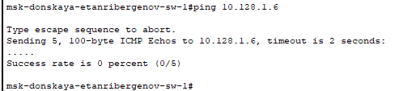
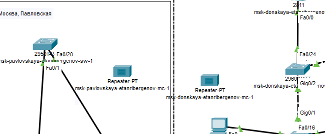
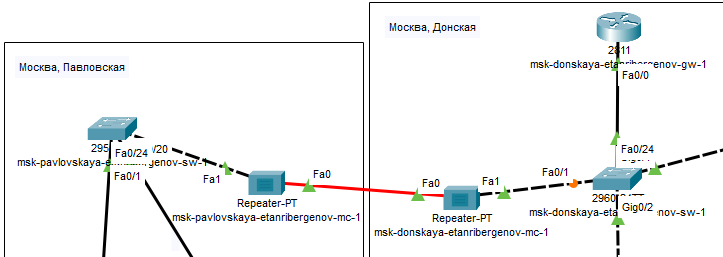
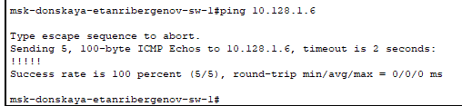

---
## Front matter
title: "Отчёт по лабораторной работе №7"
subtitle: "Дисциплина: Администрирование локальных сетей"
author: "Выполнил: Танрибергенов Эльдар"

## Generic options
lang: ru-RU
toc-title: "Содержание"

## Bibliography
bibliography: ../bib/cite.bib
csl: ../pandoc/csl/gost-r-7-0-5-2008-numeric.csl

## Pdf output format
toc: true # Table of contents
toc-depth: 2
lof: true # List of figures
lot: true # List of tables
fontsize: 12pt
linestretch: 1.5
papersize: a4
documentclass: scrreprt
## I18n polyglossia
polyglossia-lang:
  name: russian
  options:
	- spelling=modern
	- babelshorthands=true
polyglossia-otherlangs:
  name: english
## I18n babel
babel-lang: russian
babel-otherlangs: english
## Fonts
mainfont: PT Serif
romanfont: PT Serif
sansfont: PT Sans
monofont: PT Mono
mainfontoptions: Ligatures=TeX
romanfontoptions: Ligatures=TeX
sansfontoptions: Ligatures=TeX,Scale=MatchLowercase
monofontoptions: Scale=MatchLowercase,Scale=0.9
## Biblatex
biblatex: true
biblio-style: "gost-numeric"
biblatexoptions:
  - parentracker=true
  - backend=biber
  - hyperref=auto
  - language=auto
  - autolang=other*
  - citestyle=gost-numeric
## Pandoc-crossref LaTeX customization
figureTitle: "Рис."
tableTitle: "Таблица"
listingTitle: "Листинг"
lofTitle: "Список иллюстраций"
lotTitle: "Список таблиц"
lolTitle: "Листинги"
## Misc options
indent: true
header-includes:
  - \usepackage{indentfirst}
  - \usepackage{float} # keep figures where there are in the text
  - \floatplacement{figure}{H} # keep figures where there are in the text
---

# Цель работы

Получить навыки работы с физической рабочей областью Packet Tracer, а также учесть физические параметры сети.

# Задание

Требуется заменить соединение между коммутаторами двух территорий на соединение, учитывающее физические параметры сети, а именно - расстояние между двумя территориями.

# Выполнение лабораторной работы

1. Открыл проект предыдущей лабораторной работы

{#fig:001}

2. Перешёл в физическую рабочую область Packet Tracer. Присвоил название городу - Moscow.

{#fig:002}

3. Щёлкнув на изображении города, увидел изображение здания. Присвоил ему название Donskaya. Добавил здание для территории Pavlovskaya.

{#fig:003}

4. Щёлкнув на изображении здания Donskaya, переместил изображение, обозначающее серверное помещение, в него.

{#fig:004}

5. Щёлкнув на изображении серверной, увидел отображение серверных стоек.

{#fig:005}

6. Переместил коммутатор msk-pavlovskaya-etanribergenov-sw-1 и два оконечных устройства dk-pavlovskaya-etanribergenov-1 и other-pavlovskaya-etanribergenov-1 на территорию Pavlovskaya, используя меню Move физической рабочей области Packet Tracer.

{#fig:006}

{#fig:007}

{#fig:008}

7. Вернувшись в логическую рабочую область Packet Tracer, пропинговал с коммутатора msk-donskaya-etanribergenov-sw-1 коммутатор msk-pavlovskaya-etanribergenov-sw-1. Убедился в работоспособности соединения.

{#fig:009}

8. В меню *Options* -> *Preferences* во вкладке *Interface* активировал разрешение на учёт физических характеристик среды передачи (Enable Cable Length Effects).

{#fig:010}

9. В физической рабочей области Packet Tracer разместил две территории на расстоянии более 1000 м друг от друга.

{#fig:011}

10. Вернувшись в логическую рабочую область Packet Tracer, пропинговал с коммутатора msk-donskaya-etanribergenov-sw-1 коммутатор msk-pavlovskaya-etanribergenov-sw-1. Убедился в неработоспособности соединения.

{#fig:012}

11. Удалил соединение между коммутаторами. Добавил в логическую рабочую область два повторителя (Repeater-PT). Присвоил им соответствующие названия msk-donskaya-etanribergenov-mc-1 и msk-pavlovskaya-etanribergenov-mc-1. 

{#fig:013}

Заменил имеющиеся модули на PT-REPEATERNM-1FFE и PT-REPEATER-NM-1CFE для подключения оптоволокна и витой пары по технологии Fast Ethernet.

{#fig:014}

{#fig:015}

12. Переместил msk-pavlovskaya-etanribergenov-mc-1 на территорию Pavlovskaya (в физической рабочей области Packet Tracer).

{#fig:016}

13. Подключил коммутатор msk-donskaya-etanribergenov-sw-1 к msk-donskaya-etanribergenov-mc-1 по витой паре, msk-donskaya-etanribergenov-mc-1 и msk-pavlovskaya-etanribergenov-mc-1 - по оптоволокну, msk-pavlovskaya-etanribergenov-sw-1 к msk-pavlovskaya-etanribergenov-mc-1 - по витой паре.

{#fig:017}

14. Убедился в работоспособности соединения между msk-donskaya-etanribergenov-sw-1 и msk-pavlovskaya-etanribergenov-sw-1.

{#fig:018}

# Ответы на контрольные вопросы

1. Среды передачи данных: коаксиальный кабель, оптоволоконный кабель, витая пара (медный кабель), радиоволны, инфракрасное излучение.
При планировании сети нужно обратить внимание на: максимальную дальность передачи данных, стоимость, скорость передачи данных.

2. Категори витой пары: CAT1, CAT2, CAT3, CAT4, CAT5, CAT5e, CAT6, CAT6a, CAT7. Отличаются эффективным пропускаемым частотным диапазоном.

3. В одномодовом волокне отсутствует межмодовая дисперсия, то есть искажение сигнала во времени из-за разницы в скорости распространения мод.
Из-за влияния межмодовой дисперсии MM-волокно имеет ограничения по скорости и дальности распространения сигнала по сравнению с SM-волокном. Длину многомодовых линий связи ограничивает также большое по сравнению с одномодовым волокном затухание.
Одномодовое волокно требуется для передачи данных на расстояние 500 км и более.
Многомодовое - для меньших расстояний и экономии денег.

4. На оптических патч-кордах встречаются следующие типы разъёмов:

- LC коннектор (Lucent Connector) - один из наиболее распространённых. Компактный размер оптического LC разъема позволяет существенно повысить плотность портов на кроссе. Вместе с тем, из-за недостаточного пространства усложняется коммутация. При большой плотности портов коммутацию удобно выполнять только при помощи специализированного инструмента
- Коннектор SC (Subscriber Connector) - разработан для абонентских сетей доступа. К преимуществам оптического SC разъема можно отнести простоту коммутации. Для фиксации в розетке достаточно просто вставить его до щелчка. Аналогично производится и его извлечение. Вместе с тем, он плохо адаптирован к механическим и вибрационным нагрузкам.
- Коннектор FC (Ferrule Connector) - предназначен для важных соединений или контрольно-измерительного оборудования. Он имеет металлический корпус и фиксируется в розетке при помощи резьбового соединения. Последнее придает такому соединению механической прочности и вибрационной устойчивости. Но в удобстве коммутации он явно проигрывает. Оптические разъемы FC по умолчанию устанавливаются на все измерительные приборы для ВОЛС.

# Выводы

Я получил навыки работы с физической рабочей областью Packet Tracer, а также учёл физические параметры сети.

