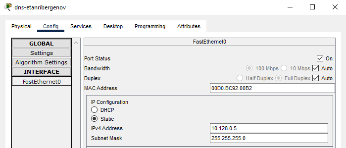
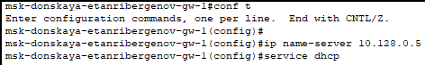
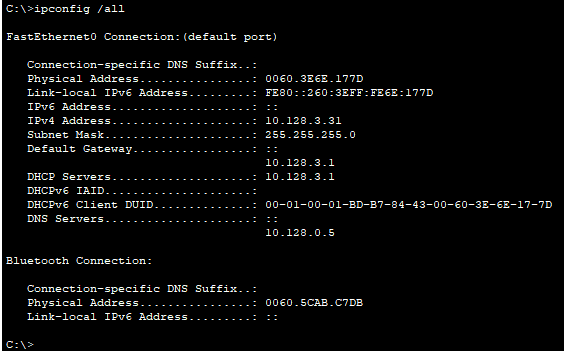
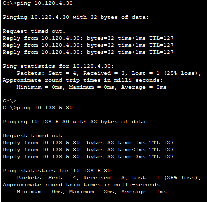

---
## Front matter
lang: ru-RU
title: "Лабораторная работа № 8"
subtitle: "Настройка сетевых сервисов. DHCP"
author:
  - "Танрибергенов Эльдар"
institute:
  - "Российский университет дружбы народов, Москва, Россия"
date: 2024 г.

## i18n babel
babel-lang: russian
babel-otherlangs: english

## Formatting pdf
toc: false
toc-title: Содержание
slide_level: 2
aspectratio: 169
section-titles: true
theme: metropolis
header-includes:
 - \metroset{progressbar=frametitle,sectionpage=progressbar,numbering=fraction}
 - '\makeatletter'
 - '\beamer@ignorenonframefalse'
 - '\makeatother'
---

# Цели и задачи

## Цель лабораторной работы

Приобретение практических навыков по настройке динамического распределения IP-адресов посредством протокола DHCP (Dynamic Host Configuration Protocol) в локальной сети.

## Задачи

1. Добавить DNS-записи для домена donskaya-etanribergenov.rudn.edu на сервер dns.
2. Настроить DHCP-сервис на маршрутизаторе.
3. Заменить в конфигурации оконечных устройствах статическое распределение адресов на динамическое.

# Выполнение работы

## Добавление в сеть сервера dns

Требуется:

- Разместить в логической рабочей области проекта оконечное устройство типа "Сервер", соединив его с коммутатором msk-donskaya-etanribergenov-sw-3
- Настроить порт коммутатора
- Сконфигурировать сервер, задав ip-адрес шлюза и собственный адрес

## Добавление в сеть сервера dns

- Размещение в логичекой рабочей области проекта сервера, подключение к интерфейсу f0/2 коммутатора

{#fig:001 width=80% height=80%}

## Добавление в сеть сервера dns

- Настройка порта коммутатора

{#fig:002 width=80% height=80%}

## Добавление в сеть сервера dns

- Конфигурирование сервера: задание ip-адреса шлюза

{#fig:003 width=80% height=80%}

## Добавление в сеть сервера dns

- Конфигурирование сервера: задание собственного ip-адреса

{#fig:004 width=80% height=80%}

## Настройка службы DNS на сервере

Требуется:

- Активировать службу DNS на сервере
- Добавить DNS-записи для серверов www, mail, file, dns

## Настройка службы DNS на сервере

- Активация службы DNS на сервере

{#fig:005 width=80% height=80%}

## Настройка службы DNS на сервере

- Добавление DNS-записей для серверов

{#fig:006 width=80% height=80%}

## Настройка службы DHCP на маршрутизаторе

Требуется:

- Указать IP-адрес DNS-сервера
- Включить службу DHCP
- Задать название конфигурируемому диапазону адресов (пулу адресов), указать адрес сети, адрес шлюза и DNS-сервера, а также пулы адресов, исключаемых из динамического распределения

## Настройка службы DHCP на маршрутизаторе

- Указание IP-адреса DNS-сервера и активациия службы DHCP на маршрутизаторе

{#fig:007}

## Настройка службы DHCP на маршрутизаторе

- Задание названия конфигурируемому диапазону адресов (пулу адресов), указание адреса сети, адреса шлюза и DNS-сервера, а также пулов адресов, исключаемых из динамического распределения

{#fig:008 width=80% height=80%}

## Смена распределения адресов на оконечных устройствах

{#fig:009 width=80% height=80%}

# Результаты

## Проверка работы DHCP-сервера

- Вывод информации о сетевом интерфейсе на оконечном устройстве (команда *ipconfig /all*)

{#fig:010  width=80% height=80%}

## Проверка доступности устройств из разных подсетей

- Команда *ping*

{#fig:011 width=80% height=80%}

## Проверка работы DNS-сервера

{#fig:012}

## Результат

- Добавлен в сеть и сконфигурирован DNS-сервер
- Маршрутизатор сконфигурирован как DHCP-сервер

# Вывод

## Вывод

Я приобрёл практические навыки по настройке динамического распределения IP-адресов посредством протокола DHCP в локальной сети.
