---
## Front matter
title: "Отчёт по лабораторной работе №8"
subtitle: "Дисциплина: Администрирование локальных сетей"
author: "Выполнил: Танрибергенов Эльдар"

## Generic options
lang: ru-RU
toc-title: "Содержание"

## Bibliography
bibliography: ../bib/cite.bib
csl: ../pandoc/csl/gost-r-7-0-5-2008-numeric.csl

## Pdf output format
toc: true # Table of contents
toc-depth: 2
lof: true # List of figures
lot: true # List of tables
fontsize: 12pt
linestretch: 1.5
papersize: a4
documentclass: scrreprt
## I18n polyglossia
polyglossia-lang:
  name: russian
  options:
	- spelling=modern
	- babelshorthands=true
polyglossia-otherlangs:
  name: english
## I18n babel
babel-lang: russian
babel-otherlangs: english
## Fonts
mainfont: PT Serif
romanfont: PT Serif
sansfont: PT Sans
monofont: PT Mono
mainfontoptions: Ligatures=TeX
romanfontoptions: Ligatures=TeX
sansfontoptions: Ligatures=TeX,Scale=MatchLowercase
monofontoptions: Scale=MatchLowercase,Scale=0.9
## Biblatex
biblatex: true
biblio-style: "gost-numeric"
biblatexoptions:
  - parentracker=true
  - backend=biber
  - hyperref=auto
  - language=auto
  - autolang=other*
  - citestyle=gost-numeric
## Pandoc-crossref LaTeX customization
figureTitle: "Рис."
tableTitle: "Таблица"
listingTitle: "Листинг"
lofTitle: "Список иллюстраций"
lotTitle: "Список таблиц"
lolTitle: "Листинги"
## Misc options
indent: true
header-includes:
  - \usepackage{indentfirst}
  - \usepackage{float} # keep figures where there are in the text
  - \floatplacement{figure}{H} # keep figures where there are in the text
---

# Цель работы

Приобретение практических навыков по настройке динамического распределения IP-адресов посредством протокола DHCP (Dynamic Host Configuration Protocol) в локальной сети.

# Задание

1. Добавить DNS-записи для домена donskaya-etanribergenov.rudn.edu на сервер dns.
2. Настроить DHCP-сервис на маршрутизаторе.
3. Заменить в конфигурации оконечных устройствах статическое распределение адресов на динамическое.

# Выполнение лабораторной работы

1. В логическую рабочую область проекта добавил сервер dns и подключил его к коммутатору msk-donskaya-etanribergenov-sw-3 через порт Fa0/2, не забыв активировать порт при помощи соответствующих команд на коммутаторе.

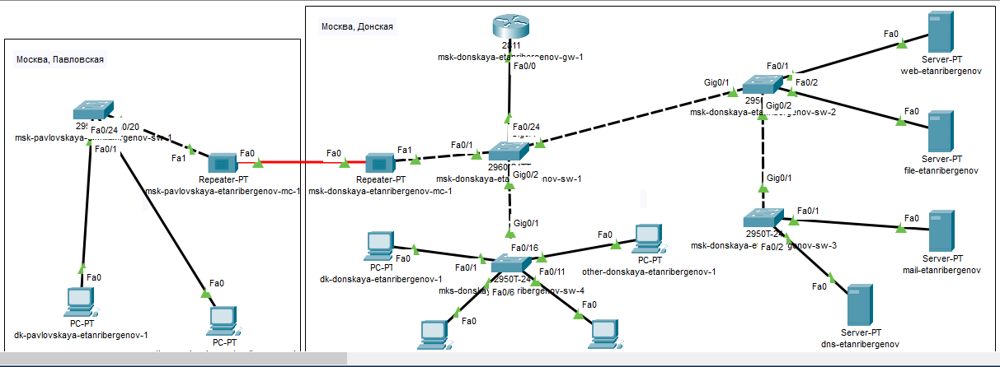{#fig:001}

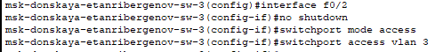{#fig:002}

В конфигурации сервера указал в качестве адреса шлюза 10.128.0.1, а в качестве адреса самого сервера - 10.128.0.5 с соответствующей маской 255.255.255.0.

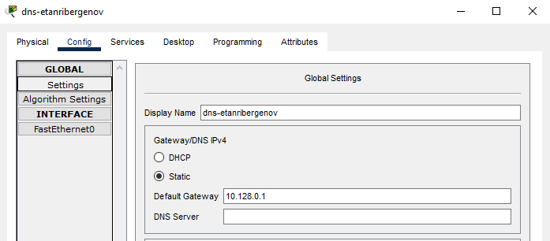{#fig:003}

{#fig:004}

2. Настроил сервис DNS:

– в конфигурации сервера выбрал службу DNS, активировал её (выбрав флаг On);
– в поле Type в качестве типа записи DNS выберал записи типа A (A Record);

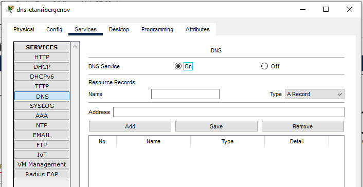{#fig:005}

– в поле Name указал доменное имя, по которому нужно обратиться к определённому серверу, затем указал его IP-адрес в соответствующем поле;
– нажав на кнопку Add , добавил DNS-запись на сервер;
– аналогичным образом добавил DNS-записи для серверов mail, file, dns согласно распределению адресов.

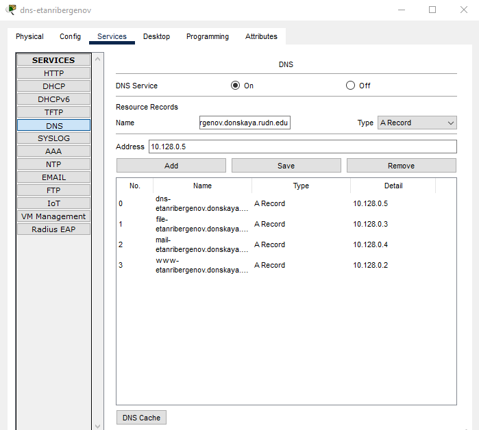{#fig:006}

3. Настроил DHCP-сервис на маршрутизаторе для каждой выделенной сети: указал IP-адрес DNS-сервера;

{#fig:007}

Затем перешёл к настройке DHCP; задал название конфигурируемому диапазону адресов (пулу адресов), указал адрес сети, а также адреса шлюза и DNS-сервера; 
Задал пулы адресов, исключаемых из динамического распределения.

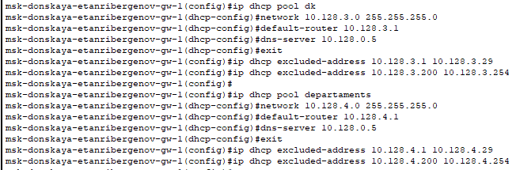{#fig:008}

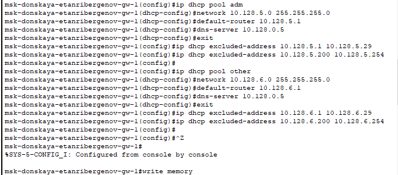{#fig:009}

Просмотрел информацию о пулах DHCP:

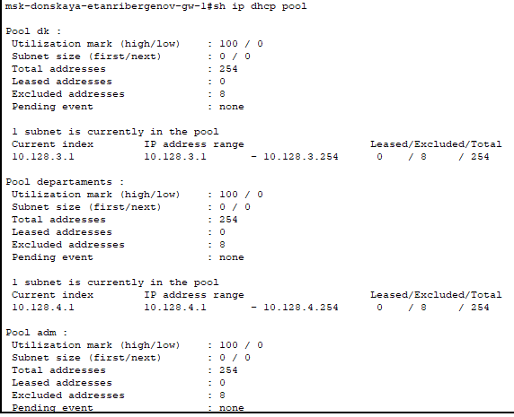{#fig:010}

4. На оконечных устройствах заменил в настройках статическое распределение адресов на динамическое.

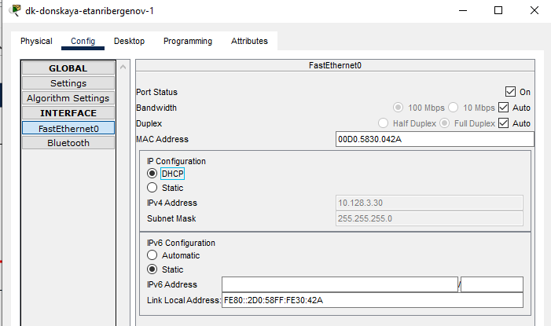{#fig:011}

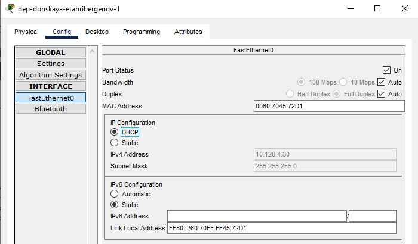{#fig:012}

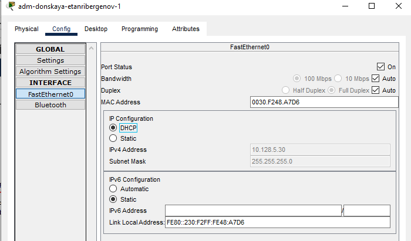{#fig:013}

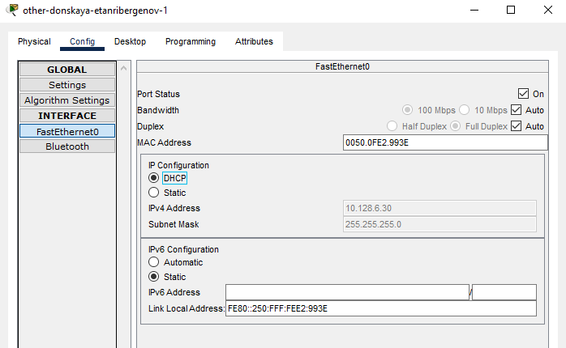{#fig:014}

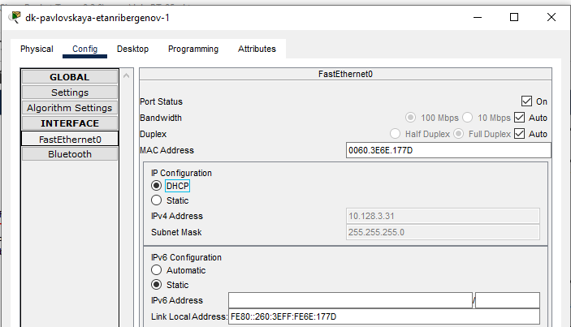{#fig:015}

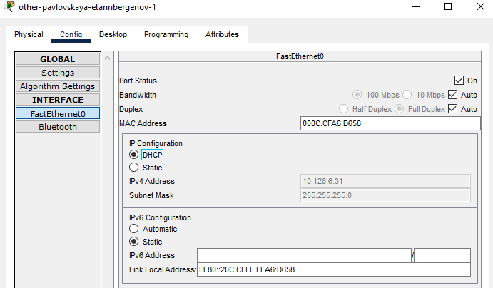{#fig:016}

5. Проверил, какие адреса выделяются оконечным устройствам, а также доступность устройств из разных подсетей.

Проверил работу DHCP-сервера: на оконечном устройстве посмотрел информацию о текущей конфигурации сети командой *ipconfig /all*

{#fig:017}

Как видно на изображении, IP-адрес - динамически полученный в соответствии с назначенным пулом доступных адресов.

Проверил доступность устройств из разных подсетей - успешно:

{#fig:018}

Проверил работу DNS-сервера, пропинговав серверы по доменному имени:

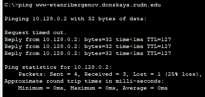{#fig:019}

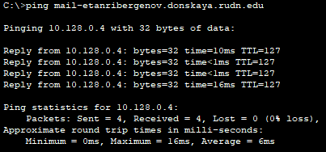{#fig:020}

6. В режиме симуляции изучил, каким образом происходит запрос адреса по протоколу DHCP (какие сообщения и какие отклики передаются по сети).

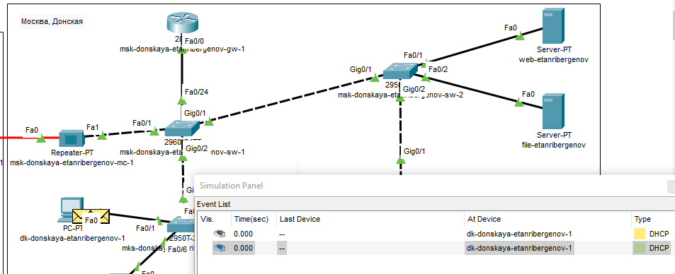{#fig:021}

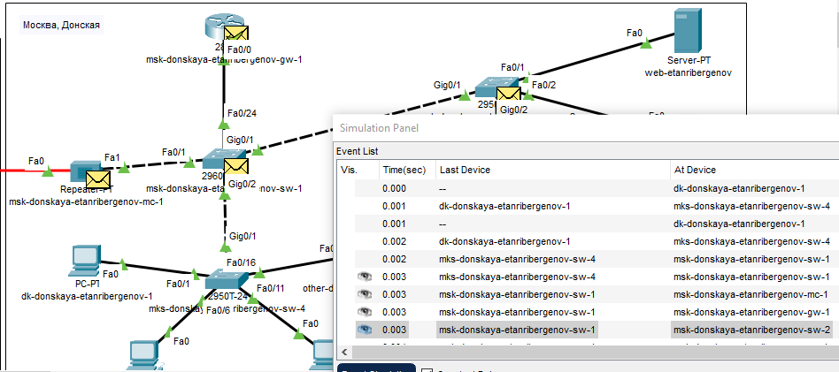{#fig:022}

Пакет сначала достигает маршрутизатора (DHCP-сервера), затем маршрутизатор отправляет клиенту доступный ip-адрес. Клиент, получив этот пакет, отправляет маршрутизатору согласие на полученную конфигурацию, затем маршрутизатор, получив это сообщение, отправляет подтверждение

Просмотрел содержимое пакета DHCP.  В нём есть заголовки UDP и DHCP с адресами DHCP сервера и клиента.

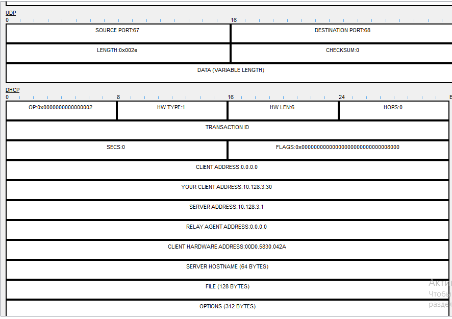{#fig:023}

# Ответы на контрольные вопросы

1. Протокол DHCP отвечает за динамическое распределение IP-адресов и сведений о конфигурации клиентам сервера.

2. Основные типы DHCP-сообщений: DHCPDISCOVER, DHCPOFFER, DHCPREQUEST, DHCPACK, DHCPNAK (Negative Acknowledgement), DHCPRELEASE, DHCPINFORM, DHCPDECLINE.

3. В сообщениях DHCP могут быть переданы параметры: IP-адрес маршрутизатора по умолчанию, маска подсети, адреса серверов DNS, имя домена DNS.

4. DNS (система доменных имён) - система, которая ведёт список доменных имён вместе с их числовыми IP-адресами.

5.  Несколько типов ресурсных записей DNS:

- А - адресная запись, соответствие между именем и IP-адресом; только латиница, цифры и дефис;
- AAAA - адрес в формате IPv6
- AVC - видимость и контроль приложений
- CNAME - каноническое (альтернативное) имя для псевдонима домена (одноуровневая переадресация); для написания национальными символами
- DNAME - псевдоним домена; например, для упрощённой китайской нотации, когда CNAME - на традиционной

# Выводы

Я приобрёл практические навыки по настройке динамического распределения IP-адресов посредством протокола DHCP в локальной сети.

