---
## Front matter
lang: ru-RU
title: "Лабораторная работа № 10"
subtitle: "Настройка списков управления доступом (ACL)"
author:
  - "Танрибергенов Эльдар"
institute:
  - "Российский университет дружбы народов, Москва, Россия"
date: 2024 г.

## i18n babel
babel-lang: russian
babel-otherlangs: english

## Formatting pdf
toc: false
toc-title: Содержание
slide_level: 2
aspectratio: 169
section-titles: true
theme: metropolis
header-includes:
 - \metroset{progressbar=frametitle,sectionpage=progressbar,numbering=fraction}
 - '\makeatletter'
 - '\beamer@ignorenonframefalse'
 - '\makeatother'
---

# Цели и задачи

## Цель лабораторной работы

Освоить настройку прав доступа пользователей к ресурсам сети.

## Задачи

1. Требуется настроить следующие правила доступа:
	1) web-сервер: разрешить доступ всем пользователям по протоколу HTTP
	через порт 80 протокола TCP, а для администратора открыть доступ
	по протоколам Telnet и FTP;
	2) файловый сервер: с внутренних адресов сети доступ открыт по портам
	для общедоступных каталогов, с внешних — доступ по протоколу FTP;
	3) почтовый сервер: разрешить пользователям работать по протоколам
	SMTP и POP3 (соответственно через порты 25 и 110 протокола TCP),
	а для администратора — открыть доступ по протоколам Telnet и FTP;
	4) DNS-сервер: открыть порт 53 протокола UDP для доступа из внутренней сети;
	5) разрешить icmp-сообщения, направленные в сеть серверов;
	6) запретить для сети Other любые запросы за пределы сети, за исключением администратора;
	7) разрешить доступ в сеть управления сетевым оборудованием только администратору сети.

2. Проверить правильность действия установленных правил доступа.

# Выполнение работы

## Размещение ноутбука администратора в сети other-donskaya

- IP-адрес устройства - 10.128.6.200,  шлюз - 10.128.6.1,  DNS-сервер - 10.128.0.5,  подсоединён к порту 24 коммутатора msk-donskaya-etanribergenov-sw-4

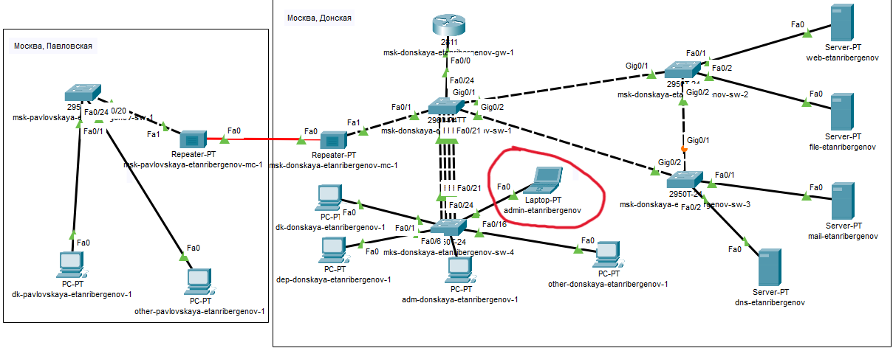{#fig:001 width=80% height=80%}

## Настройка доступа к web-серверу по порту tcp 80

- *ip access-list extended servers-out*  -  переход к настройке расширенного (extended) списка управления доступом servers-out
- *remark \<текст\>*  -  комментарий-напоминание
- *permit \<протокол\> \<адрес источника\> \<адрес назначения\> eq \<порт\>* - разрешение хосту \<адрес источника\> отправлять сообщения по протоколу \<протокол\>  хосту \<адрес назначения\> на порт \<порт\>

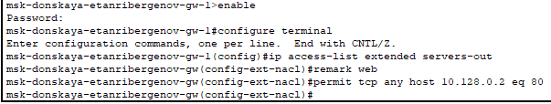{#fig:002 width=70% height=70%}

## Добавление списка управления доступом к интерфейсу

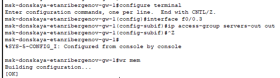{#fig:003}

## Проверка работы правила

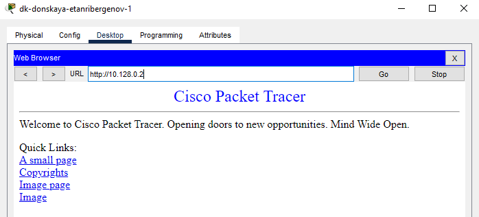{#fig:004}

## Проверка работы правила

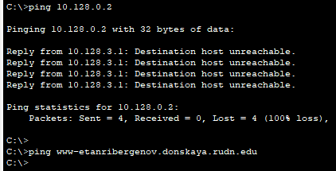{#fig:005}

## Дополнительный доступ для администратора по протоколам Telnet и FTP

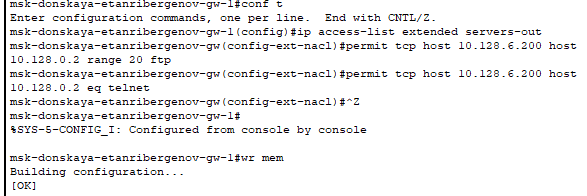{#fig:006}

## Проверка работы правила

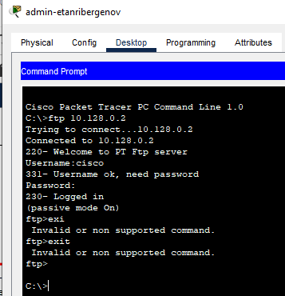{#fig:007 width=70% height=70%}

## Проверка работы правила

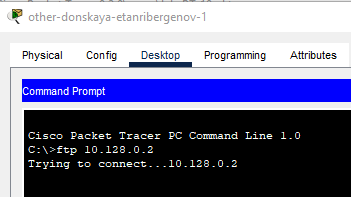{#fig:008}

## Настройка доступа к файловому серверу

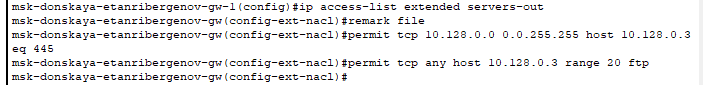{#fig:009}

## Настройка доступа к почтовому серверу

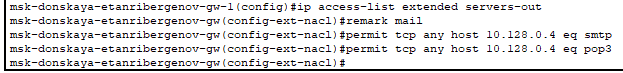{#fig:010}

## Настройка доступа к DNS-серверу

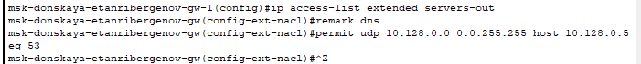{#fig:011}

## Проверка работы правила

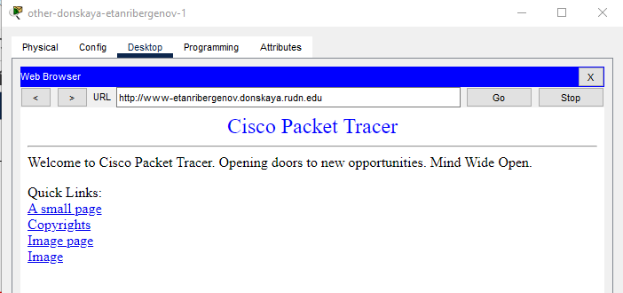{#fig:012 width=75% height=75%}

## Разрешение icmp-запросов

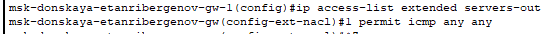{#fig:013}

## Проверка работы правила

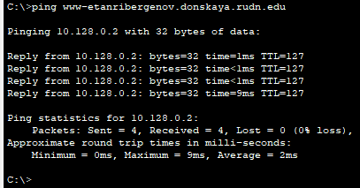{#fig:014}

## Настройка доступа для сети Other

- наложение ограничения на исходящий из сети Other трафик, который по отношению к маршрутизатору является входящим трафиком

{#fig:015}

## Настройка доступа администратора к сети сетевого оборудования

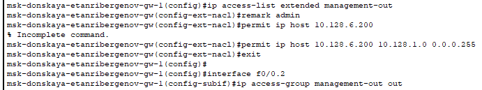{#fig:016}

## Проверка работы правила
 
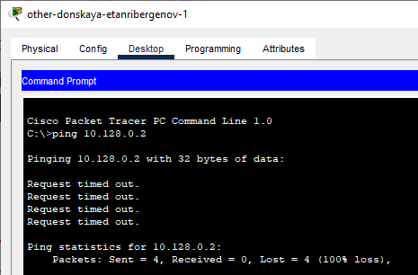{#fig:017 width=70% height=70%}

## Проверка работы правила

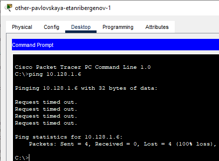{#fig:018 width=70% height=70%}

## Проверка работы правила

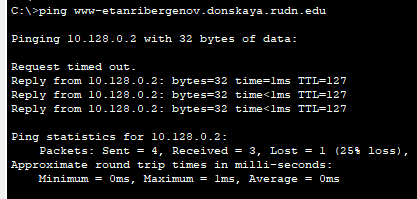{#fig:019}

## Проверка работы правила

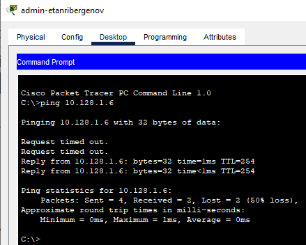{#fig:020 width=70% height=70%}

## Размещение ноутбука администратора в сети other-pavlovskaya (на Павловской)

{#fig:021 width=70% height=70%}

## Добавление правил для ноутбука администратора в списки управления доступом

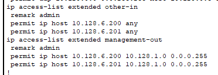{#fig:022}

## Проверка работы правила

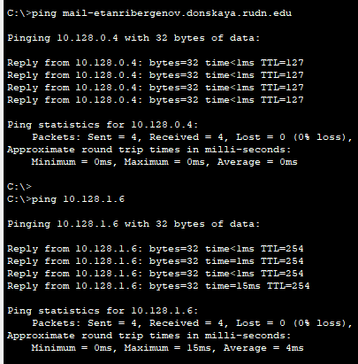{#fig:029 width=70% height=70%}

# Результаты

## Результат

- Созданы правила доступа к разным устройствам сети.
- В сеть добавлены ноутбуки администраторов и разрешён доступ к сетевому оборудованию только администраторам.

# Вывод

## Вывод

Я освоил настройку прав доступа пользователей к ресурсам сети.