---
## Front matter
title: "Отчёт по лабораторной работе №10"
subtitle: "Дисциплина: Администрирование локальных сетей"
author: "Выполнил: Танрибергенов Эльдар"

## Generic options
lang: ru-RU
toc-title: "Содержание"

## Bibliography
bibliography: ../bib/cite.bib
csl: ../pandoc/csl/gost-r-7-0-5-2008-numeric.csl

## Pdf output format
toc: true # Table of contents
toc-depth: 2
lof: true # List of figures
lot: true # List of tables
fontsize: 12pt
linestretch: 1.5
papersize: a4
documentclass: scrreprt
## I18n polyglossia
polyglossia-lang:
  name: russian
  options:
	- spelling=modern
	- babelshorthands=true
polyglossia-otherlangs:
  name: english
## I18n babel
babel-lang: russian
babel-otherlangs: english
## Fonts
mainfont: PT Serif
romanfont: PT Serif
sansfont: PT Sans
monofont: PT Mono
mainfontoptions: Ligatures=TeX
romanfontoptions: Ligatures=TeX
sansfontoptions: Ligatures=TeX,Scale=MatchLowercase
monofontoptions: Scale=MatchLowercase,Scale=0.9
## Biblatex
biblatex: true
biblio-style: "gost-numeric"
biblatexoptions:
  - parentracker=true
  - backend=biber
  - hyperref=auto
  - language=auto
  - autolang=other*
  - citestyle=gost-numeric
## Pandoc-crossref LaTeX customization
figureTitle: "Рис."
tableTitle: "Таблица"
listingTitle: "Листинг"
lofTitle: "Список иллюстраций"
lotTitle: "Список таблиц"
lolTitle: "Листинги"
## Misc options
indent: true
header-includes:
  - \usepackage{indentfirst}
  - \usepackage{float} # keep figures where there are in the text
  - \floatplacement{figure}{H} # keep figures where there are in the text
---

# Цель работы

Освоить настройку прав доступа пользователей к ресурсам сети.

# Задание

1. Требуется настроить следующие правила доступа:
	1) web-сервер: разрешить доступ всем пользователям по протоколу HTTP
	через порт 80 протокола TCP, а для администратора открыть доступ
	по протоколам Telnet и FTP;
	2) файловый сервер: с внутренних адресов сети доступ открыт по портам
	для общедоступных каталогов, с внешних — доступ по протоколу FTP;
	3) почтовый сервер: разрешить пользователям работать по протоколам
	SMTP и POP3 (соответственно через порты 25 и 110 протокола TCP),
	а для администратора — открыть доступ по протоколам Telnet и FTP;
	4) DNS-сервер: открыть порт 53 протокола UDP для доступа из внутренней сети;
	5) разрешить icmp-сообщения, направленные в сеть серверов;
	6) запретить для сети Other любые запросы за пределы сети, за исключением администратора;
	7) разрешить доступ в сеть управления сетевым оборудованием только администратору сети.

2. Проверить правильность действия установленных правил доступа.
3. Выполнить задание для самостоятельной работы по настройке прав доступа администратора сети на Павловской.

# Выполнение лабораторной работы

1. В рабочей области проекта подсоединил ноутбук к порту 24 коммутатора msk-donskaya-sw-4 (рис. [-@fig:001]) и присвоил ему статический
адрес 10.128.6.200 (рис. [-@fig:002]), указав в качестве gateway-адреса 10.128.6.1 и адреса DNS-сервера 10.128.0.5 (рис. [-@fig:003]).

{#fig:001}

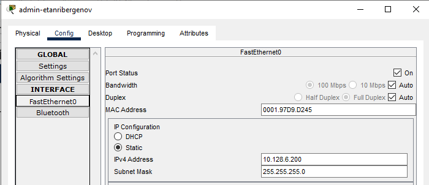{#fig:002}

{#fig:003}

2. Настройка доступа к web-серверу по порту tcp 80:

Создал список контроля доступа с названием servers-out (так как предполагается ограничить доступ в конкретные подсети и по отношению к маршрутизатору это будет исходящий трафик);
 указал (в качестве комментария-напоминания remark web), что ограничения предназначены для работы с web-сервером;
 дано разрешение доступа (permit) по протоколу TCP всем (any) пользователям сети (host) на доступ к web-серверу, имеющему адрес 10.128.0.2, через порт 80.

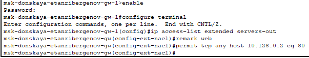{#fig:004}

3. Добавление списка управления доступом к интерфейсу:

К интерфейсу f0/0.3 подключил список прав доступа servers-out и применил к исходящему трафику (out) (рис. [-@fig:005]).
Проверил, что доступ к web-серверу есть через протокол HTTP (введя в строке браузера хоста ip-адрес web-сервера) (рис. [-@fig:006]).
При этом команда ping демонстрирует недоступность web-сервера как по имени, так и по ip-адресу web-сервера (рис. [-@fig:007]).

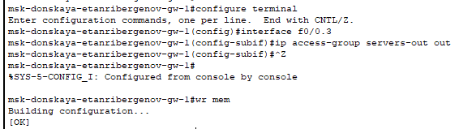{#fig:005}

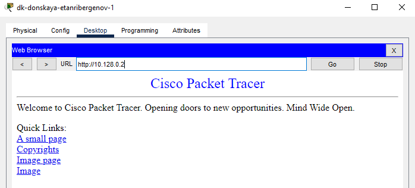{#fig:006}

{#fig:007}

4. Дополнительный доступ для администратора по протоколам Telnet и FTP:

В список контроля доступа servers-out добавил правило, разрешающее устройству администратора с ip-адресом 10.128.6.200 доступ на web-сервер (10.128.0.2) по протоколам FTP и telnet (рис. [-@fig:008]).
Убедился, что с узла с ip-адресом 10.128.6.200 есть доступ по протоколу FTP. Для этого в командной строке устройства администратора ввёл ftp 10.128.0.2, а затем по запросу имя пользователя cisco и пароль cisco (рис. [-@fig:009]).

{#fig:008}

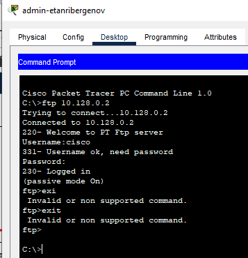{#fig:009}

Попробовал провести аналогичную процедуру с другого устройства сети. Убедился, что доступ запрещён.

{#fig:010}

5. Настройка доступа к файловому серверу:

В списке контроля доступа servers-out указал (в качестве комментария-напоминания remark file), что следующие ограничения предназначены для работы с file-сервером;
 всем узлам внутренней сети (10.128.0.0) разрешён доступ по протоколу SMB (работает через порт 445 протокола TCP) к каталогам общего пользования;
 любым узлам разрешён доступ к file-серверу по протоколу FTP. Запись 0.0.255.255 — обратная маска (wildcard mask).

{#fig:011}

6. Настройка доступа к почтовому серверу:

В списке контроля доступа servers-out указал (в качестве комментария-напоминания remark mail), что следующие ограничения предназначены для работы с почтовым сервером;
 всем разрешён доступ к почтовому серверу по протоколам POP3 и SMTP.

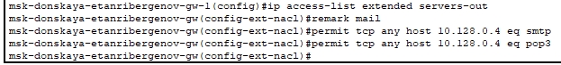{#fig:012}

7. Настройка доступа к DNS-серверу:

В списке контроля доступа servers-out указал (в качестве комментария-напоминания remark dns), что следующие ограничения предназначены для работы с DNS-сервером;
 всем узлам внутренней сети разрешён доступ к DNS-серверу через UDP-порт 53 (рис. [-@fig:013]).
Проверил доступность web-сервера (через браузер) по имени (рис. [-@fig:014]).

{#fig:013}

{#fig:014}

8. Разрешение icmp-запросов:

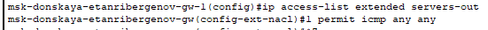{#fig:015}

Явно указал порядок размещения правил — правило разрешения для icmp-запросов добавил в начало списка контроля доступа (рис. [-@fig:016]).

{#fig:016}

Проверил, что icmp-запросы доступны (рис. [-@fig:017]).

{#fig:017}

9. Настройка доступа для сети Other (наложил ограничение на исходящий из сети Other трафик, который по отношению к маршрутизатору является входящим трафиком):

В списке контроля доступа other-in указано, что следующие правила относятся к администратору сети; даётся разрешение устройству с адресом 10.128.6.200 на любые действия (any);
 к интерфейсу f0/0.104 подключается список прав доступа other-in и применяется к входящему трафику (in).

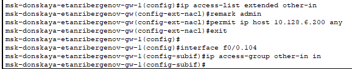{#fig:018}

10. Настройка доступа администратора к сети сетевого оборудования:

В списке контроля доступа management-out указал (в качестве комментария-напоминания remark admin), что устройству администратора с адресом 10.128.6.200 разрешён доступ к сети сетевого оборудования (10.128.1.0);
 к интерфейсу f0/0.2 подключается список прав доступа management-out и применяется к исходящему трафику (out).

{#fig:019}

11. Проверил корректность установленных правил доступа, попытавшись получить доступ по различным протоколам с разных устройств сети к подсети серверов и подсети сетевого оборудования.

Проверил правильность работы установленных правил доступа, попытавшись получить доступ с устройства из сети other. Убедился, что доступ запрещён.

К серверу:

{#fig:020}

К сетевому оборудованию:

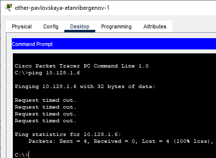{#fig:021}

Проверил правильность работы установленных правил доступа, попытавшись получить доступ с устройства администатора. Убедился, что доступ разрешён.

К серверу:

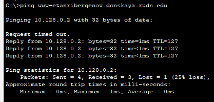{#fig:022}

К сетевому оборудованию:

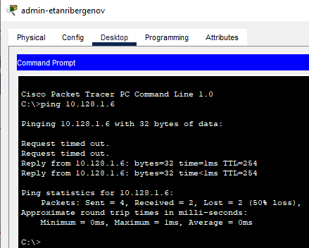{#fig:023}

12. Разрешил администратору из сети Other на Павловской действия, аналогичные действиям администратора сети Other на Донской.

Разместил ноутбук администратора на территории Павловская и соединил с 23 портом коммутатора msk-pavlovskaya-etanribergenov-sw-1:

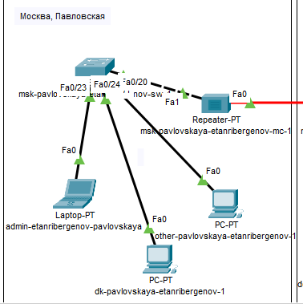{#fig:024}

Настроил интерфейс f0/23: задал ему принадлежность к vlan 104 (сеть other):

{#fig:025}

Задал адреса шлюза и dns-сервера, а также его собственный статический ip-адрес:

{#fig:026}

{#fig:027}

Добавил правила (доступ по всем протоколам ко всем узлам сети и сетевому оборудованию) в списки доступа для узла администратора на Павловской:

{#fig:028}

Проверка доступа узла администатора на Павловской к остальным узлам сети и сетевому оборудованию:

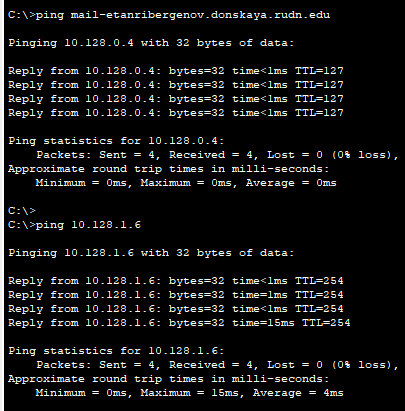{#fig:029}

# Ответы на контрольные вопросы

1. Команда *permit \<протокол\> \<кому\> \<куда\> \<порт\>*  задаёт правило для конкретного протокола.
2. Чтобы задать действие правила сразу для нескольких портов, можно написать сразу несколько протоколов.
3. Команда *show access-lists* выводит списки доступа с их порядковыми номерами.
4. Добавив перед правилом (перед словом permit/deny) число, можно изменить порядок применения правил в списке контроля доступа.

# Выводы

Я освоил настройку прав доступа пользователей к ресурсам сети.
