---
## Front matter
lang: ru-RU
title: "Лабораторная работа № 11"
subtitle: "Настройка NAT. Планирование"
author:
  - "Танрибергенов Эльдар"
institute:
  - "Российский университет дружбы народов, Москва, Россия"
date: 2024 г.

## i18n babel
babel-lang: russian
babel-otherlangs: english

## Formatting pdf
toc: false
toc-title: Содержание
slide_level: 2
aspectratio: 169
section-titles: true
theme: metropolis
header-includes:
 - \metroset{progressbar=frametitle,sectionpage=progressbar,numbering=fraction}
 - '\makeatletter'
 - '\beamer@ignorenonframefalse'
 - '\makeatother'
---

# Цели и задачи

## Цель лабораторной работы

Провести подготовительные мероприятия по подключению локальной сети организации к Интернету.

## Задачи

1. Построить схему подсоединения локальной сети к Интернету.
2. Построить модельные сети провайдера и сети Интернет.
3. Построить схемы сетей L1, L2, L3.

# Выполнение работы

## Внесение изменений в схему L1 сети, добавив в неё сеть провайдера и сеть модельного Интернета

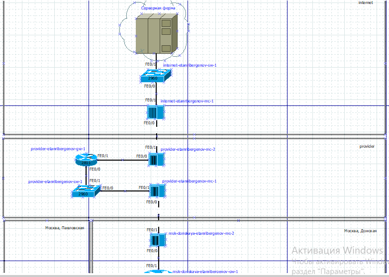{#fig:001 height=70% witdh=70%}

## Внесение изменений в схемы L2 и L3

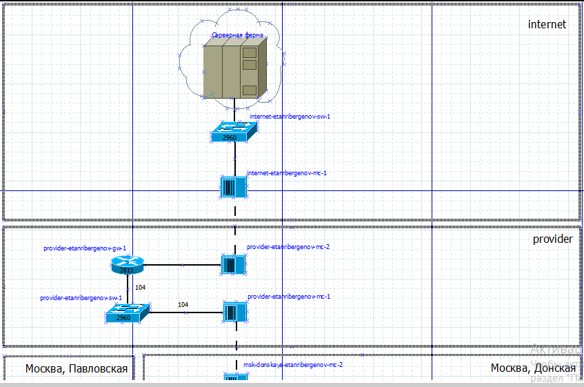{#fig:002 height=70% witdh=70%}

## Внесение изменений в схемы L2 и L3

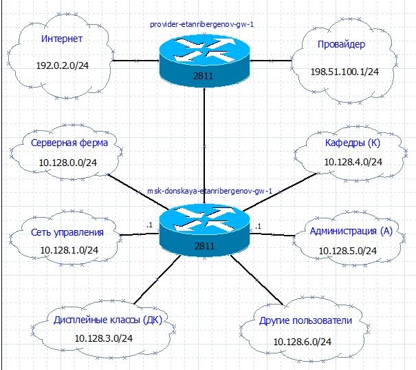{#fig:003 height=70% witdh=70%}

## Корректировка таблицы распределения IP-адресов и портов

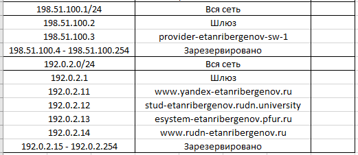{#fig:004}

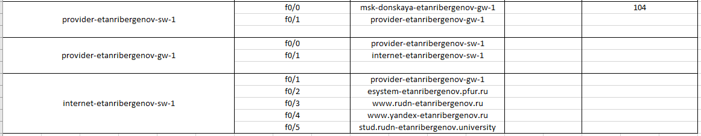{#fig:005}

## Размещение необходимого оборудования

Оборудование для сети провайдера и сети модельного Интернета:

- 4 медиаконвертера (Repeater-PT),

- 2 коммутатора типа Cisco 2960-24TT, 

- маршрутизатор типа Cisco 2811, 

- 4 сервера.

## Размещение необходимого оборудования

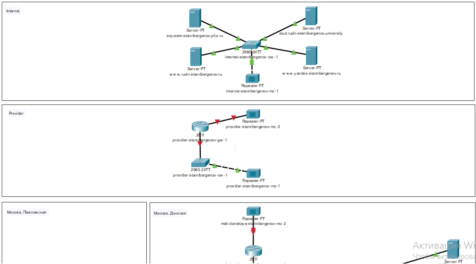{#fig:006 height=80% witdh=80%}

## Добавление здания провайдера и здания, имитирующего расположение серверов модельного Интернета

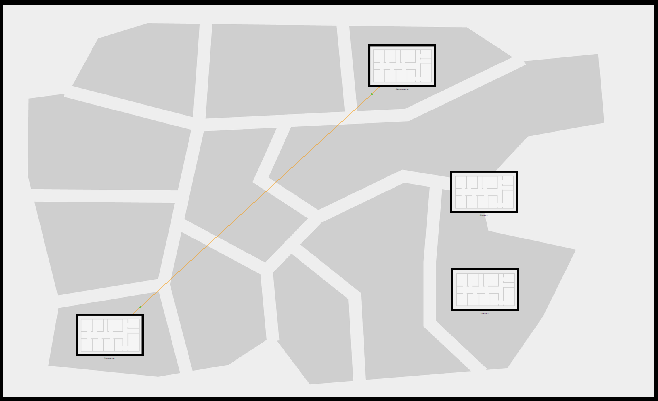{#fig:007 height=70% witdh=70%}

## Перенос из сети «Донская» оборудования провайдера и модельной сети Интернета в соответствующие здания

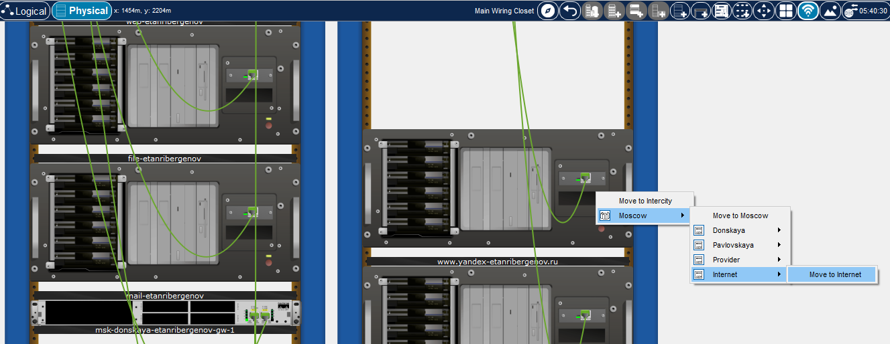{#fig:008}

## Перенос из сети «Донская» оборудования провайдера и модельной сети Интернета в соответствующие здания

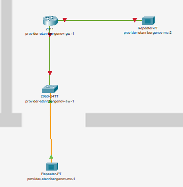{#fig:009 height=70% witdh=70%}

## Перенос из сети «Донская» оборудования провайдера и модельной сети Интернета в соответствующие здания

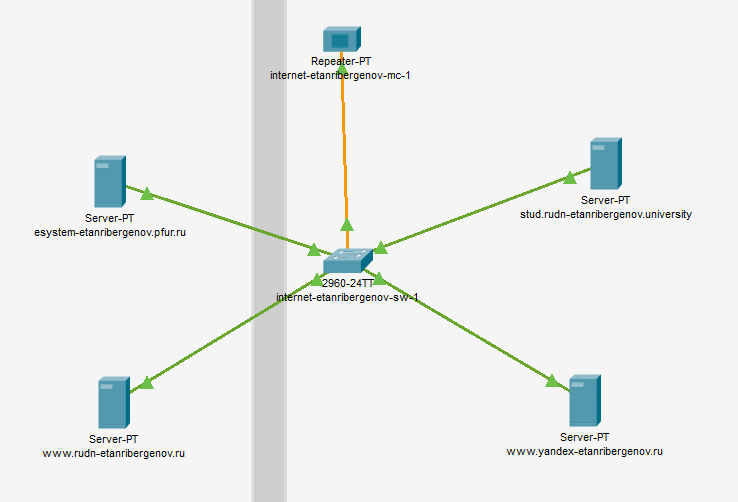{#fig:010 height=70% witdh=70%}

## Замена модулей на медиаконвертерах для подключения витой пары и оптоволокна

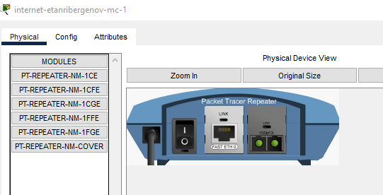{#fig:011 height=70% witdh=70%}

## Соединение объектов согласно скорректированной схеме L1

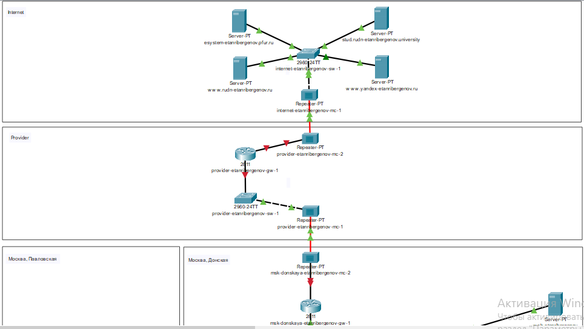{#fig:012 height=70% witdh=70%}

## Добавление IP-адресов серверам

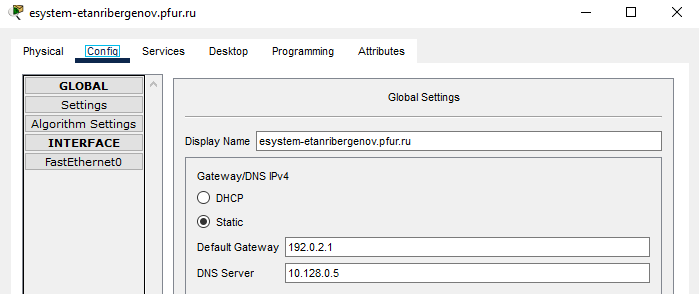{#fig:013}

## Добавление IP-адресов серверам

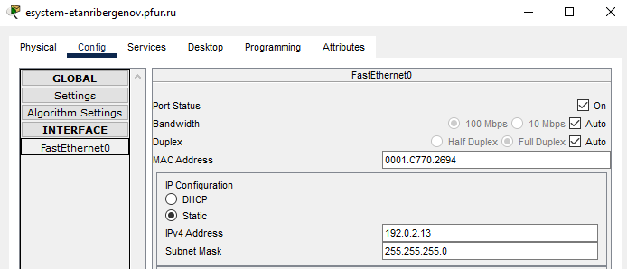{#fig:014}

## Добавление сведений о серверах на DNS-сервере сети «Донская»

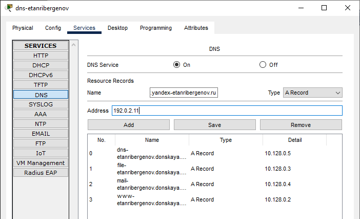{#fig:015 height=70% witdh=70%}

## Добавление сведений о серверах на DNS-сервере сети «Донская»

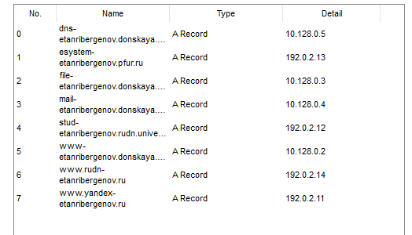{#fig:016 height=70% witdh=70%}

# Результаты

## Результат

- Добавлены модельные сети Интернета и провайдера
- Добавлены DNS-записи на DNS-сервер сети «Донская»

# Вывод

## Вывод

Я провёл подготовительные мероприятия по подключению локальной сети организации к Интернету.