---
## Front matter
title: "Отчёт по лабораторной работе №11"
subtitle: "Дисциплина: Администрирование локальных сетей"
author: "Выполнил: Танрибергенов Эльдар"

## Generic options
lang: ru-RU
toc-title: "Содержание"

## Bibliography
bibliography: ../bib/cite.bib
csl: ../pandoc/csl/gost-r-7-0-5-2008-numeric.csl

## Pdf output format
toc: true # Table of contents
toc-depth: 2
lof: true # List of figures
lot: true # List of tables
fontsize: 12pt
linestretch: 1.5
papersize: a4
documentclass: scrreprt
## I18n polyglossia
polyglossia-lang:
  name: russian
  options:
	- spelling=modern
	- babelshorthands=true
polyglossia-otherlangs:
  name: english
## I18n babel
babel-lang: russian
babel-otherlangs: english
## Fonts
mainfont: PT Serif
romanfont: PT Serif
sansfont: PT Sans
monofont: PT Mono
mainfontoptions: Ligatures=TeX
romanfontoptions: Ligatures=TeX
sansfontoptions: Ligatures=TeX,Scale=MatchLowercase
monofontoptions: Scale=MatchLowercase,Scale=0.9
## Biblatex
biblatex: true
biblio-style: "gost-numeric"
biblatexoptions:
  - parentracker=true
  - backend=biber
  - hyperref=auto
  - language=auto
  - autolang=other*
  - citestyle=gost-numeric
## Pandoc-crossref LaTeX customization
figureTitle: "Рис."
tableTitle: "Таблица"
listingTitle: "Листинг"
lofTitle: "Список иллюстраций"
lotTitle: "Список таблиц"
lolTitle: "Листинги"
## Misc options
indent: true
header-includes:
  - \usepackage{indentfirst}
  - \usepackage{float} # keep figures where there are in the text
  - \floatplacement{figure}{H} # keep figures where there are in the text
---

# Цель работы

Провести подготовительные мероприятия по подключению локальной сети организации к Интернету.

# Задание

1. Построить схему подсоединения локальной сети к Интернету.
2. Построить модельные сети провайдера и сети Интернет.
3. Построить схемы сетей L1, L2, L3.

# Выполнение лабораторной работы

1. Внёс изменения в схему L1 сети, добавив в неё сеть провайдера и сеть модельного Интернета с указанием названий оборудования и портов подключения.

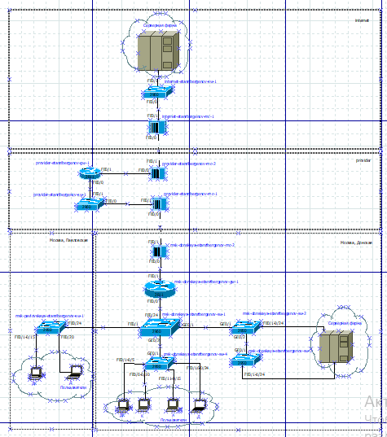{#fig:001}

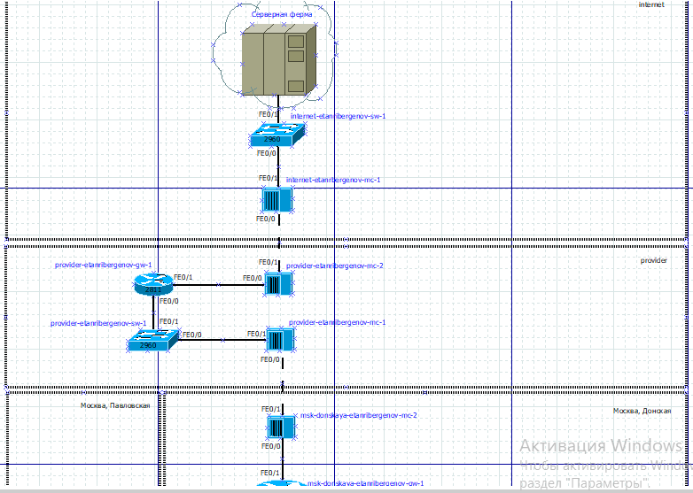{#fig:002}

2. Внёс изменения в схемы L2 и L3 сети, указав адреса и VLAN сети провайдера и модельной сети Интернета.

{#fig:003}

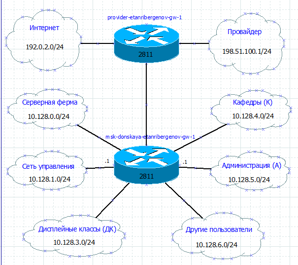{#fig:004}

 Скорректировал таблицы распределения IP-адресов и портов.

{#fig:005}

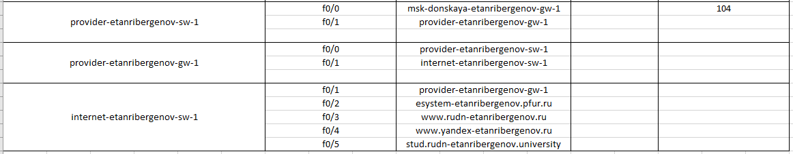{#fig:006}

3. На схеме предыдущего своего проекта разместил необходимое оборудование для сети провайдера и сети модельного Интернета: 
4 медиаконвертера (Repeater-PT), 2 коммутатора типа Cisco 2960-24TT, маршрутизатор типа Cisco 2811, 4 сервера.

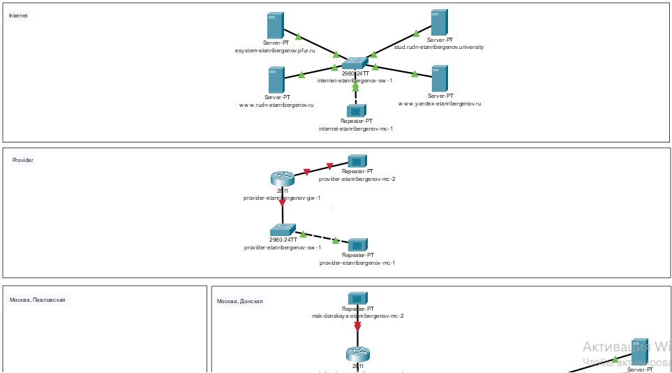{#fig:007}

4. В физической рабочей области добавил здание провайдера и здание, имитирующее расположение серверов модельного Интернета. Присвоил им соответствующие названия: Provider и Internet.

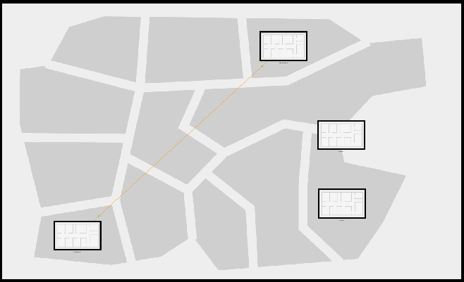{#fig:008}

5. Перенёс из сети «Донская» оборудование провайдера и модельной сети Интернета в соответствующие здания.

{#fig:009}

{#fig:010}

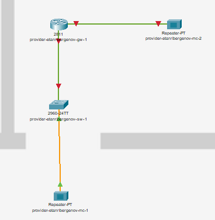{#fig:011}

{#fig:012}

6. На медиаконвертерах заменил имеющиеся модули на PT-REPEATER-NM-1FFE и PT-REPEATER-NM-1CFE для подключения витой пары по технологии Fast Ethernet и оптоволокна соответственно.

{#fig:013}

7. Провёл соединение объектов согласно скорректированной схеме L1.

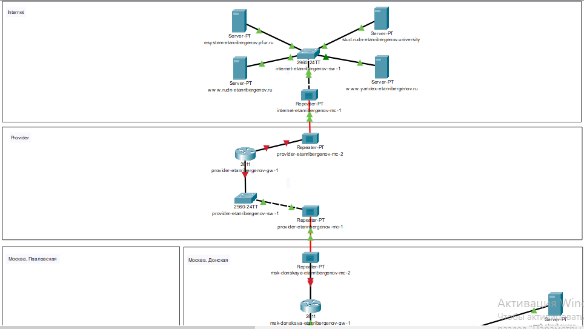{#fig:014}

8. Прописал IP-адреса серверам:

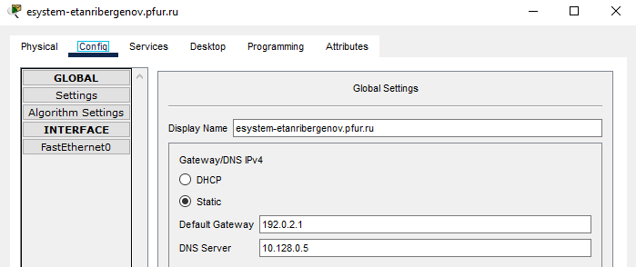{#fig:015}

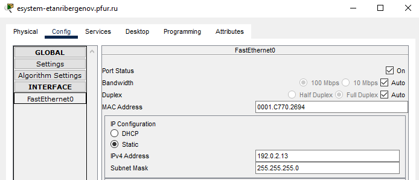{#fig:016}

{#fig:017}

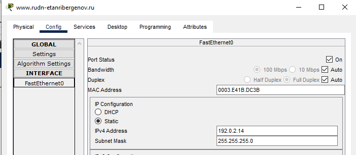{#fig:018}

{#fig:019}

{#fig:020}

{#fig:021}

{#fig:022}

9. Прописал сведения о серверах на DNS-сервере сети «Донская»:

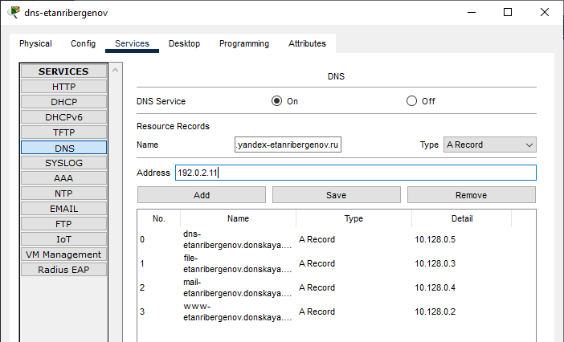{#fig:023}

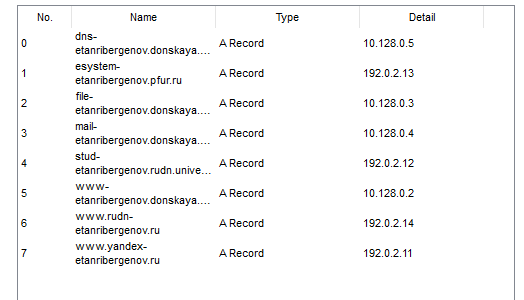{#fig:024}

# Ответы на контрольные вопросы

1. NAT (Network Address Translation) - механизм преобразования IP-адресов транзитных пакетов для обеспечения доступа устройств локальных сетей с внутренними IP-адресами к сети Интернет.

2. Проверить IP-адрес компьютера. Если он находится в одном из диапазонов, зарезервированных для локальных сетей, то это локальный (внутренний) адрес, и узел находится за NAT.

3. Маршрутизатор отвечает за преобразование адреса методом NAT.

4,5. 

- Статический NAT (Static NAT, SNAT) — осуществляет преобразование адресов по принципу 1:1 (в частности, один локальный IP-адрес преобразуется во внешний адрес, выделенный, например, провайдером);

- Динамический NAT (Dynamic NAT, DNAT) — осуществляет преобразование адресов по принципу 1:N (например, один адрес устройства локальной сети преобразуется в один из адресов диапазона внешних адресов);

- NAT Overload (или NAT Masquerading, или Port Address Translation, PAT) — осуществляет преобразование адресов по принципу N:1 (например, адреса группы устройств локальной подсети преобразуются в один внешний адрес, при этом дополнительно используется механизм адресации через номера портов).

# Выводы

Я научился проводить подготовительные мероприятия по подключению локальной сети организации к Интернету.
