---
## Front matter
lang: ru-RU
title: "Лабораторная работа № 12"
subtitle: "Настройка NAT"
author:
  - "Танрибергенов Эльдар"
institute:
  - "Российский университет дружбы народов, Москва, Россия"
date: 2024 г.

## i18n babel
babel-lang: russian
babel-otherlangs: english

## Formatting pdf
toc: false
toc-title: Содержание
slide_level: 2
aspectratio: 169
section-titles: true
theme: metropolis
header-includes:
 - \metroset{progressbar=frametitle,sectionpage=progressbar,numbering=fraction}
 - '\makeatletter'
 - '\beamer@ignorenonframefalse'
 - '\makeatother'
---

# Цели и задачи

## Цель лабораторной работы

Приобретение практических навыков по настройке доступа локальной сети к внешней сети посредством NAT.

## Задачи

1. Сделать первоначальную настройку маршрутизатора provider-gw-1 и коммутатора provider-sw-1 провайдера: задать имя, настроить доступ по паролю и т.п..
2. Настроить интерфейсы маршрутизатора provider-gw-1 и коммутатора provider-sw-1 провайдера.
3. Настроить интерфейсы маршрутизатора сети «Донская» для доступа к сети провайдера.
4. Настроить на маршрутизаторе сети «Донская» NAT.
5. Настроить доступ из внешней сети в локальную сеть организации.
6. Проверить работоспособность заданных настроек.

# Выполнение работы

## Первоначальная настройка маршрутизатора

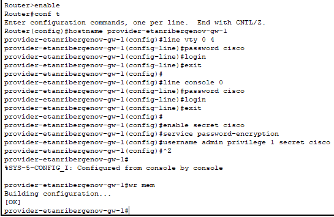{#fig:001 height=70% witdh=70%}

## Первоначальная настройка коммутатора

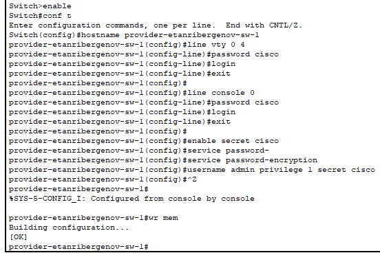{#fig:002 height=70% witdh=70%}

## Настройка интерфейсов маршрутизатора

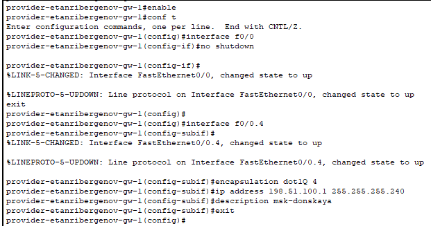{#fig:003 height=70% witdh=70%}

## Настройка интерфейсов коммутатора

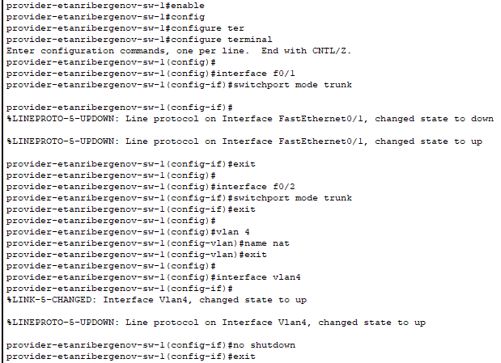{#fig:004 height=70% witdh=70%}

## Настройка интерфейсов маршрутизатора сети «Донская» для доступа к сети провайдера

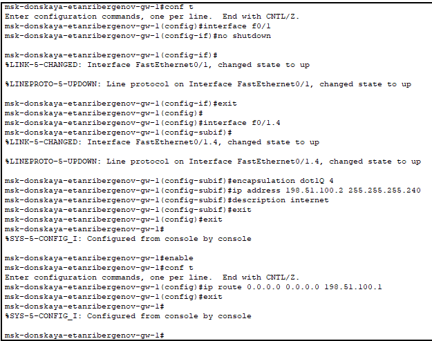{#fig:005 height=70% witdh=70%}

4. Настрока NAT на маршрутизаторе сети «Донская» 

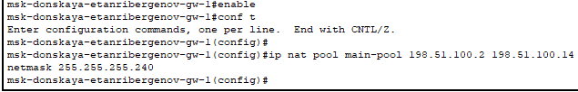{#fig:006}

## Добавление правил в список доступа для NAT для каждой сети 

- Хосты из сети дисплейных классов имеют доступ только к сайтам, необходимым для учёбы (www.yandex-etanribergenov.ru (192.0.2.11), stud-etanribergenov.rudn.university (192.0.2.12)).

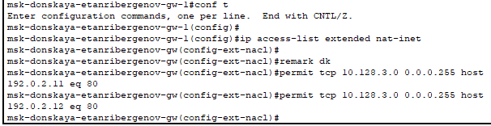{#fig:007 height=60% width=60%}

## Добавление правил в список доступа для NAT для каждой сети 

- Сеть кафедр работает только с образовательными сайтами (esystem-etanribergenov.pfur.ru (192.0.2.13)).

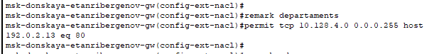{#fig:008}

## Добавление правил в список доступа для NAT для каждой сети 

- Сеть администрации имеет возможность работать только с сайтом университета (www.rudn-etanribergenov.ru (192.0.2.14)).

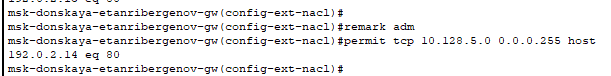{#fig:009}

## Добавление правил в список доступа для NAT для каждой сети 

- В сети для других пользователей компьютер администратора имеет полный доступ в Интернет. Другие не имеют доступа.

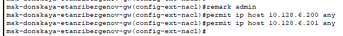{#fig:010}

## Настройка Port Address Translation (PAT)

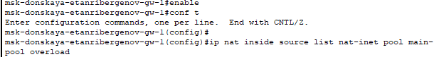{#fig:011}

## Настройка интерфейсов для NAT

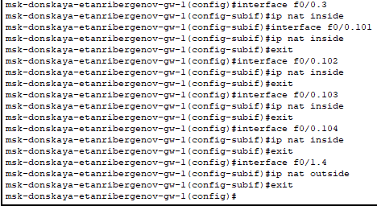{#fig:012}

## Настройка доступа из внешней сети в локальную сеть организации

{#fig:013}

## Проверка работоспособности заданных настроек

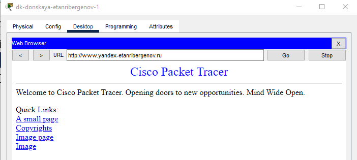{#fig:014}

## Проверка работоспособности заданных настроек

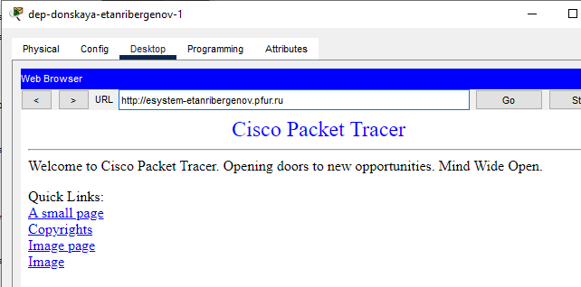{#fig:015 height=70% witdh=70%}

## Проверка работоспособности заданных настроек

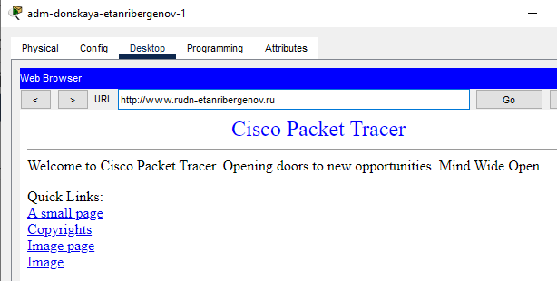{#fig:016 height=70% witdh=70%}

## Проверка работоспособности заданных настроек

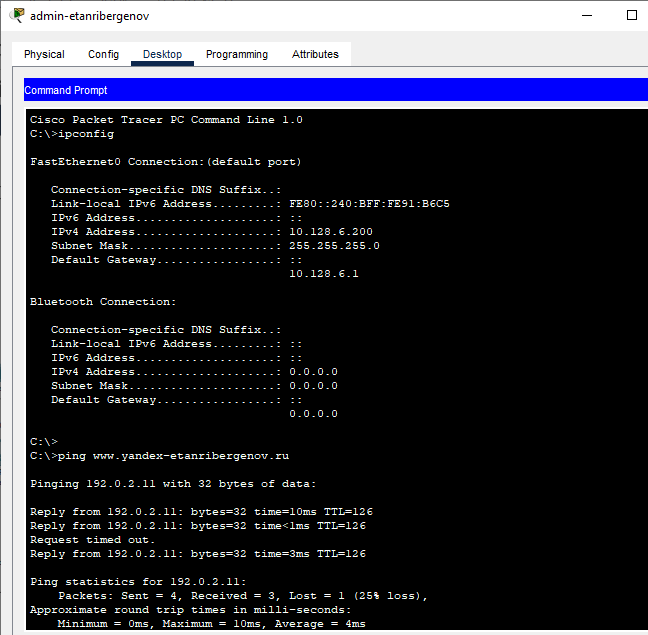{#fig:017 height=70% witdh=70%}

## Проверка доступа к узлам локальной сети из Интернета (проверка работоспособности настроек NAT)

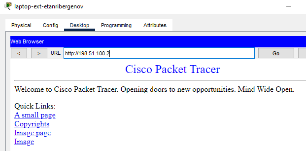{#fig:018 height=70% witdh=70%}

## Проверка доступа к узлам локальной сети из Интернета (проверка работоспособности настроек NAT)

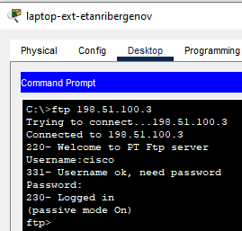{#fig:019 height=70% witdh=70%}

# Результаты

## Результат

- Созданы правила доступа к разным устройствам сети.
- Настроено NAT-преобразование ip-адресов.

# Вывод

## Вывод

Я приобрёл практические навыки по настройке доступа локальной сети к внешней сети посредством NAT.