---
## Front matter
title: "Отчёт по лабораторной работе №12"
subtitle: "Дисциплина: Администрирование локальных сетей"
author: "Выполнил: Танрибергенов Эльдар"

## Generic options
lang: ru-RU
toc-title: "Содержание"

## Bibliography
bibliography: ../bib/cite.bib
csl: ../pandoc/csl/gost-r-7-0-5-2008-numeric.csl

## Pdf output format
toc: true # Table of contents
toc-depth: 2
lof: true # List of figures
lot: true # List of tables
fontsize: 12pt
linestretch: 1.5
papersize: a4
documentclass: scrreprt
## I18n polyglossia
polyglossia-lang:
  name: russian
  options:
	- spelling=modern
	- babelshorthands=true
polyglossia-otherlangs:
  name: english
## I18n babel
babel-lang: russian
babel-otherlangs: english
## Fonts
mainfont: PT Serif
romanfont: PT Serif
sansfont: PT Sans
monofont: PT Mono
mainfontoptions: Ligatures=TeX
romanfontoptions: Ligatures=TeX
sansfontoptions: Ligatures=TeX,Scale=MatchLowercase
monofontoptions: Scale=MatchLowercase,Scale=0.9
## Biblatex
biblatex: true
biblio-style: "gost-numeric"
biblatexoptions:
  - parentracker=true
  - backend=biber
  - hyperref=auto
  - language=auto
  - autolang=other*
  - citestyle=gost-numeric
## Pandoc-crossref LaTeX customization
figureTitle: "Рис."
tableTitle: "Таблица"
listingTitle: "Листинг"
lofTitle: "Список иллюстраций"
lotTitle: "Список таблиц"
lolTitle: "Листинги"
## Misc options
indent: true
header-includes:
  - \usepackage{indentfirst}
  - \usepackage{float} # keep figures where there are in the text
  - \floatplacement{figure}{H} # keep figures where there are in the text
---

# Цель работы

Приобретение практических навыков по настройке доступа локальной сети к внешней сети посредством NAT.

# Задание

1. Сделать первоначальную настройку маршрутизатора provider-gw-1 и коммутатора provider-sw-1 провайдера: задать имя, настроить доступ по паролю и т.п..
2. Настроить интерфейсы маршрутизатора provider-gw-1 и коммутатора provider-sw-1 провайдера.
3. Настроить интерфейсы маршрутизатора сети «Донская» для доступа к сети провайдера.
4. Настроить на маршрутизаторе сети «Донская» NAT.
5. Настроить доступ из внешней сети в локальную сеть организации.
6. Проверить работоспособность заданных настроек.

# Выполнение лабораторной работы

1. Сделал первоначальную настройку маршрутизатора (рис. [-@fig:001]) и коммутатора provider-sw-1 провайдера (рис. [-@fig:002]): задал имя, настроил доступ по паролю и т.п..

{#fig:001}

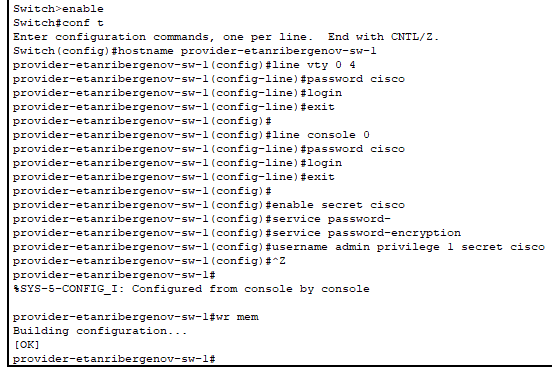{#fig:002}

2. Настроил интерфейсы маршрутизатора (рис. [-@fig:003] - [-@fig:004]) и коммутатора (рис. [-@fig:005]) провайдера.

{#fig:003}

{#fig:004}

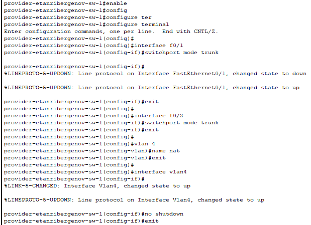{#fig:005}

3. Настроил интерфейсы маршрутизатора сети «Донская» для доступа к сети провайдера.

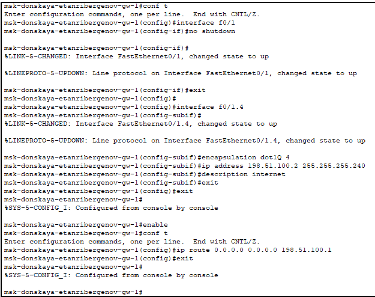{#fig:006}

4. Настроил на маршрутизаторе сети «Донская» NAT.

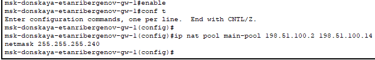{#fig:007}

Создал расширенный список управления доступом "main-pool" для NAT: создал правила для каждой сети.

Хосты из сети дисплейных классов имеют доступ только к сайтам, необходимым для учёбы (www.yandex-etanribergenov.ru (192.0.2.11), stud-etanribergenov.rudn.university (192.0.2.12)).

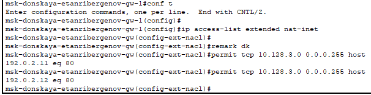{#fig:008}

Сеть кафедр работает только с образовательными сайтами (esystem-etanribergenov.pfur.ru (192.0.2.13)).

{#fig:009}

Сеть администрации имеет возможность работать только с сайтом университета (www.rudn-etanribergenov.ru (192.0.2.14)).

{#fig:010}

В сети для других пользователей компьютер администратора имеет полный доступ в Интернет. Другие не имеют доступа.

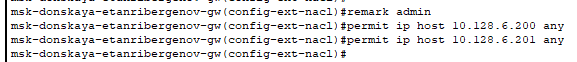{#fig:011}

Настроил Port Address Translation (PAT):

{#fig:012}

Настроил интерфейсы для NAT:

{#fig:013}

5. Настроил доступ из внешней сети в локальную сеть организации.

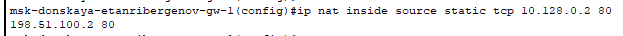{#fig:014}

{#fig:015}

{#fig:016}

{#fig:017}

6. Проверил работоспособность заданных настроек.

Сеть дисплейных классов:

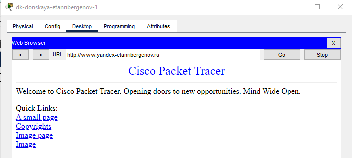{#fig:018}

{#fig:019}

{#fig:020}

Сеть кафедр:

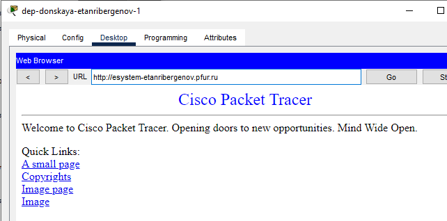{#fig:021}

{#fig:022}

Сеть администрации:

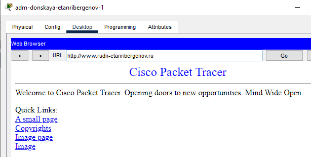{#fig:023}

{#fig:024}

Компьютер администратора:

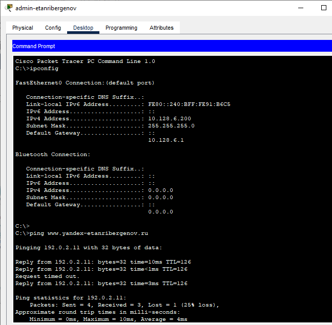{#fig:025}

Проверка доступа к узлам локальной сети из Интернета (проверка работоспособности настроек NAT):

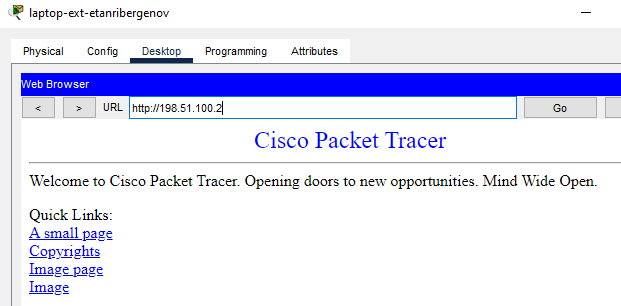{#fig:026}

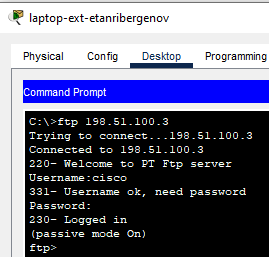{#fig:027}

# Ответы на контрольные вопросы

1. Принцип работы NAT заключается в том, чтобы осуществлять перевод частного локального IP-адреса в общедоступный глобальный IP-адрес и наоборот. Это необходимо для обеспечения доступа к Интернету локальным узлам, использующим частные адреса.
2. NAT настраивается на маршрутизаторе.
3. Да. Преобразования NAT источника или назначения могут применяться к любому интерфейсу или подинтерфейсу с IP-адресом (включая интерфейсы программы набора номера).
4. Пул IP NAT - это набор из одного или нескольких общедоступных IPv4-адресов, которые используются в маршрутизаторе NAT.
5. Статическое преобразование сетевых адресов (NAT) выполняет взаимно однозначное преобразование внутренних IP-адресов во внешние.

# Выводы

Я приобрёл практические навыки по настройке доступа локальной сети к внешней сети посредством NAT.
