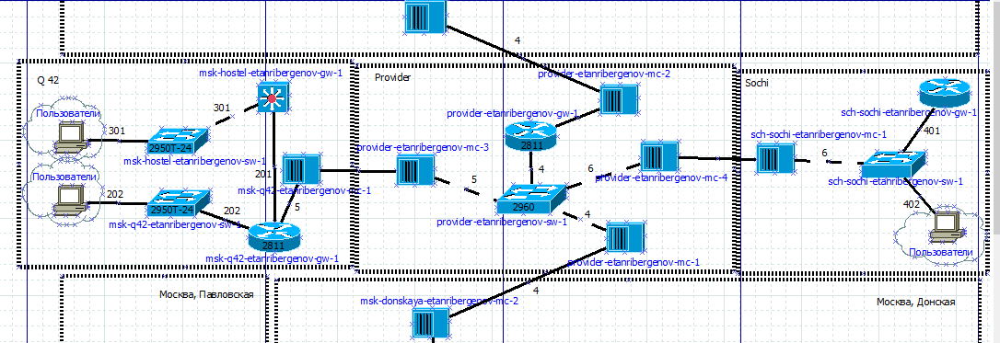
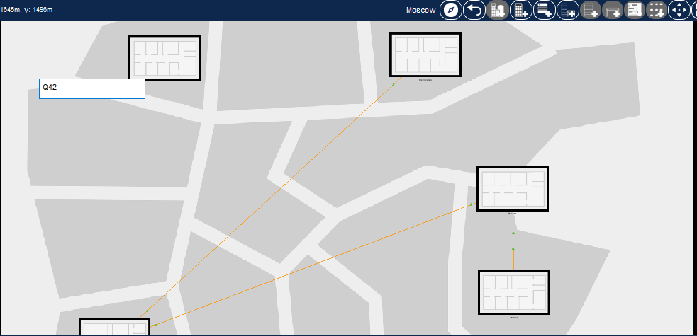
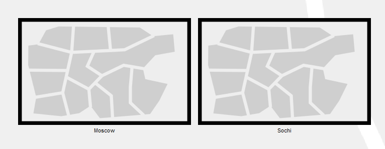
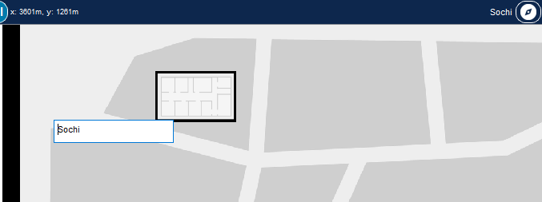
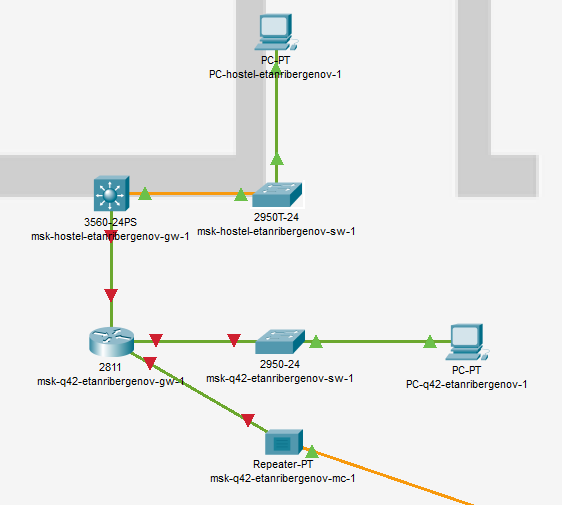
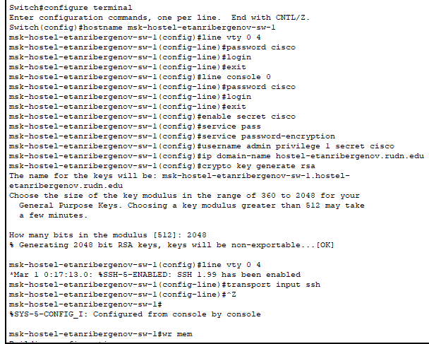

---
## Front matter
lang: ru-RU
title: "Лабораторная работа № 13"
subtitle: "Статическая маршрутизация в Интернете. Планирование"
author:
  - "Танрибергенов Эльдар"
institute:
  - "Российский университет дружбы народов, Москва, Россия"
date: 2024 г.

## i18n babel
babel-lang: russian
babel-otherlangs: english

## Formatting pdf
toc: false
toc-title: Содержание
slide_level: 2
aspectratio: 169
section-titles: true
theme: metropolis
header-includes:
 - \metroset{progressbar=frametitle,sectionpage=progressbar,numbering=fraction}
 - '\makeatletter'
 - '\beamer@ignorenonframefalse'
 - '\makeatother'
---

# Цели и задачи

## Цель лабораторной работы

Провести подготовительные мероприятия по организации взаимодействия через сеть провайдера посредством статической маршрутизации локальной сети с сетью основного здания, расположенного в 42-м квартале в Москве, и сетью филиала, расположенного в г. Сочи.

## Задачи

1. Внести изменения в схемы L1, L2 и L3 сети, добавив в них информацию о сети основной территории (42-й квартал в Москве) и сети филиала в г. Сочи.
2. Дополнить схему проекта, добавив подсеть основной территории организации 42-го квартала в Москве и подсеть филиала в г. Сочи.
3. Сделать первоначальную настройку добавленного в проект оборудования.

# Выполнение работы

## Изменения в схемы L1, L2 и L3 сети

{#fig:001 width=80% height=80%}

## Изменения в схемы L1, L2 и L3 сети

{#fig:002 width=80% height=80%}

## Изменения в схемы L1, L2 и L3 сети

{#fig:003 width=80% height=80%}

## Размещение необходимого оборудования

Добавлено оборудование:

- 4 медиаконвертера (Repeater-PT),
- 2 маршрутизатора типа Cisco 2811,
- 1 маршрутизирующий коммутатор типа Cisco 3560-24PS,
- 2 коммутатора типа Cisco 2950-24, коммутатор Cisco 2950-24T,
- 3 оконечных устройства типа PC-PT.

## Размещение необходимого оборудования

{#fig:004 width=80% height=80%}

## Добавление в физической рабочей области в г. Москва здание 42 квартала

{#fig:005 width=80% height=80%}

## Добавление в физической рабочей области в г. Сочи здания филиала

{#fig:006}

## Добавление в физической рабочей области в г. Сочи здания филиала

{#fig:007}

## Перенос из сети «Донская» оборудования сети 42-го квартала и сети филиала в Сочи в соответствующие здания

{#fig:008 width=80% height=80%}

## Перенос из сети «Донская» оборудования сети 42-го квартала и сети филиала в Сочи в соответствующие здания

{#fig:009 width=80% height=80%}

## Первоначальная настройка устройств

- Добавлены пароли на привелегированный режим и на подключение к виртуальным терминалам (line vty 0 4), консоли (line console 0)
- Добавлено шифрование паролей
- Добавлено доменное имя
- Добавлен пользователь admin с уровнем привилегий 1
- Сгенерирован криптоключ для подключения по SSH
- Настроен в качестве транспорта входящего подключения протокол SSH.

## Первоначальная настройка устройств

{#fig:010 width=80% height=80%}

# Результаты

## Результат

- Внесены изменения в схемы L1, L2 и L3 сети, добавлением в них информации о сети основной территории (42-й квартал в Москве) и сети филиала в г. Сочи.
- Дополнена схему проекта, добавлением подсети основной территории организации 42-го квартала в Москве и подсети филиала в г. Сочи.
- Сделана первоначальная настройка добавленного в проект оборудования.

# Вывод

## Вывод

Я провёл подготовительные мероприятия по организации взаимодействия через сеть провайдера посредством статической маршрутизации локальной сети с сетью основного здания, расположенного в 42-м квартале в Москве, и сетью филиала, расположенного в г. Сочи.
