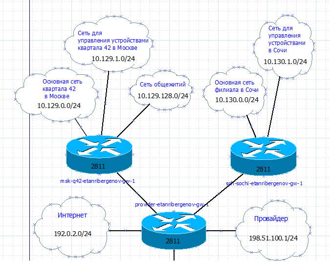
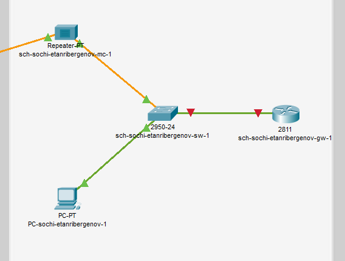

---
## Front matter
title: "Отчёт по лабораторной работе №13"
subtitle: "Дисциплина: Администрирование локальных сетей"
author: "Выполнил: Танрибергенов Эльдар"

## Generic options
lang: ru-RU
toc-title: "Содержание"

## Bibliography
bibliography: ../bib/cite.bib
csl: ../pandoc/csl/gost-r-7-0-5-2008-numeric.csl

## Pdf output format
toc: true # Table of contents
toc-depth: 2
lof: true # List of figures
lot: true # List of tables
fontsize: 12pt
linestretch: 1.5
papersize: a4
documentclass: scrreprt
## I18n polyglossia
polyglossia-lang:
  name: russian
  options:
	- spelling=modern
	- babelshorthands=true
polyglossia-otherlangs:
  name: english
## I18n babel
babel-lang: russian
babel-otherlangs: english
## Fonts
mainfont: PT Serif
romanfont: PT Serif
sansfont: PT Sans
monofont: PT Mono
mainfontoptions: Ligatures=TeX
romanfontoptions: Ligatures=TeX
sansfontoptions: Ligatures=TeX,Scale=MatchLowercase
monofontoptions: Scale=MatchLowercase,Scale=0.9
## Biblatex
biblatex: true
biblio-style: "gost-numeric"
biblatexoptions:
  - parentracker=true
  - backend=biber
  - hyperref=auto
  - language=auto
  - autolang=other*
  - citestyle=gost-numeric
## Pandoc-crossref LaTeX customization
figureTitle: "Рис."
tableTitle: "Таблица"
listingTitle: "Листинг"
lofTitle: "Список иллюстраций"
lotTitle: "Список таблиц"
lolTitle: "Листинги"
## Misc options
indent: true
header-includes:
  - \usepackage{indentfirst}
  - \usepackage{float} # keep figures where there are in the text
  - \floatplacement{figure}{H} # keep figures where there are in the text
---

# Цель работы

Провести подготовительные мероприятия по организации взаимодействия через сеть провайдера посредством статической маршрутизации локальной сети с сетью основного здания, расположенного в 42-м квартале в Москве, и сетью филиала, расположенного в г. Сочи.

# Задание

1. Внести изменения в схемы L1, L2 и L3 сети, добавив в них информацию о сети основной территории (42-й квартал в Москве) и сети филиала в г. Сочи.
2. Дополнить схему проекта, добавив подсеть основной территории организации 42-го квартала в Москве и подсеть филиала в г. Сочи.
3. Сделать первоначальную настройку добавленного в проект оборудования.

# Выполнение лабораторной работы

1. Внёс изменения в схемы L1, L2 и L3 сети.

{#fig:001}

{#fig:002}

{#fig:003}

2. На схеме предыдущего проекта разместил необходимое оборудование: 4 медиаконвертера (Repeater-PT), 2 маршрутизатора типа Cisco 2811, 1 маршрутизирующий коммутатор типа Cisco 3560-24PS, 2 коммутатора типа Cisco 2950-24, коммутатор Cisco 2950-24T, 3 оконечных устройства типа PC-PT.

{#fig:004}

3. Присвоил названия размещённым объектам.

{#fig:005}

4. На медиаконвертерах заменил имеющиеся модули на PT-REPEATER-NM-1FFE и PT-REPEATER-NM-1CFE для подключения витой пары по технологии Fast Ethernet и оптоволокна соответственно.

{#fig:006}

{#fig:007}

5. На маршрутизаторе msk-q42-gw-1 добавил дополнительный интерфейс NM-2FE2W.

{#fig:008}

6. В физической рабочей области Packet Tracer добавил в г. Москва здание 42-го квартала, присвоил ему соответствующее название.

{#fig:009}

7. В физической рабочей области Packet Tracer добавил город Сочи и в нём здание филиала, присвоил ему соответствующее название.

{#fig:010}

{#fig:011}

8. Перенёс из сети «Донская» оборудование сети 42-го квартала и сети филиала в соответствующие здания.

{#fig:012}

{#fig:013}

{#fig:014}

{#fig:015}

Разместил перенесённые устройства в соответствующих зданиях в физической рабочей области Packet Tracer.

{#fig:016}

{#fig:017}

9. Провёл соединение объектов согласно скорректированной схеме L1.

{#fig:018}

10. Провёл первоначальную настройку устройств.

В Москве, 42 квартале:

{#fig:019}

{#fig:020}

{#fig:021}

{#fig:022}

{#fig:023}

{#fig:024}

В Сочи:

{#fig:025}

{#fig:026}

# Ответы на контрольные вопросы

1. Статическую маршрутизацию рекомендуется применять тогда, когда ваша сеть взаимодействует с одной или двумя другими сетями, но не более.

2. Устаревший метод: по одному интерфейсу коммутатора из каждой VLAN соединяется с интерфейсом маршрутизатора. Недостаток метода - для каждой VLAN нужен отдельный интерфейс маршрутизатора.

Маршрутизация с использованием коммутатора 3 уровня - предпочтительный метод, не требующий маршрутизатора. Многоуровневая коммутация масштабируется лучше, чем любая другая реализация маршрутизации между VLAN.

Router-on-a-stick: маршрутизатор и коммутатор соединены 1 транковым каналом, который передаёт информацию для всех VLAN. Максимальное количество VLAN при данном методе - 50.

# Выводы

Я провёл подготовительные мероприятия по организации взаимодействия через сеть провайдера посредством статической маршрутизации локальной сети с сетью основного здания, расположенного в 42-м квартале в Москве, и сетью филиала, расположенного в г. Сочи.
