---
## Front matter
lang: ru-RU
title: "Лабораторная работа № 14"
subtitle: "Статическая маршрутизация в Интернете. Настройка"
author:
  - "Танрибергенов Эльдар"
institute:
  - "Российский университет дружбы народов, Москва, Россия"
date: 2024 г.

## i18n babel
babel-lang: russian
babel-otherlangs: english

## Formatting pdf
toc: false
toc-title: Содержание
slide_level: 2
aspectratio: 169
section-titles: true
theme: metropolis
header-includes:
 - \metroset{progressbar=frametitle,sectionpage=progressbar,numbering=fraction}
 - '\makeatletter'
 - '\beamer@ignorenonframefalse'
 - '\makeatother'
---

# Цели и задачи

## Цель лабораторной работы

Настроить взаимодействие через сеть провайдера посредством статической маршрутизации локальной сети организации с сетью основного здания, расположенного в 42-м квартале в Москве, и сетью филиала, расположенного в г. Сочи.

## Задачи

1. Настроить связь между территориями.
2. Настроить оборудование, расположенное в квартале 42 в Москве.
3. Настроить оборудование, расположенное в филиале в г. Сочи.
4. Настроить статическую маршрутизацию между территориями.
5. Настроить статическую маршрутизацию на территории квартала 42 в г. Москва.
6. Настроить NAT на маршрутизаторе msk-donskaya-etanribergenov-gw-1.

# Выполнение работы

## Настройка связи между площадками

- Интерфейсы коммутаторов переведены в режим "нетэгированный" (trunk)
- Добавлены vlan-ы и включены соответствующие им интерфейсы  на коммутаторах
- На маршрутизаторах добавлены подыинтерфейсы для маршрутизации устройств из разных vlan

## Настройка связи между площадками

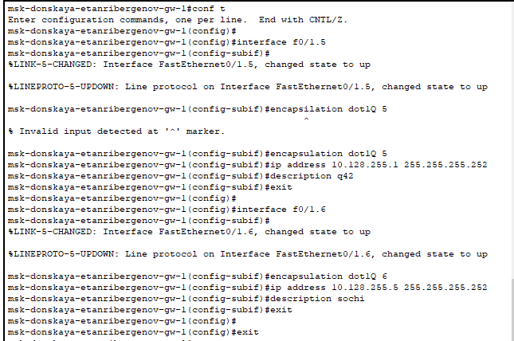{#fig:001 witdh=75% height=75%}

## Настройка связи между площадками

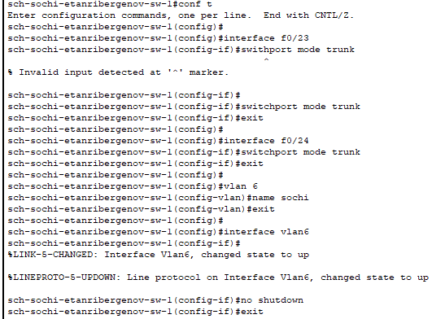{#fig:002 witdh=75% height=75%}

## Настройка площадки 42-го квартала

- Объекты распределены в разные VLAN
- Настроена маршрутизация между устройствами из разных VLAN

## Настройка площадки 42-го квартала

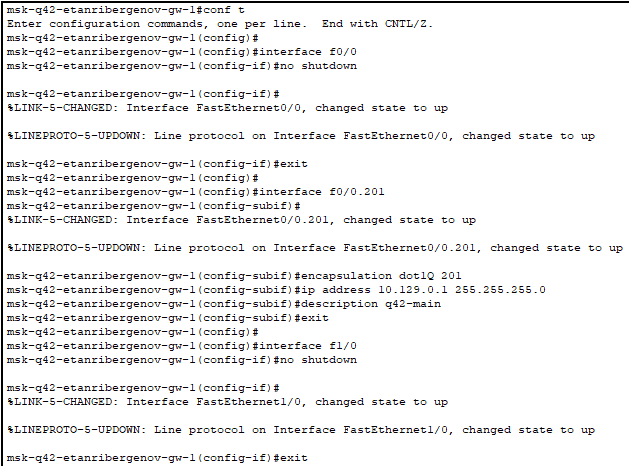{#fig:003 witdh=75% height=75%}

## Настройка площадки 42-го квартала

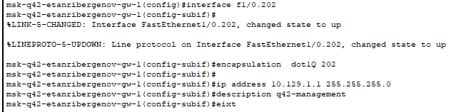{#fig:004}

## Настройка площадки 42-го квартала

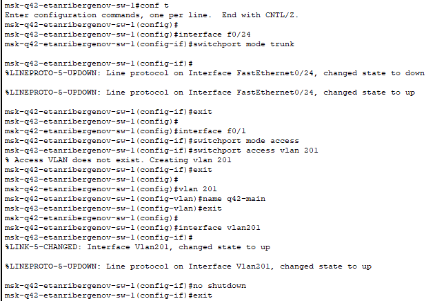{#fig:005 witdh=75% height=75%}

## Настройка площадки в Сочи

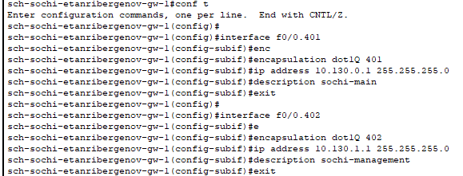{#fig:006}

## Настройка площадки в Сочи

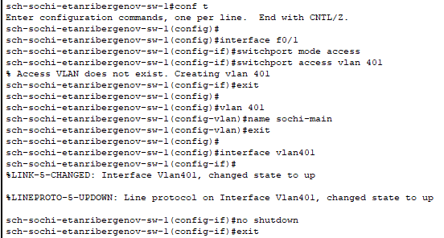{#fig:007 witdh=75% height=75%}

## Настройка маршрутизации между площадками

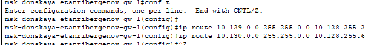{#fig:008}

## Настройка маршрутизации между площадками

{#fig:009}

## Настройка маршрутизации между площадками

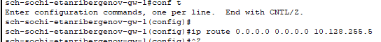{#fig:010}

## Настройка маршрутизации на 42 квартале

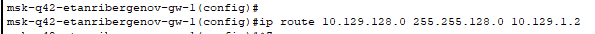{#fig:011}

## Настройка маршрутизации на 42 квартале

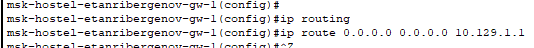{#fig:012}

## Настройка NAT на маршрутизаторе msk-donskaya-gw-1

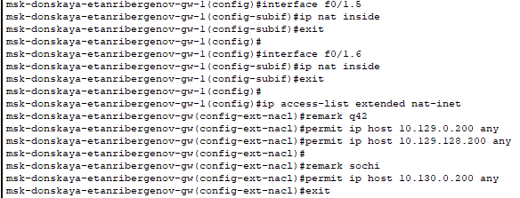{#fig:013}

# Результаты

## Результат

- Настроена связь между территориями.
- Настроено оборудование, расположенное в квартале 42 в Москве.
- Настроено оборудование, расположенное в филиале в г. Сочи.
- Настроена статическая маршрутизация между территориями.
- Настроена статическая маршрутизация на территории квартала 42 в г. Москва.
- Настроено NAT на маршрутизаторе msk-donskaya-etanribergenov-gw-1.

# Вывод

## Вывод

Я настроил взаимодействие через сеть провайдера посредством статической маршрутизации локальной сети организации с сетью основного здания, расположенного в 42-м квартале в Москве, и сетью филиала, расположенного в г. Сочи.
