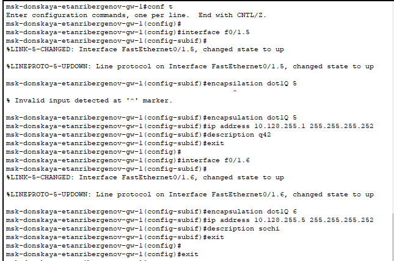
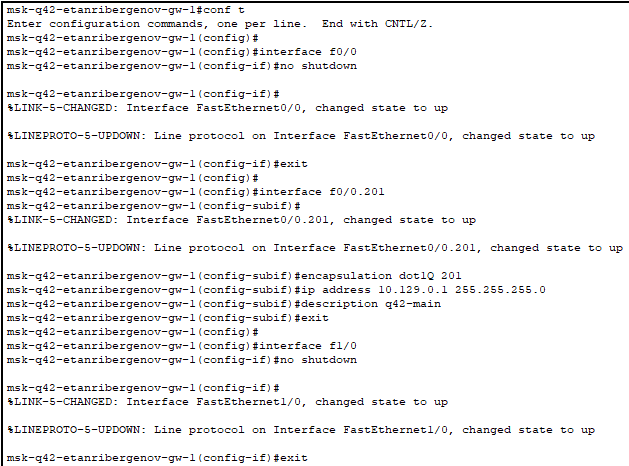
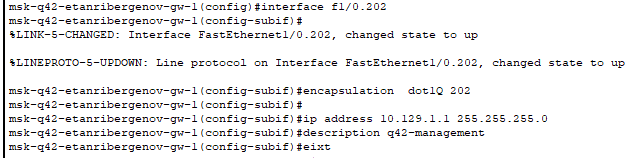
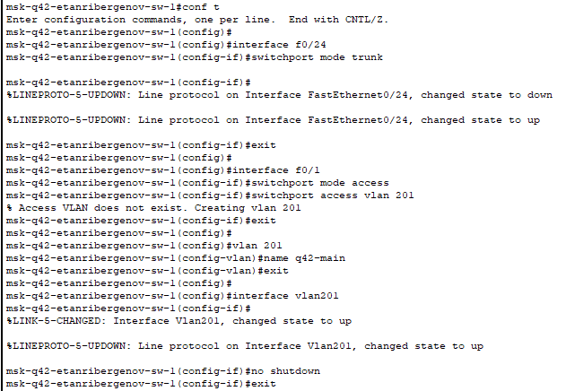
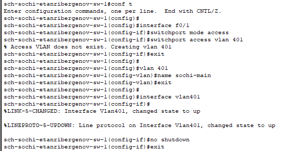
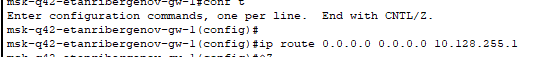
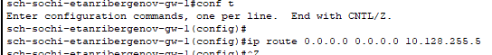
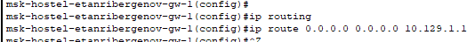

---
## Front matter
title: "Отчёт по лабораторной работе №14"
subtitle: "Дисциплина: Администрирование локальных сетей"
author: "Выполнил: Танрибергенов Эльдар"

## Generic options
lang: ru-RU
toc-title: "Содержание"

## Bibliography
bibliography: ../bib/cite.bib
csl: ../pandoc/csl/gost-r-7-0-5-2008-numeric.csl

## Pdf output format
toc: true # Table of contents
toc-depth: 2
lof: true # List of figures
lot: true # List of tables
fontsize: 12pt
linestretch: 1.5
papersize: a4
documentclass: scrreprt
## I18n polyglossia
polyglossia-lang:
  name: russian
  options:
	- spelling=modern
	- babelshorthands=true
polyglossia-otherlangs:
  name: english
## I18n babel
babel-lang: russian
babel-otherlangs: english
## Fonts
mainfont: PT Serif
romanfont: PT Serif
sansfont: PT Sans
monofont: PT Mono
mainfontoptions: Ligatures=TeX
romanfontoptions: Ligatures=TeX
sansfontoptions: Ligatures=TeX,Scale=MatchLowercase
monofontoptions: Scale=MatchLowercase,Scale=0.9
## Biblatex
biblatex: true
biblio-style: "gost-numeric"
biblatexoptions:
  - parentracker=true
  - backend=biber
  - hyperref=auto
  - language=auto
  - autolang=other*
  - citestyle=gost-numeric
## Pandoc-crossref LaTeX customization
figureTitle: "Рис."
tableTitle: "Таблица"
listingTitle: "Листинг"
lofTitle: "Список иллюстраций"
lotTitle: "Список таблиц"
lolTitle: "Листинги"
## Misc options
indent: true
header-includes:
  - \usepackage{indentfirst}
  - \usepackage{float} # keep figures where there are in the text
  - \floatplacement{figure}{H} # keep figures where there are in the text
---

# Цель работы

Настроить взаимодействие через сеть провайдера посредством статической маршрутизации локальной сети организации с сетью основного здания, расположенного в 42-м квартале в Москве, и сетью филиала, расположенного в г. Сочи.

# Задание

1. Настроить связь между территориями.
2. Настроить оборудование, расположенное в квартале 42 в Москве.
3. Настроить оборудование, расположенное в филиале в г. Сочи.
4. Настроить статическую маршрутизацию между территориями.
5. Настроить статическую маршрутизацию на территории квартала 42 в г. Москва.
6. Настроить NAT на маршрутизаторе msk-donskaya-gw-1.

# Выполнение лабораторной работы

1. Настройка связи между площадками

{#fig:001}

{#fig:002}

{#fig:003}

{#fig:004}

{#fig:005}

{#fig:006}

2. Настройка площадки 42-го квартала

{#fig:007}

{#fig:008}

{#fig:009}

{#fig:010}

{#fig:011}

{#fig:012}

3. Настройка площадки в Сочи

{#fig:013}

{#fig:014}

4. Настройка маршрутизации между площадками

{#fig:015}

{#fig:016}

{#fig:017}

5. Настройка маршрутизации на 42 квартале

{#fig:018}

{#fig:019}

6. Настройка NAT на маршрутизаторе msk-donskaya-gw-1

{#fig:020}

# Ответы на контрольные вопросы

1. Пример настройки статической маршрутизации между двумя подсетями организации:

 ip route 10.129.0.0   255.255.0.0   10.128.255.2   
 ip route 0.0.0.0       0.0.0.0          10.128.255.1

2. Допустим, узел из одного VLAN хочет получить доступ к узлу из другого VLAN. Узел источник знает IP-адрес адресата и также знает, что этот адрес не принадлежит его сети. Поэтому он формирует IP-пакет на адрес основного шлюза сети (роутера), помещает его в Ethernet-кадр и отправляет на порт коммутатора. Коммутатор добавляет к кадру тег и доставляет его роутеру.
Роутер получает данный кадр, извлекает из него IP-пакет и анализирует заголовки. Обнаружив адрес назначения, он сверяется с таблицей маршрутизации и принимает решение куда отправить данный пакет дальше. После чего формируется новый Ethernet-кадр, который получает тег с новым VLAN ID сети-получателя, в него помещается IP-пакет, и он отправляется по назначению.

3. Проверить работоспособность маршрута можно командой tracert или traceroute.

4. Посмотреть таблицу маршрутизации позволяет команда show ip route.

# Выводы

Я настроил взаимодействие через сеть провайдера посредством статической маршрутизации локальной сети организации с сетью основного здания, расположенного в 42-м квартале в Москве, и сетью филиала, расположенного в г. Сочи.

