---
## Front matter
lang: ru-RU
title: "Лабораторная работа № 15"
subtitle: "Динамическая маршрутизация"
author:
  - "Танрибергенов Эльдар"
institute:
  - "Российский университет дружбы народов, Москва, Россия"
date: 2024 г.

## i18n babel
babel-lang: russian
babel-otherlangs: english

## Formatting pdf
toc: false
toc-title: Содержание
slide_level: 2
aspectratio: 169
section-titles: true
theme: metropolis
header-includes:
 - \metroset{progressbar=frametitle,sectionpage=progressbar,numbering=fraction}
 - '\makeatletter'
 - '\beamer@ignorenonframefalse'
 - '\makeatother'
---

# Цели и задачи

## Цель лабораторной работы

Настроить динамическую маршрутизацию между территориями организации.

## Задачи

1. Настроить динамическую маршрутизацию по протоколу OSPF на маршрутизаторах.
2. Настроить связь сети квартала 42 в Москве с сетью филиала в г. Сочи напрямую.
3. В режиме симуляции отследить движение пакета ICMP с ноутбука администратора сети на Донской в Москве (Laptop-PT admin-etanribergenov) до компьютера пользователя в филиале в г. Сочи pc-sochi-etanribergenov-1.
4. На коммутаторе провайдера отключить временно vlan 6 и в режиме симуляции убедиться в изменении маршрута прохождения пакета ICMP с ноутбука администратора сети на Донской в Москве (Laptop-PT admin-etanribergenov) до компьютера пользователя в филиале в г. Сочи pc-sochi-etanribergenov-1.
5. На коммутаторе провайдера восстановить vlan 6 и в режиме симуляции убедиться в изменении маршрута прохождения пакета ICMP с ноутбука администратора сети на Донской в Москве (Laptop-PT admin-etanribergenov) до компьютера пользователя в филиале в г. Сочи pc-sochi-etanribergenov-1.

# Выполнение работы

## Настройка динамической маршрутизации по протоколу OSPF на маршрутизаторах

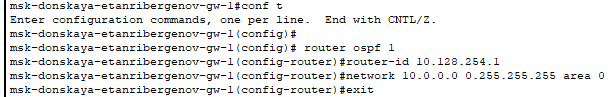{#fig:001 width=75% height=75%}

## Настройка динамической маршрутизации по протоколу OSPF на маршрутизаторах

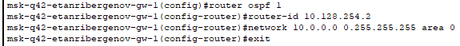{#fig:002 width=75% height=75%}

## Настройка динамической маршрутизации по протоколу OSPF на маршрутизаторах

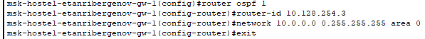{#fig:003 width=75% height=75%}

## Настройка динамической маршрутизации по протоколу OSPF на маршрутизаторах

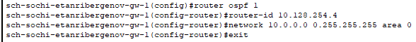{#fig:004 width=75% height=75%}

## Настройка связи сети квартала 42 в Москве с сетью филиала в г. Сочи напрямую

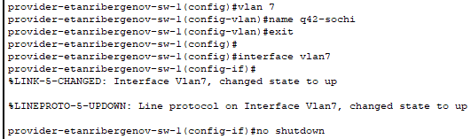{#fig:005 width=75% height=75%}

## Настройка связи сети квартала 42 в Москве с сетью филиала в г. Сочи напрямую

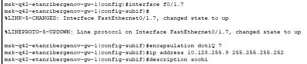{#fig:006 width=75% height=75%}

## Настройка связи сети квартала 42 в Москве с сетью филиала в г. Сочи напрямую

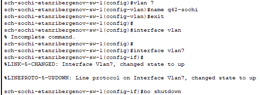{#fig:007 width=75% height=75%}

## Настройка связи сети квартала 42 в Москве с сетью филиала в г. Сочи напрямую

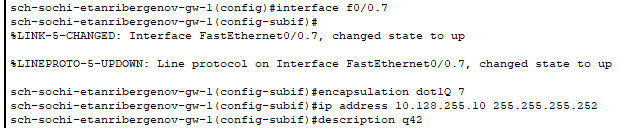{#fig:008 width=75% height=75%}

## Проверка динамической маршрутизации

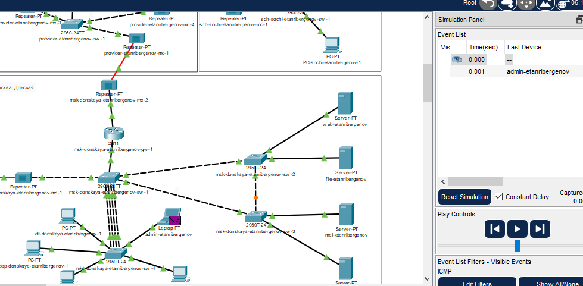{#fig:009  width=75% height=75%}

## Проверка динамической маршрутизации

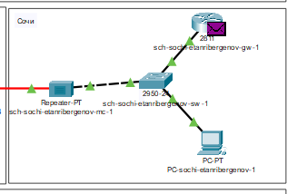{#fig:010 width=75% height=75%}

## Проверка динамической маршрутизации

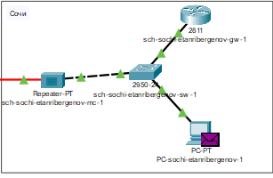{#fig:011 width=75% height=75%}

## Проверка динамической маршрутизации

- Временное выключение vlan 6 на коммутаторе провайдера для проверки, что маршрут изменится

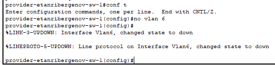{#fig:012 width=75% height=75%}

## Проверка динамической маршрутизации

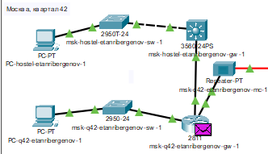{#fig:013 width=75% height=75%}

## Проверка динамической маршрутизации

- Включение vlan 6 на коммутаторе провайдера для проверки, что маршрут вновь изменится

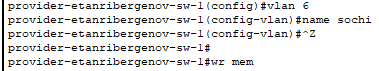{#fig:014 width=75% height=75%}

## Проверка динамической маршрутизации

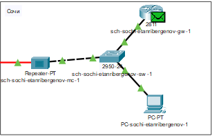{#fig:015 width=75% height=75%}

# Результаты

## Результат

- Настроена динамическая маршрутизация по протоколу OSPF на маршрутизаторах.
- Настроена связь сети квартала 42 в Москве с сетью филиала в г. Сочи напрямую.
- В режиме симуляции проверена работоспособность динамической маршрутизации.

# Вывод

## Вывод

Я приобрёл практические навыки по настройке динамической маршрутизации между территориями организации.