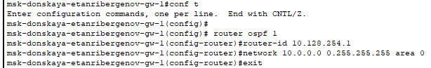
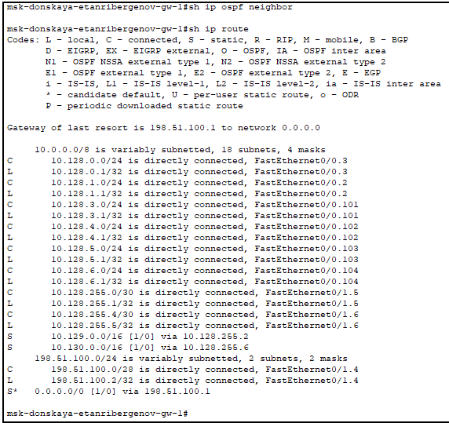
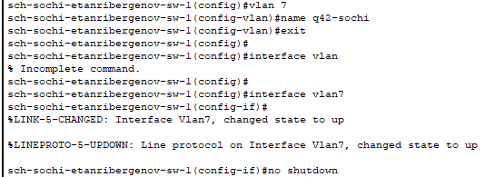
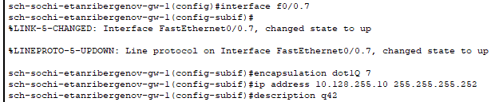
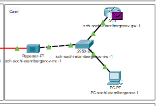
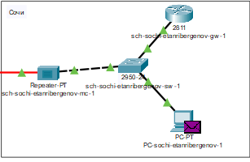
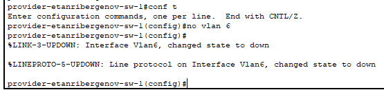
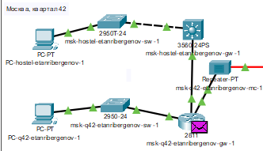
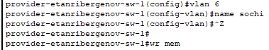
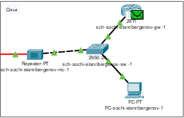

---
## Front matter
title: "Отчёт по лабораторной работе №15"
subtitle: "Дисциплина: Администрирование локальных сетей"
author: "Выполнил: Танрибергенов Эльдар"

## Generic options
lang: ru-RU
toc-title: "Содержание"

## Bibliography
bibliography: ../bib/cite.bib
csl: ../pandoc/csl/gost-r-7-0-5-2008-numeric.csl

## Pdf output format
toc: true # Table of contents
toc-depth: 2
lof: true # List of figures
lot: true # List of tables
fontsize: 12pt
linestretch: 1.5
papersize: a4
documentclass: scrreprt
## I18n polyglossia
polyglossia-lang:
  name: russian
  options:
	- spelling=modern
	- babelshorthands=true
polyglossia-otherlangs:
  name: english
## I18n babel
babel-lang: russian
babel-otherlangs: english
## Fonts
mainfont: PT Serif
romanfont: PT Serif
sansfont: PT Sans
monofont: PT Mono
mainfontoptions: Ligatures=TeX
romanfontoptions: Ligatures=TeX
sansfontoptions: Ligatures=TeX,Scale=MatchLowercase
monofontoptions: Scale=MatchLowercase,Scale=0.9
## Biblatex
biblatex: true
biblio-style: "gost-numeric"
biblatexoptions:
  - parentracker=true
  - backend=biber
  - hyperref=auto
  - language=auto
  - autolang=other*
  - citestyle=gost-numeric
## Pandoc-crossref LaTeX customization
figureTitle: "Рис."
tableTitle: "Таблица"
listingTitle: "Листинг"
lofTitle: "Список иллюстраций"
lotTitle: "Список таблиц"
lolTitle: "Листинги"
## Misc options
indent: true
header-includes:
  - \usepackage{indentfirst}
  - \usepackage{float} # keep figures where there are in the text
  - \floatplacement{figure}{H} # keep figures where there are in the text
---

# Цель работы

Настроить динамическую маршрутизацию между территориями организации.

# Задание

1. Настроить динамическую маршрутизацию по протоколу OSPF на маршрутизаторах msk-donskaya-gw-1, msk-q42-gw-1, msk-hostel-gw-1, sch-sochi-gw-1.
2. Настроить связь сети квартала 42 в Москве с сетью филиала в г. Сочи напрямую.
3. В режиме симуляции отследить движение пакета ICMP с ноутбука администратора сети на Донской в Москве (Laptop-PT admin) до компьютера пользователя в филиале в г. Сочи pc-sochi-1.
4. На коммутаторе провайдера отключить временно vlan 6 и в режиме симуляции убедиться в изменении маршрута прохождения пакета ICMP с ноутбука администратора сети на Донской в Москве (Laptop-PT admin) до компьютера пользователя в филиале в г. Сочи pc-sochi-1.
5. На коммутаторе провайдера восстановить vlan 6 и в режиме симуляции убедиться в изменении маршрута прохождения пакета ICMP с ноутбука администратора сети на Донской в Москве (Laptop-PT admin) до компьютера пользователя в филиале в г. Сочи pc-sochi-1.

# Выполнение лабораторной работы

1. Настроил динамическую маршрутизацию по протоколу OSPF на маршрутизаторах.

Включение OSPF на маршрутизаторе предполагает, во-первых, включение процесса OSPF командой router ospf \<process-id\>, 
во-вторых - назначение областей (зон) интерфейсам с помощью команды network \<network or IP address\> \<mask\> area \<area-id\>

{#fig:001}

Идентификатор процесса OSPF (process-id) по сути идентифицирует маршрутизатор в автономной системе, и, вообще говоря, он не должен совпадать с идентификаторами процессов на других маршрутизаторах.

Значение идентификатора области (area-id) может быть целым числом от 0 до 4294967295 или может быть представлено в виде IP-адреса: A.B.C.D.
Область 0 называется магистралью, области с другими идентификаторами должны подключаться к магистрали.

Проверил состояние протокола OSPF на маршрутизаторе msk-donskaya-gw-1:

{#fig:002}

{#fig:003}

{#fig:004}

Маршрутизаторы с общим сегментом являются соседями в этом сегменте. Соседи выбираются с помощью протокола Hello.
Команда show ip ospf neighbor показывает статус всех соседей в заданном сегменте.
Команда show ip ospf route (или show ip route) выводит информацию из таблицы маршрутизации.

{#fig:005}

{#fig:006}

{#fig:007}

Проверил состояние протокола OSPF на всех маршрутизаторах. У маршрутизаторов sch-sochi-... и msk-q42-... по одному соседу с одинаковым идентификатором, у msk-donskaya-... 2 соседа.

{#fig:008}

{#fig:009}

{#fig:010}

{#fig:011}

{#fig:012}

{#fig:013}

{#fig:014}

{#fig:015}

{#fig:016}

2. Настроил связь сети квартала 42 в Москве с сетью филиала в г. Сочи напрямую.

{#fig:017}

{#fig:018}

{#fig:019}

{#fig:020}

3. В режиме симуляции отследил движение пакета ICMP с ноутбука администратора сети на Донской в Москве до компьютера пользователя в филиале в г. Сочи pc-sochi-etanribergenov-1.

{#fig:021}

Пакет сначала доходит до маршрутизатора территории Сочи, а затем уже попадает на пк.

{#fig:022}

{#fig:023}

4. На коммутаторе провайдера отключил временно vlan 6 и в режиме симуляции убедился в изменении маршрута прохождения пакета ICMP с ноутбука администратора сети на Донской в Москве (Laptop-PT admin) до компьютера пользователя в филиале в г. Сочи pc-sochi-1.

{#fig:024}

Теперь пакет приходит на маршрутизатор в 42 квартале в Москве, после чего направляется к целевому пк.

{#fig:025}

5. На коммутаторе провайдера восстановил vlan 6 и в режиме симуляции убедился в изменении маршрута прохождения пакета ICMP с ноутбука администратора сети на Донской в Москве (Laptop-PT admin) до компьютера пользователя в филиале в г. Сочи pc-sochi-1.

{#fig:026}

Маршрут прохождения пакета ICMP снова перестроился. Пакет от коммутатора провайдера идёт напрямую к маршрутизатору в Сочи, а оттуда - к целевому пк.

{#fig:027}

# Ответы на контрольные вопросы

1.  RIP, RIPv2, IGRP, EIGRP, OSPF, Intermediate System-to-Intermediate System (IS-IS) - относятся к протоколам динамической маршрутизации.

2. Принцип работы протокола OSPF (Open Shortest Path First) заключается в следующем:
После включения маршрутизаторов протокол ищет непосредственно подключенных соседей и устанавливает с ними «дружеские» отношения.
Затем они обмениваются друг с другом информацией о подключенных и доступных им сетях, то есть строят карту сети (топологию сети).
На основе полученной информации запускается алгоритм SPF (Shortest Path First, «выбор наилучшего пути»), который рассчитывает оптимальный маршрут к каждой сети.

3. Маршрутизаторы периодически обмениваются специальной топологической информацией об имеющихся в интерсети сетях, а также о связях между маршрутизаторами. Обычно учитывается не только топология связей, но и их пропускная способность и состояние.

4. При просмотре таблицы маршрутизации отображается следующая информация:

- Адрес сети или узла назначения. Также может стоять маршрут по умолчанию.
- Маска сети назначения. С помощью маски указывается единичный адрес или же некоторый диапазон адресов.
- Шлюз, обозначающий адрес маршрутизатора в сети.
- Интерфейс, через который доступен шлюз.
- Метрика — числовой показатель, задающий предпочтительность маршрута.

# Выводы

Я приобрёл практические навыки по настройке динамической маршрутизации между территориями организации.
