---
## Front matter
lang: ru-RU
title: "Лабораторная работа № 16"
subtitle: "Настройка VPN"
author:
  - "Танрибергенов Эльдар"
institute:
  - "Российский университет дружбы народов, Москва, Россия"
date: 2024 г.

## i18n babel
babel-lang: russian
babel-otherlangs: english

## Formatting pdf
toc: false
toc-title: Содержание
slide_level: 2
aspectratio: 169
section-titles: true
theme: metropolis
header-includes:
 - \metroset{progressbar=frametitle,sectionpage=progressbar,numbering=fraction}
 - '\makeatletter'
 - '\beamer@ignorenonframefalse'
 - '\makeatother'
---

# Цели и задачи

## Цель лабораторной работы

Получение навыков настройки VPN-туннеля через незащищённое Интернет-соединение.

## Задачи

Настроить VPN-туннель между сетью Университета г. Пиза (Италия) и сетью «Донская» в г. Москва

# Выполнение работы

## Размещение в рабочей области проекта в соответствии с модельными предположениями оборудования для сети Университета г. Пиза

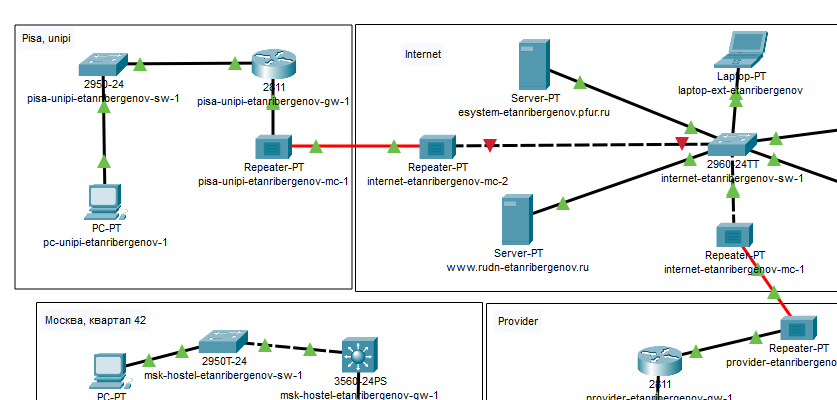{#fig:001 width=75% height=75%}

## Создание города Pisa и здания университета Unipi в нём 

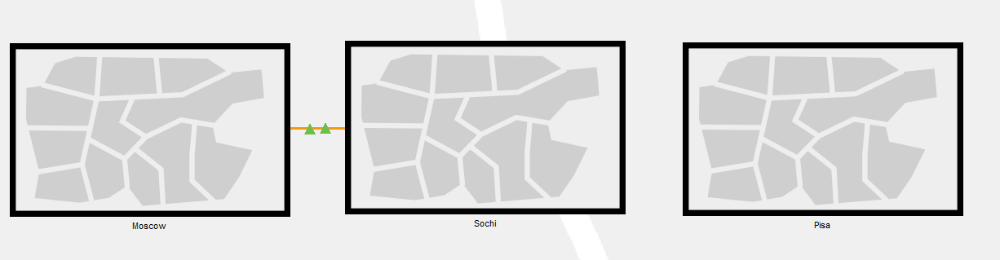{#fig:002 width=75% height=75%}

## Создание города Pisa и здания университета Unipi в нём

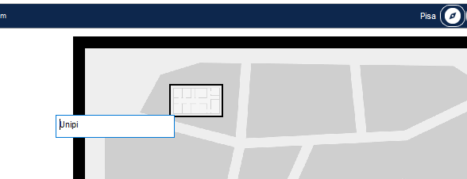{#fig:003 width=75% height=75%}

## Перемещение соответсвующего оборудования в Pisa, Unipi

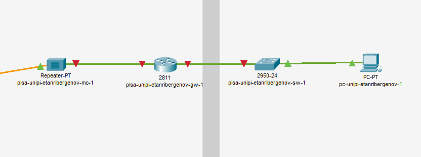{#fig:004 width=75% height=75%}

## Первоначальная настройка оборудования сети Университета г. Пиза

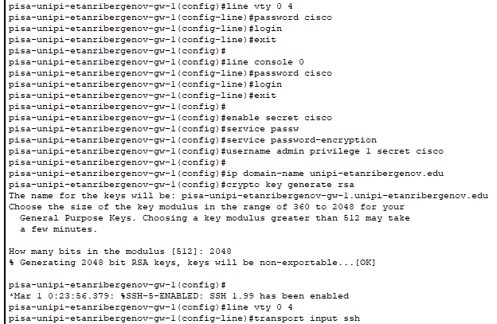{#fig:005 width=75% height=75%}

## Первоначальная настройка оборудования сети Университета г. Пиза

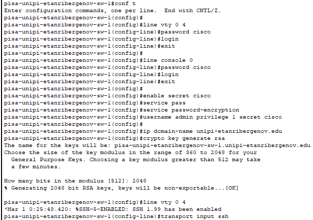{#fig:006 width=75% height=75%}

## Настройка интерфейсов оборудования сети Университета г. Пиза

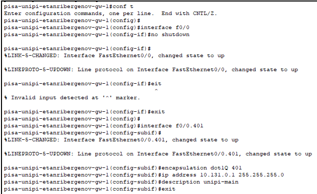{#fig:007 width=75% height=75%}

## Настройка интерфейсов оборудования сети Университета г. Пиза

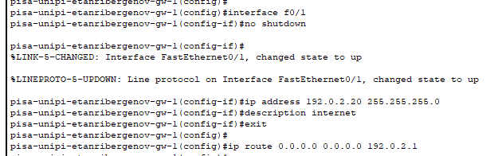{#fig:008 width=75% height=75%}

## Настройка интерфейсов оборудования сети Университета г. Пиза

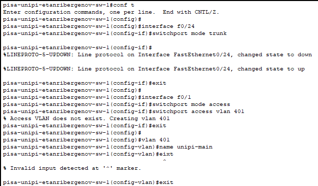{#fig:009 width=75% height=75%}

## Настройка интерфейсов оборудования сети Университета г. Пиза

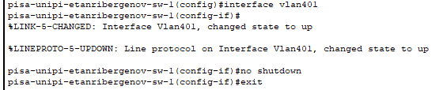{#fig:010 width=75% height=75%}

## Настройка узла pc-unipi-etanribergenov-1 сети Университета г. Пиза

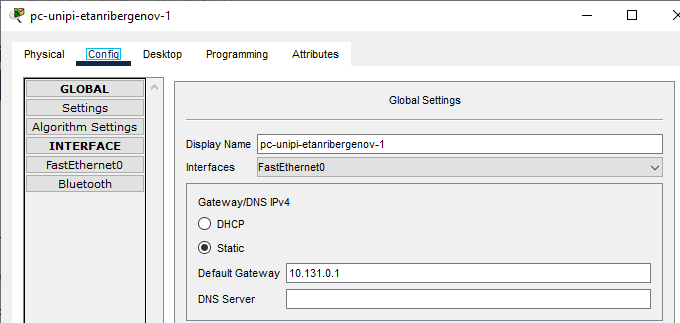{#fig:011 width=75% height=75%}

## Настройка узла pc-unipi-etanribergenov-1 сети Университета г. Пиза

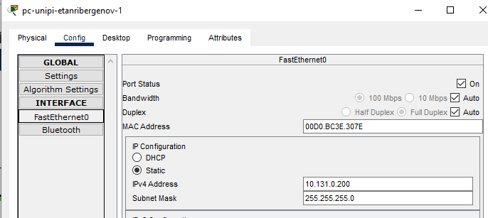{#fig:012 width=75% height=75%}

## Настройка VPN на основе протокола GRE

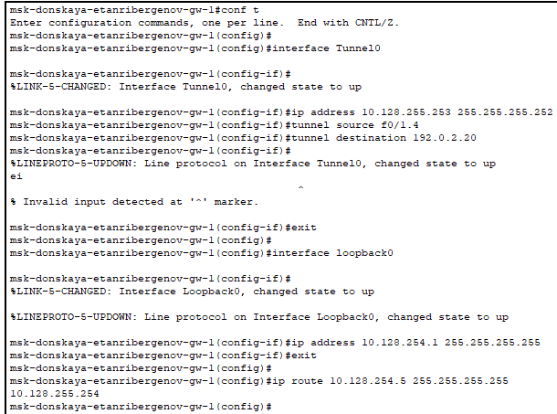{#fig:013 width=75% height=75%}

## Настройка VPN на основе протокола GRE

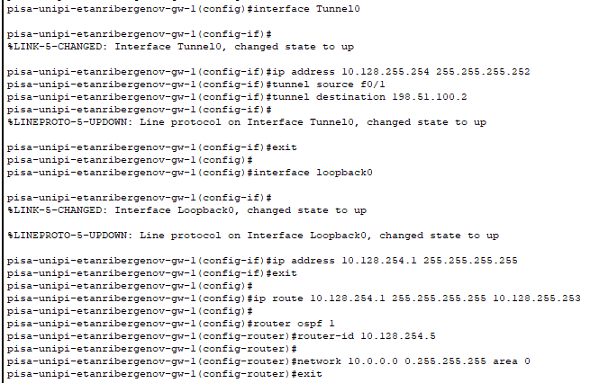{#fig:014 width=75% height=75%}

## Проверка доступности узлов сети Университета г. Пиза с ноутбука администратора сети «Донская»

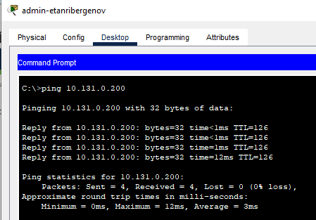{#fig:015 width=75% height=75%}

# Результаты

## Результат

- Добавлена новая площадка - Университет в г. Пиза (Pisa, Unipi)
- Добавлены и настроены устройства в новой площадке
- Настроена VPN на основе протокола GRE

# Вывод

## Вывод

Я приобрёл практические навыки по настройке VPN-туннеля через незащищённое Интернет-соединение.