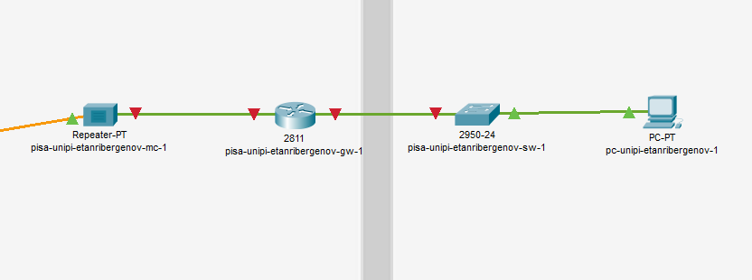
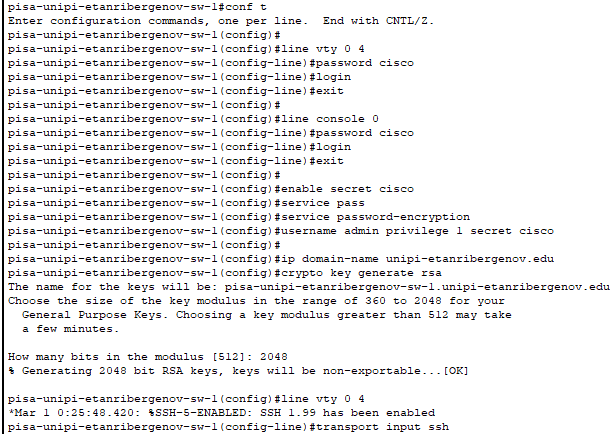
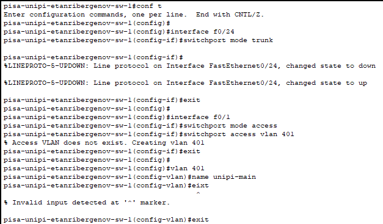
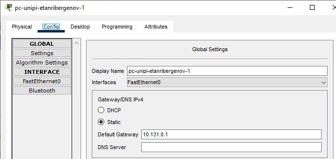
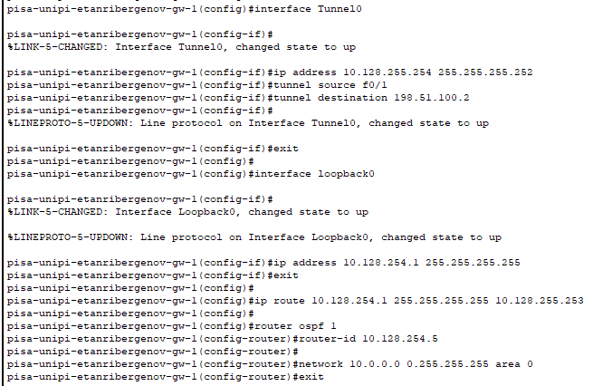

---
## Front matter
title: "Отчёт по лабораторной работе №16"
subtitle: "Дисциплина: Администрирование локальных сетей"
author: "Выполнил: Танрибергенов Эльдар"

## Generic options
lang: ru-RU
toc-title: "Содержание"

## Bibliography
bibliography: ../bib/cite.bib
csl: ../pandoc/csl/gost-r-7-0-5-2008-numeric.csl

## Pdf output format
toc: true # Table of contents
toc-depth: 2
lof: true # List of figures
lot: true # List of tables
fontsize: 12pt
linestretch: 1.5
papersize: a4
documentclass: scrreprt
## I18n polyglossia
polyglossia-lang:
  name: russian
  options:
	- spelling=modern
	- babelshorthands=true
polyglossia-otherlangs:
  name: english
## I18n babel
babel-lang: russian
babel-otherlangs: english
## Fonts
mainfont: PT Serif
romanfont: PT Serif
sansfont: PT Sans
monofont: PT Mono
mainfontoptions: Ligatures=TeX
romanfontoptions: Ligatures=TeX
sansfontoptions: Ligatures=TeX,Scale=MatchLowercase
monofontoptions: Scale=MatchLowercase,Scale=0.9
## Biblatex
biblatex: true
biblio-style: "gost-numeric"
biblatexoptions:
  - parentracker=true
  - backend=biber
  - hyperref=auto
  - language=auto
  - autolang=other*
  - citestyle=gost-numeric
## Pandoc-crossref LaTeX customization
figureTitle: "Рис."
tableTitle: "Таблица"
listingTitle: "Листинг"
lofTitle: "Список иллюстраций"
lotTitle: "Список таблиц"
lolTitle: "Листинги"
## Misc options
indent: true
header-includes:
  - \usepackage{indentfirst}
  - \usepackage{float} # keep figures where there are in the text
  - \floatplacement{figure}{H} # keep figures where there are in the text
---

# Цель работы

Получение навыков настройки VPN-туннеля через незащищённое Интернет-соединение.

# Задание

Настроить VPN-туннель между сетью Университета г. Пиза (Италия) и сетью «Донская» в г. Москва

# Выполнение лабораторной работы

1. Разместил в рабочей области проекта в соответствии с модельными предположениями оборудование для сети Университета г. Пиза.

{#fig:001}

При соединении устройств кабелями заменил имеющиеся у медиаконвертеров модули для подключения витой пары по технологии FE и оптоволокна.

{#fig:002}

2. В физической рабочей области проекта создал город Пиза, здание Университета г. Пиза. 

{#fig:003}

{#fig:004}

Переместил туда соответствующее оборудование.

{#fig:005}

{#fig:006}

{#fig:007}

3. Сделал первоначальную настройку и настройку интерфейсов оборудования сети Университета г. Пиза.

{#fig:008}

{#fig:009}

{#fig:010}

{#fig:011}

{#fig:012}

{#fig:013}

{#fig:014}

{#fig:015}

4. Настроил VPN на основе протокола GRE.

{#fig:016}

{#fig:017}

5. Проверил доступность узлов сети Университета г. Пиза с ноутбука администратора сети «Донская».

{#fig:018}

# Ответы на контрольные вопросы

1. Виртуальная частная сеть (Virtual Private Network, VPN) - технология, обеспечивающая одно или несколько сетевых соединений поверх другой сети (например, Интернет).

2. VPN используют: 

- Для безопасного подключения к общедоступному Wi-Fi
- Для выхода в интернет в путешествии, если надо оставаться в домашней сети
- Для онлайн-игр – чтобы разблокировать недоступные в вашей сети функции
- Для анонимной пересылки файлов
- Для снижения потока интернет-рекламы и спама
- Для блокировки доступа сотрудников к части данных компании

3. С помощью VPN обойти NAT можно, заменив свой внешний ip-адрес.

# Выводы

Я приобрёл практические навыки по настройке VPN-туннеля через незащищённое Интернет-соединение.
