---
## Front matter
lang: ru-RU
title: "Лабораторная работа №1"
subtitle: "Знакомство с Cisco Packet Tracer"
author:
  - "Танрибергенов Эльдар"
institute:
  - "Российский университет дружбы народов, Москва, Россия"
date: 2024 г.

## i18n babel
babel-lang: russian
babel-otherlangs: english

## Formatting pdf
toc: false
toc-title: Содержание
slide_level: 2
aspectratio: 169
section-titles: true
theme: metropolis
header-includes:
 - \metroset{progressbar=frametitle,sectionpage=progressbar,numbering=fraction}
 - '\makeatletter'
 - '\beamer@ignorenonframefalse'
 - '\makeatother'
---

# Цели и задачи

## Цель лабораторной работы

Установка инструмента моделирования конфигурации сети Cisco Packet Tracer, знакомство с его интерфейсом.

## Задачи

1. Установить и запустить без сетевого соединения на домашнем устройстве Cisco Packet Tracer.
2. Построить простейшую сеть в Cisco Packet Tracer, провести простейшую настройку оборудования.

# Выполнение работы

## Установка Cisco Packet Tracer

{#fig:001 width=70% height=70%}

## Запуск Cisco Packet Tracer без использования сетевого соединения

Cоздал правило блокировки доступа к Интернету Cisco Packet Tracer для Брандмауэра Windows

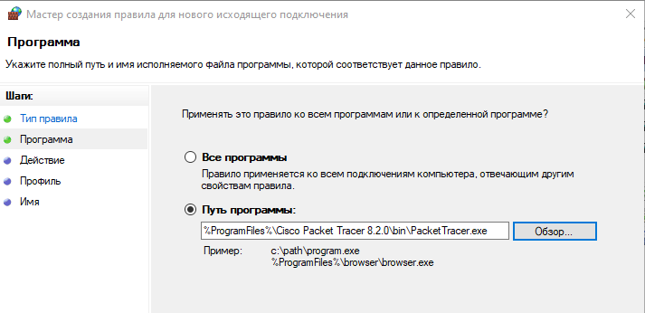{#fig:002 width=70% height=70%}

## Знакомство с интерфейсом Packet Tracer

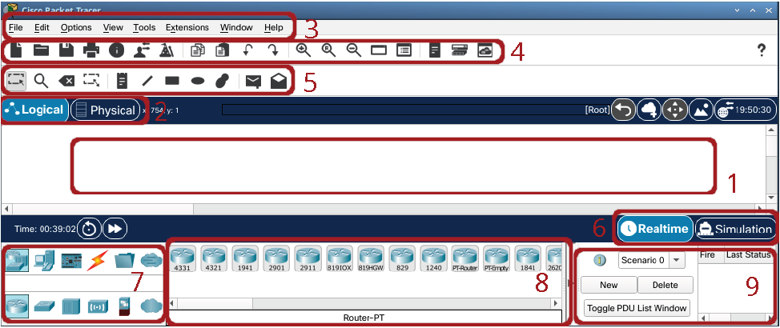{#fig:003 width=70% height=70%}

## Структура интерфейса Packet Tracer

(1) Рабочее пространство;
(2) Переключение на логическую или физическую область проекта;
(3) Меню;
(4) Панель инструментов;
(5) Панель инструментов;
(6) Переключатель режимов работы в реальном времени и в режиме моделирования;
(7) Меню выбора объекта;
(8) Меню выбора типа устройства;
(9) Окно с информацией по пакету данных, возникающему в сети во время моделирования.

## Моделирование передачи пакетов в простейшей сети с концентратором Hub-PT.

Построена сеть с концентратором и 4-мя ПК, соединённых с концентратором прямым кабелем

{#fig:004 width=70% height=70%}

## Конфигурация устройств

Устройствам ПК присвоены статичные IP-адреса

{#fig:005 height=70% width=70%}

## Конфигурация устройств

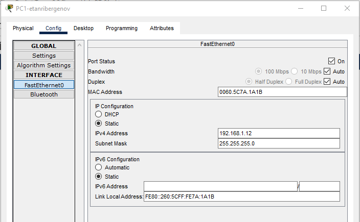{#fig:006 height=70% width=70%}

## Конфигурация устройств

{#fig:007 height=70% width=70%}

## Конфигурация устройств

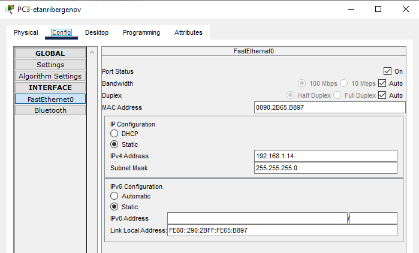{#fig:008 height=70% width=70%}

## Моделирование передачи пакетов

Рассмотрено 2 случая:

- Односторонняя передача (без коллизии)
- Одновременная передача пакетов узлов друг другу (с коллизией)

## Односторонняя передача (без коллизии)

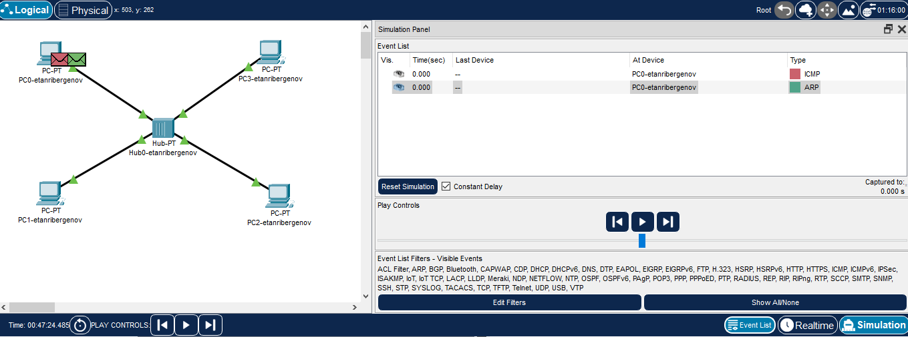{#fig:009 width=80% height=80%}

## Односторонняя передача (без коллизии)

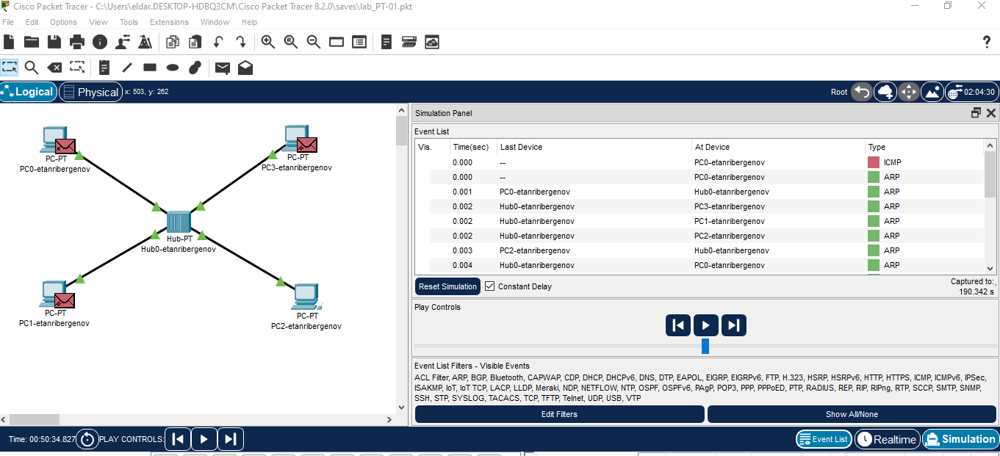{#fig:010 width=80% height=80%}

## Одновременная передача пакетов узлов друг другу (с коллизией)

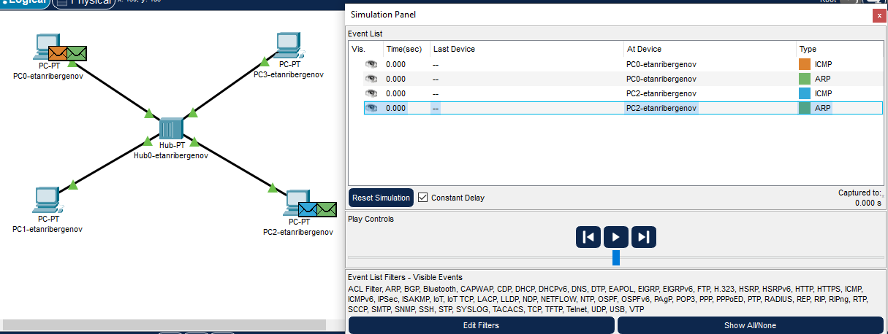{#fig:011 width=80% height=80%}

## Одновременная передача пакетов узлов друг другу (с коллизией)

{#fig:012 width=80% height=80%}

## Пояснение

Коллизия произошла из-за одновременной передачи пакетов узлов через концентратор, т.к. концентратор - устройство физического уровня и может лишь передавать сигнал, никак не обрабатывая

## Моделирование передачи пакетов в простейшей сети с коммутатором Cisco 2950-24

Построена сеть с коммутатором и 4-мя ПК, соединённых с коммутатором прямым кабелем

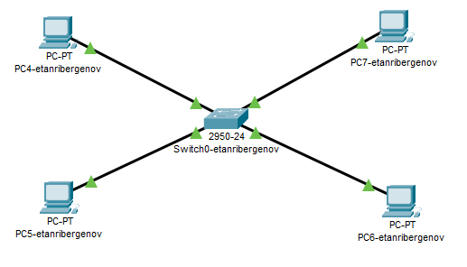{#fig:013 width=70% height=70%}

## Моделирование передачи пакетов

Рассмотрено 2 случая:

- Односторонняя передача
- Одновременная передача пакетов узлов друг другу

## Односторонняя передача

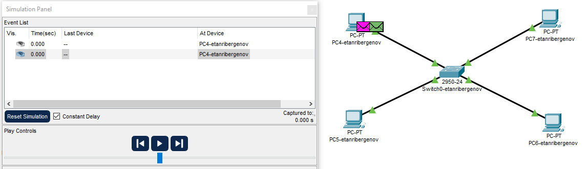{#fig:014 width=80% height=80%}

## Односторонняя передача

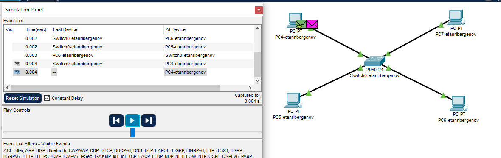{#fig:015 width=80% height=80%}

## Одновременная передача пакетов узлов друг другу

{#fig:016 width=80% height=80%}

## Одновременная передача пакетов узлов друг другу

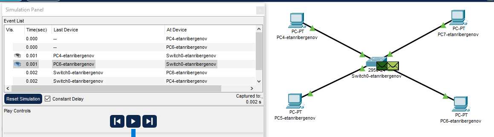{#fig:017 width=80% height=80%}

## Пояснение

Коллизии не произошло, потому что коммутатор - устройство канального уровня, способное обрабатывать и регенерировать сигналы.
Коммутатор при получении коллизии создал очередь передачи при помощи буферизации пакета.

## Моделирование передачи пакетов в сети с соединёнными коммутатором и концентратором

Коммутатор и концентратор соединены кроссовым кабелем

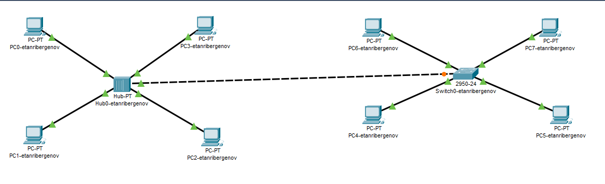{#fig:018 width=70% height=70%}

## Одновременная передача пакетов узлов друг другу

{#fig:019 width=70% height=70%}

## Одновременная передача пакетов узлов друг другу

Сначала возникает коллизия, потому что на концентраторе одновременная передача пакетов

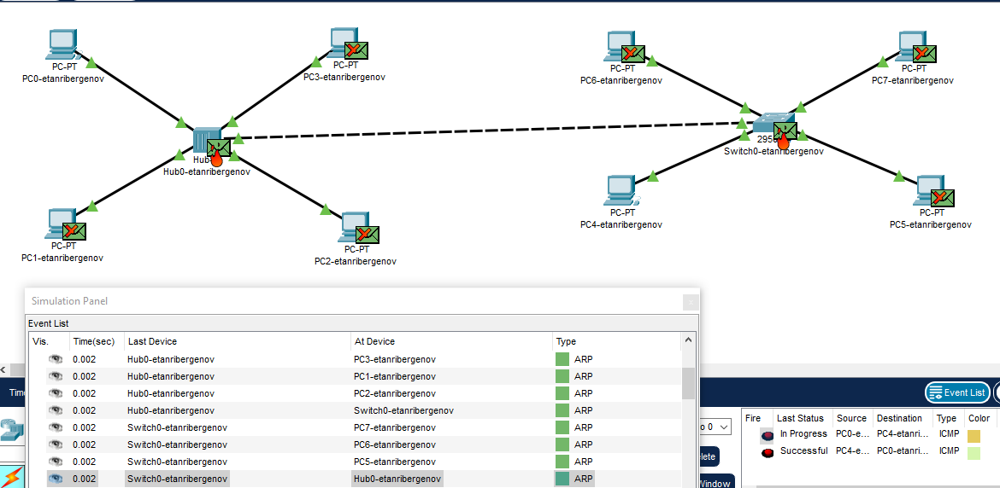{#fig:020 width=70% height=70%}

## Одновременная передача пакетов узлов друг другу

Затем пакеты успешно достигают пункта назначения, потому что коммутатор при возникновении коллизии
буферизовал свой пакет на время, пока концентратор и подключённые к нему устройства не сбросят кадр.
После чего повторно отправил пакет. 

{#fig:021 width=70% height=70%}

## Моделирование передачи пакетов в сети с соединёнными коммутатором и концентратором с подключением маршрутизатора

Размещён маршрутизатор 2811 и соединён с коммутатором прямым кабелем

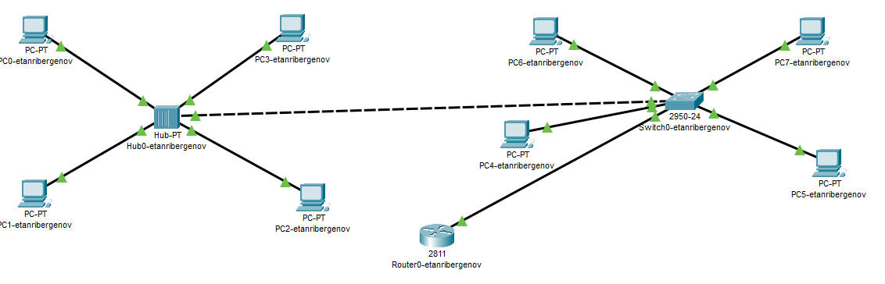{#fig:022 width=70% height=70%}

## Конфигурация маршрутизатора

Маршрутизатору присвоен статический IP-адрес и активирован порт

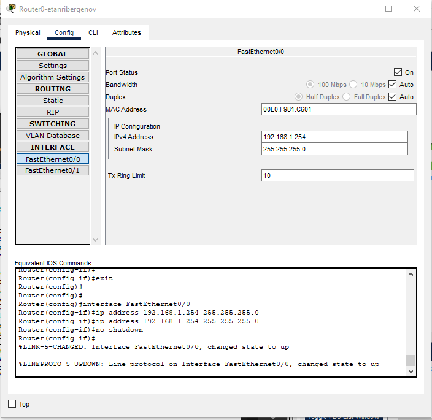{#fig:023 width=70% height=70%}

## Передача пакетов с ПК3 на маршрутизатор

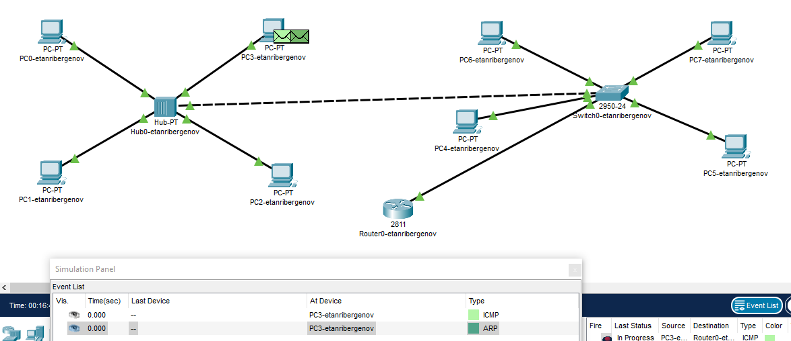{#fig:024 width=80% height=80%}

## Передача пакетов с ПК3 на маршрутизатор

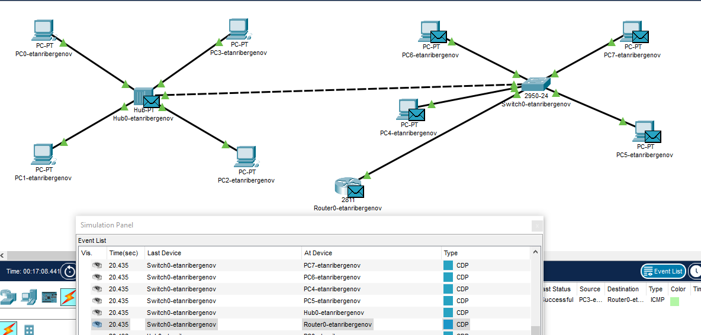{#fig:025 width=80% height=80%}

# Результаты

## Результат

- Установлено и настроено ПО Cisco Packet Tracer
- Смоделированы передачи пакетов в простейших сетях

# Вывод

## Вывод

Я ознакомился с ПО Cisco Packet Tracer для изучения передачи данных в различных сетях, а также их тестирования