---
## Front matter
title: "Отчёт по лабораторной работе №1"
subtitle: "Дисциплина: Администрирование локальных сетей"
author: "Выполнил: Танрибергенов Эльдар"

## Generic options
lang: ru-RU
toc-title: "Содержание"

## Bibliography
bibliography: ../bib/cite.bib
csl: ../pandoc/csl/gost-r-7-0-5-2008-numeric.csl

## Pdf output format
toc: true # Table of contents
toc-depth: 2
lof: true # List of figures
lot: true # List of tables
fontsize: 12pt
linestretch: 1.5
papersize: a4
documentclass: scrreprt
## I18n polyglossia
polyglossia-lang:
  name: russian
  options:
	- spelling=modern
	- babelshorthands=true
polyglossia-otherlangs:
  name: english
## I18n babel
babel-lang: russian
babel-otherlangs: english
## Fonts
mainfont: PT Serif
romanfont: PT Serif
sansfont: PT Sans
monofont: PT Mono
mainfontoptions: Ligatures=TeX
romanfontoptions: Ligatures=TeX
sansfontoptions: Ligatures=TeX,Scale=MatchLowercase
monofontoptions: Scale=MatchLowercase,Scale=0.9
## Biblatex
biblatex: true
biblio-style: "gost-numeric"
biblatexoptions:
  - parentracker=true
  - backend=biber
  - hyperref=auto
  - language=auto
  - autolang=other*
  - citestyle=gost-numeric
## Pandoc-crossref LaTeX customization
figureTitle: "Рис."
tableTitle: "Таблица"
listingTitle: "Листинг"
lofTitle: "Список иллюстраций"
lotTitle: "Список таблиц"
lolTitle: "Листинги"
## Misc options
indent: true
header-includes:
  - \usepackage{indentfirst}
  - \usepackage{float} # keep figures where there are in the text
  - \floatplacement{figure}{H} # keep figures where there are in the text
---

# Цель работы

Установка инструмента моделирования конфигурации сети Cisco Packet Tracer, знакомство с его интерфейсом.

# Задание

1. Установить на домашнем устройстве Cisco Packet Tracer.
2. Построить простейшую сеть в Cisco Packet Tracer, провести простейшую настройку оборудования.

# Выполнение лабораторной работы

## Запуск Cisco Packet Tracer без использования сетевого соединения

1. Установите в вашей операционной системе Cisco Packet Tracer.

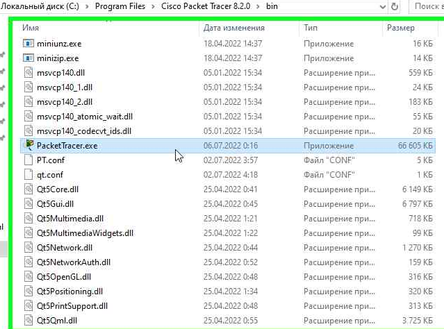{#fig:001}

2. Для ОС типа Windows требуется блокировать для Packet Tracer доступ в Интернет с путём создания правила для Брандмауэра:

– Откройте «Панель управления» -> пункт «Брандмауэр» Защитника Windows или просто Брандмауэр Windows.

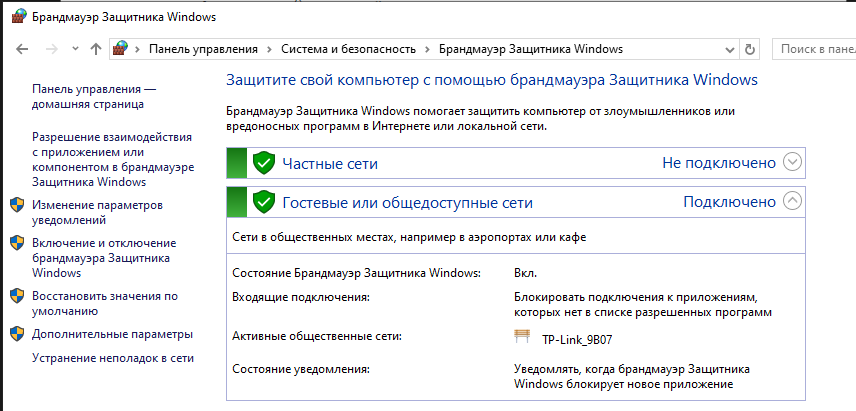{#fig:002}

– В открывшемся окне нажмите «Дополнительные параметры». 
Откроется окно брандмауэра в режиме повышенной безопасности. 
Выберите «Правило для исходящего подключения», а потом — «Создать правило». 
Выберите «Для программы» и нажмите «Далее».

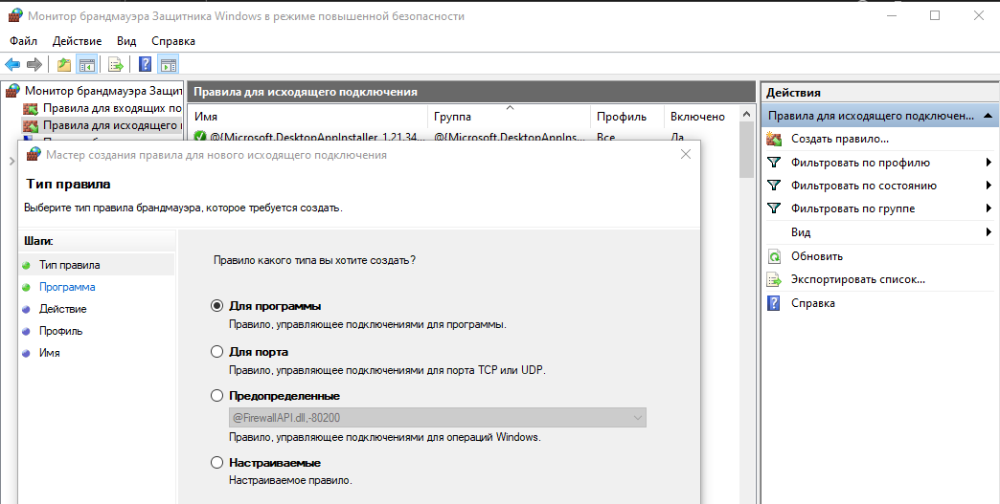{#fig:003}

– Укажите путь к исполняемому файлу программы, которой нужно
запретить доступ в Интернет. В данном случае путь к установленному
у вас в ОС Packet Tracer.

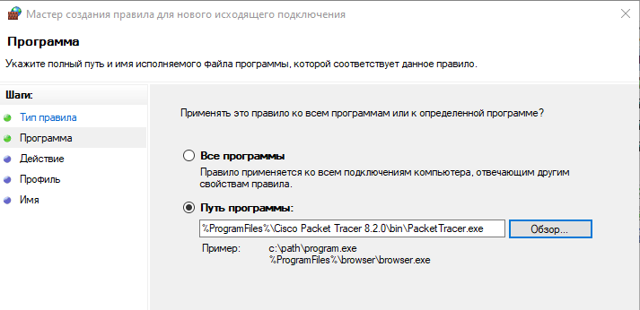{#fig:004}

– В следующем окне оставьте отмеченным пункт «Блокировать подключение».

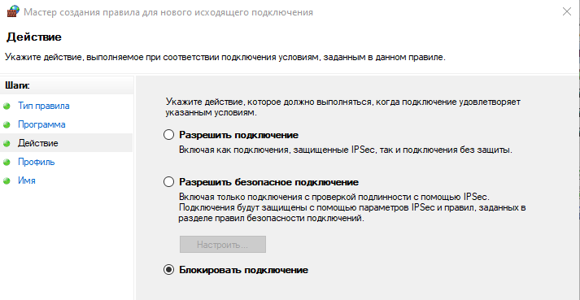{#fig:005}

– В следующем окне отметьте, для каких сетей выполнять блокировку.
Если для любых, то оставьте отмеченными все пункты.

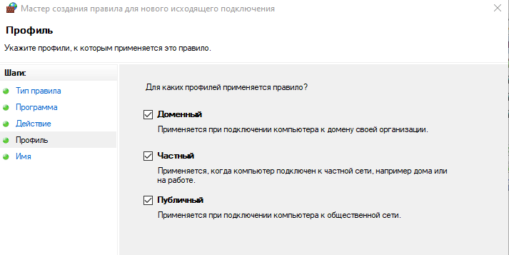{#fig:006}

– Укажите понятное для вас имя правила и нажмите «Готово».
Запустите Packet Tracer. При корректной настройке после запуска не должна требоваться аутентификация.

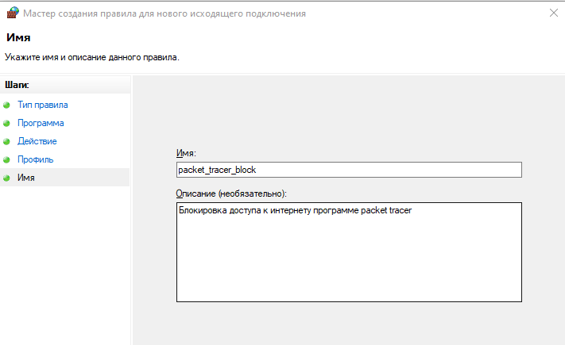{#fig:007}

## Знакомство с интерфейсом Packet Tracer

На рис. 8 представлена структура интерфейса Packet Tracer.

Основное окно программы содержит рабочее пространство (1) с переключе-
нием на логическую (Logical) или физическую (Physical) область проекта (2);
наверху расположено меню (3), панели инструментов (4)–(5), внизу — меню
выбора объекта (7) и его типа (8), а также переключатель режимов работы
в реальном времени (Realtime) и в режиме моделирования (Simulation) (6),
окно с информацией по пакету данных (9), возникающему в сети во время
моделирования.

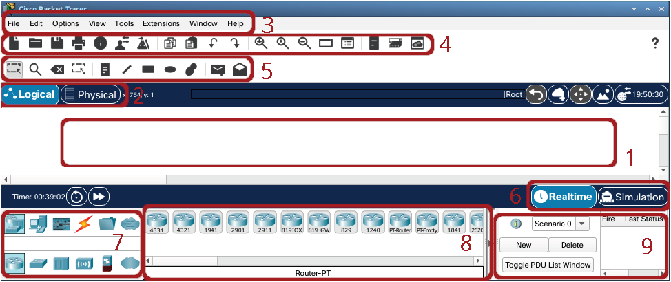{#fig:008}

## Построение простейшей сети

1. Создайте новый проект

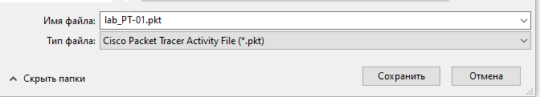{#fig:009}

2. В рабочем пространстве разместите концентратор (Hub-PT) и четыре око-
нечных устройства PC. Соедините оконечные устройства с концентратором
прямым кабелем. 

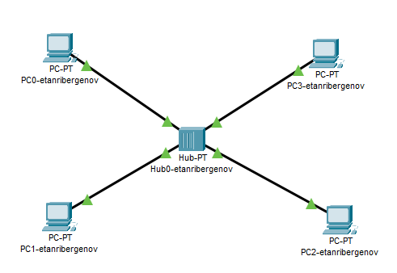{#fig:010}

Щёлкнув последовательно на каждом оконечном устройстве, задайте статические IP-адреса 192.168.1.11, 192.168.1.12,
192.168.1.13, 192.168.1.14 с маской подсети 255.255.255.0 

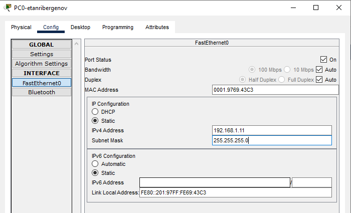{#fig:011}

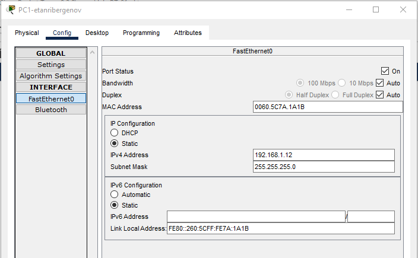{#fig:012}

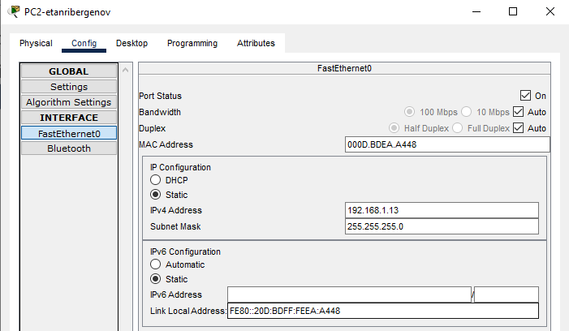{#fig:013}

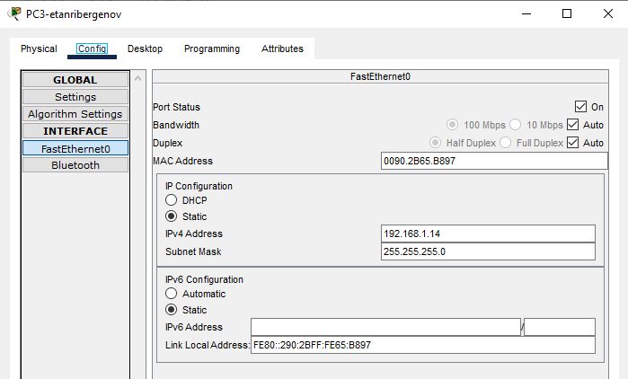{#fig:014}

3. В основном окне проекта перейдите из режима реального времени (Realtime)
в режим моделирования (Simulation). 

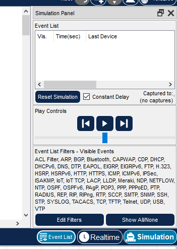{#fig:015}

Выберите на панели инструментов мышкой «Add Simple PDU (P)» и щёлкните сначала на PC0, затем на PC2.
В рабочей области должны будут появится два конверта, обозначающих пакеты,
в списке событий на панели моделирования должны будут появиться
два события, относящихся к пакетам ARP и ICMP соответственно.

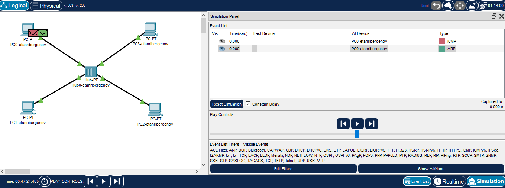{#fig:016}

На панели моделирования нажмите кнопку «Play» и проследите за движением пакетов ARP и ICMP от устройства PC0 до устройства PC2 и обратно.

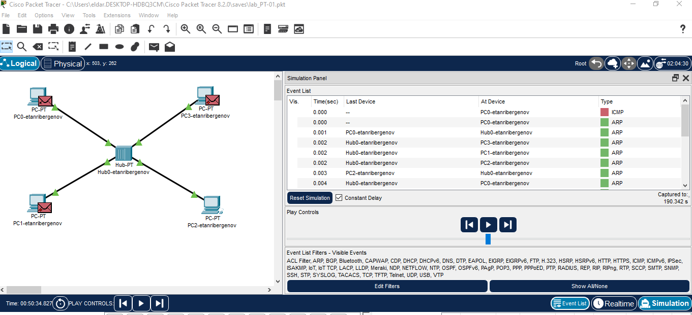{#fig:017}

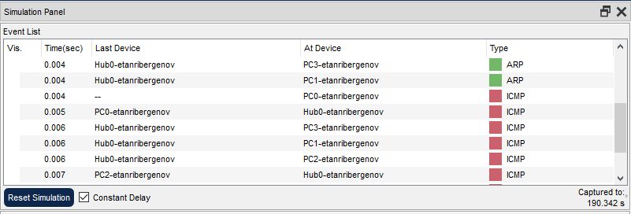{#fig:018}

4. Щёлкнув на строке события, откройте окно информации о PDU и изучите,
что происходит на уровне модели OSI при перемещении пакета.

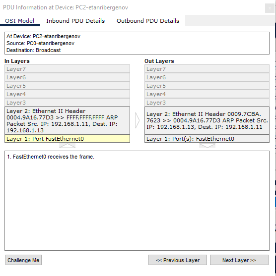{#fig:019}

Используя кнопку «Проверь себя» (Challenge Me) на вкладке OSI Model, ответьте на вопросы.

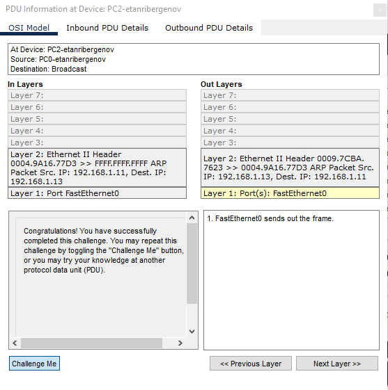{#fig:020}

5. Откройте вкладку с информацией о PDU. Опишите структуру кадра Ethernet.
Какие изменения происходят в кадре Ethernet при передвижении пакета? Какой тип имеет кадр Ethernet?
Опишите структуру MAC-адресов.

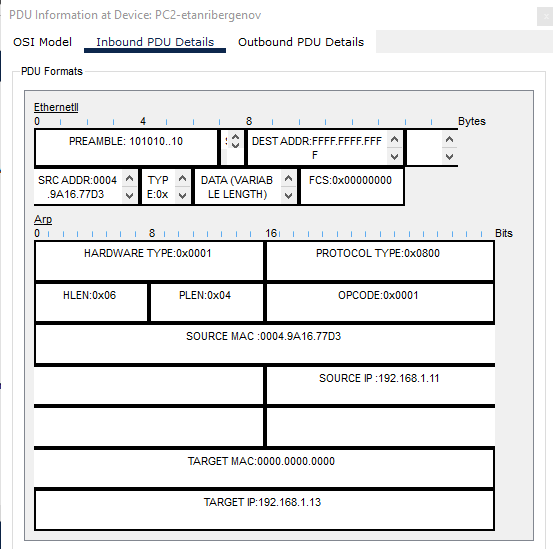{#fig:021}

Кадр Ethernet имеет: преамбулу для синхронизации, SOF - начало кадра, FCS - поле контрольной последовательности фрейма,
Destination Address - Ethernet-адрес получателя, Source Address - Ethernet-адрес отправителя,
Type - обозначение типа протокола, Length - длина данных.
При передвижении пакета в кадре Ethernet меняется адреса отправителя и получателя.
Тип кадра Ethernet - DIX (или кадр Ethernet II).
Структура MAC-адреса сети Ethernet включает 48 бит (6 октетов).
Первые 3 октета содержат 24-битный уникальный идентификатор организации (OUI) или код MFG (Manufacturing, производителя), 
который производитель получает в IEEE. В самом первом октете используются только 6 старших разрядов, а два младших имеют специальное назначение:
нулевой бит указывает, для одиночного (0) или группового (1) адресата предназначен кадр;
первый бит определяет, является ли MAC-адрес глобально (0) или локально (1) администрируемым.
Следующие три октета выбираются изготовителем для каждого экземпляра устройства.

6. Очистите список событий, удалив сценарий моделирования. Выберите на
панели инструментов мышкой «Add Simple PDU (P)» и щёлкните сначала
на PC0, затем на PC2. Снова выберите на панели инструментов мышкой
«Add Simple PDU (P)» и щёлкните сначала на PC2, затем на PC0. На панели
моделирования нажмите кнопку «Play» и проследите за возникновением
коллизии. 

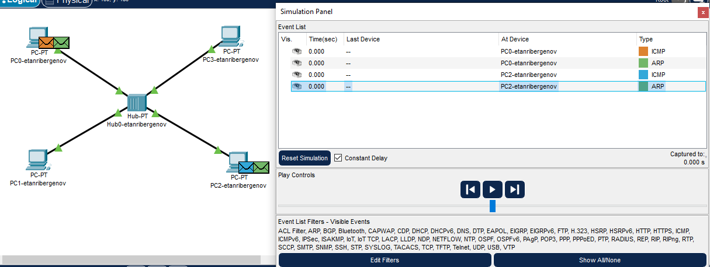{#fig:022}

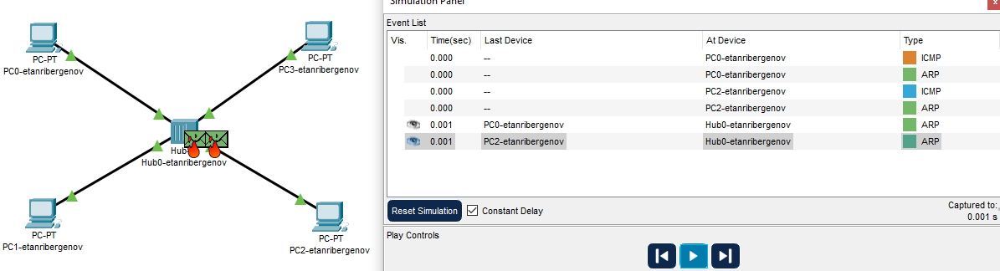{#fig:023}

В списке событий посмотрите информацию о PDU.

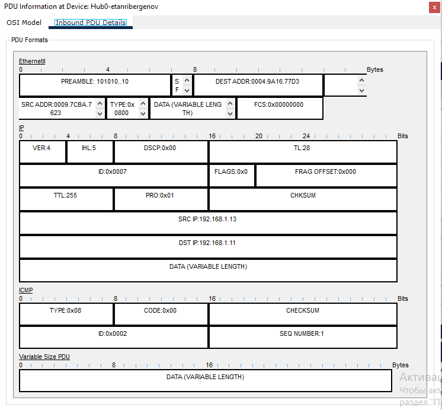{#fig:024}

Коллизия возникла из-за одновременной передачи данных c узлов.

7. Перейдите в режим реального времени (Realtime). В рабочем пространстве
разместите коммутатор (например Cisco 2950-24) и 4 оконечных устройства
PC. Соедините оконечные устройства с коммутатором прямым кабелем.
Щёлкнув последовательно на каждом оконечном устройстве, задайте стати-
ческие IP-адреса 192.168.1.21, 192.168.1.22, 192.168.1.23, 192.168.1.24 с маской
подсети 255.255.255.0.

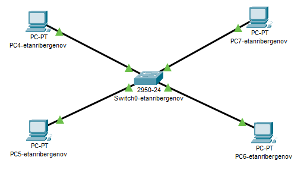{#fig:025}

8. В основном окне проекта перейдите из режима реального времени (Realtime)
в режим моделирования (Simulation). Выберите на панели инструментов
мышкой «Add Simple PDU (P)» и щёлкните сначала на PC4, затем на PC6.
В рабочей области должны будут появится два конверта, обозначающих
пакеты, в списке событий на панели моделирования должны будут появиться два 
события, относящихся к пакетам ARP и ICMP соответственно.

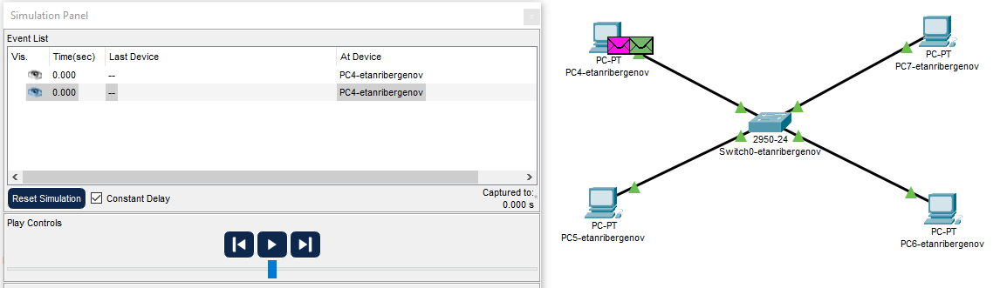{#fig:026}

На панели моделирования нажмите кнопку «Play» и проследите
за движением пакетов ARP и ICMP от устройства PC4 до устройства PC6
и обратно.

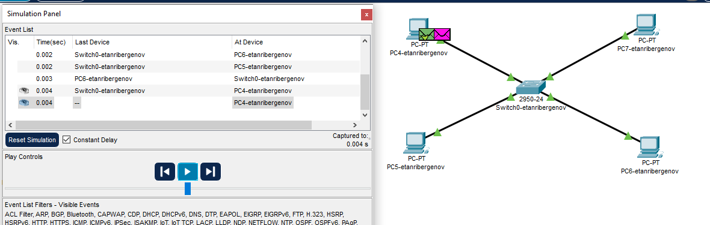{#fig:027}

В сценарии передачи пакетов ARP с коммутатором коммутатор пополняет таблицу MAC-адресов 
MAC-адресом источника, а также получает информацию о том в какую VLAN (Виртуальная локальная сеть) 
передаётся пакет и отправляет сообщение только участникам этой VLAN, в то время как концентратор отправляет
пакет всем оконечным устройствам. При достижении пакета ARP целевого получателя в таблицу коммутатора
заносится MAC-адрес этого устройства. Далее с целевого утройства отправляется ответ с индивидуальным типом 
передачи (unicast), в сценарии с концентратором - широковещательный (broadcast). Получив данное сообщение, 
коммутатор отправляет его только на порт к источнику ARP-запроса, в то время как концентратор отправляет кадр
снова на все порты.

9. Исследуйте структуру пакета ICMP. Опишите структуру кадра Ethernet.
Какие изменения происходят в кадре Ethernet при передвижении пакета?
Какой тип имеет кадр Ethernet? Опишите структуру MAC-адресов.

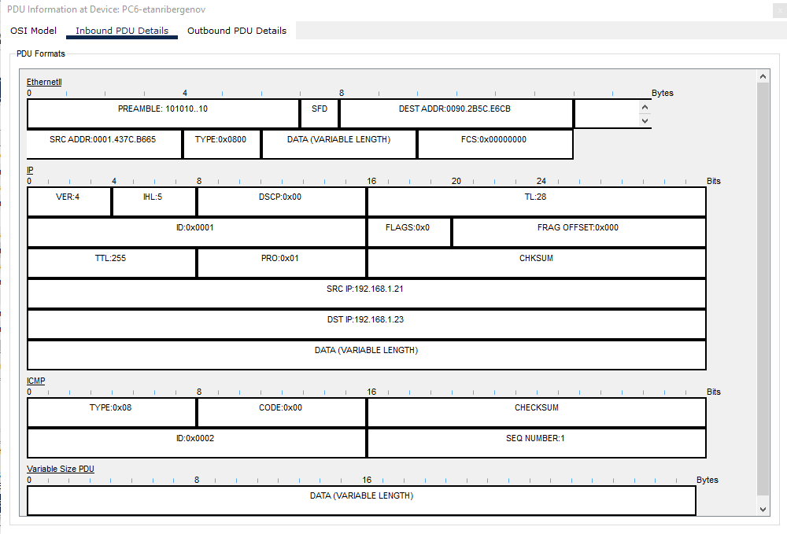{#fig:028}

Тип кадра Ethernet - EthernetII. Структура уже была описана ранее: преамбула, адреса отправителя и получателя, 
контрольная сумма и т.д. При передвижении пакета меняются адреса и тип ICMP. Структура MAC-адресов: 
Восьмой (с начала) бит первого байта МАС-адреса называется Unicast/Multicast битом и определяет, 
какого типа кадр передается с этим адресом, обычный (0) или широковещательный (1), седьмой (с начала) 
бит первого байта МАС-адреса называется Universal/Local битом и определяет, является ли адрес 
универсальным (0), или локально управляемым (1), далее уникальный идентификатор устройства и номер сетевого адаптера.

10. Очистите список событий, удалив сценарий моделирования. Выберите на
панели инструментов мышкой «Add Simple PDU (P)» и щёлкните сначала
на PC4, затем на PC6. Снова выберите на панели инструментов мышкой
«Add Simple PDU (P)» и щёлкните сначала на PC6, затем на PC4. На
панели моделирования нажмите кнопку «Play» и проследите за движением
пакетов.

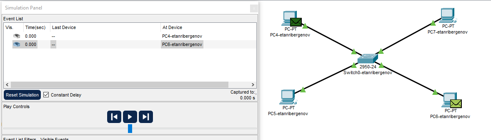{#fig:029}

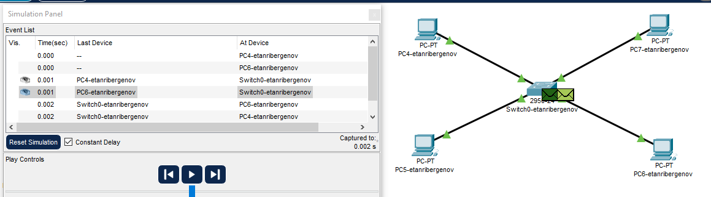{#fig:030}

В сети узлы соединены с коммутатором индивидуальными линиями, образовав вместе с портами микросегменты, и 
работают в полнодуплексном режиме. В полнодуплексном режиме работы коллизий при микросегментации не возникает. 
При одновременной передаче данных от двух источников одному адресату буферизация кадров позволяет запомнить 
и передать кадры поочередно и, следовательно, избежать их потери.

11. Перейдите в режим реального времени (Realtime). В рабочем пространстве 
соедините кроссовым кабелем концентратор и коммутатор. 

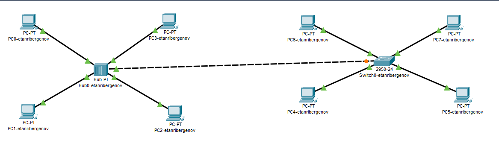{#fig:031}

Перейдите в режим моделирования (Simulation). Очистите список событий, удалив
сценарий моделирования. Выберите на панели инструментов мышкой «Add Simple PDU (P)» 
и щёлкните сначала на PC0, затем на PC4. Снова выберите на панели инструментов 
мышкой «Add Simple PDU (P)» и щёлкните сначала на PC4, затем на PC0. 
На панели моделирования нажмите кнопку «Play» и проследите за движением пакетов.

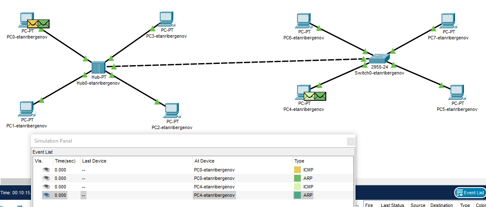{#fig:032}

Сначала возникает коллизия из-за одновременной передачи пакетов концентратором и коммутатором. 

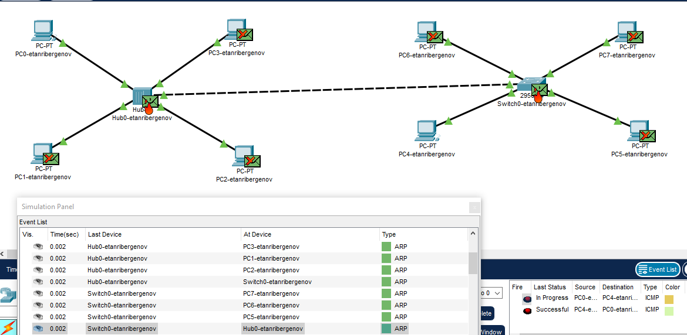{#fig:033}

Затем пакеты успешно достигают пункта назначения, потому что коммутатор при возникновении коллизии
буферизовал свой пакет на время, пока концентратор и подключённые к нему устройства не сбросят кадр.
После чего повторно отправил пакет. Таким образом, пакеты ARP и ICMP успешно достигли пункта назначения.

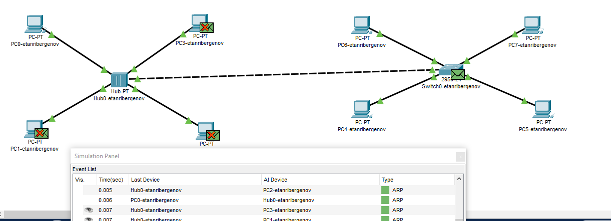{#fig:034}

12. Очистите список событий, удалив сценарий моделирования. На панели
моделирования нажмите «Play» и в списке событий получите пакеты STP. 

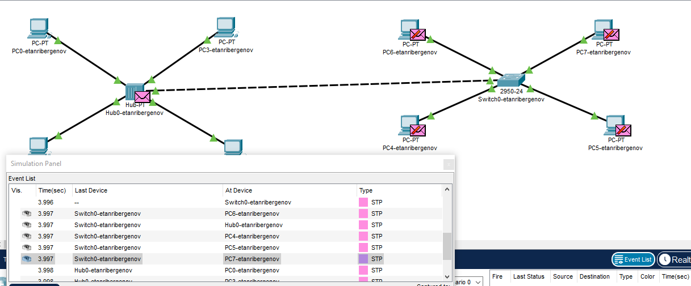{#fig:035}

STP пакет содержит кадры: Ethernet, LLC и STP BPDU.
Тип Ethernet - Ethernet 802.3 с подуровнем LLC. 
MAC-адрес источника (коммутатора) является индивидуальным и глобально администрированным (октет 00), 
а получателя (концентратора) - групповым и глобально администрированным (октет 01)

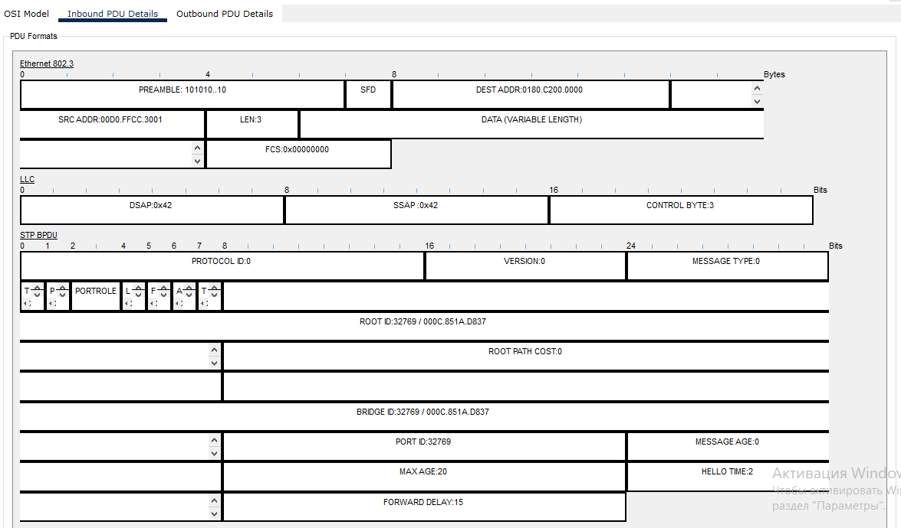{#fig:036}

13. Перейдите в режим реального времени (Realtime). В рабочем пространстве добавьте маршрутизатор 
(например, Cisco 2811). Соедините прямым кабелем коммутатор и маршрутизатор. 

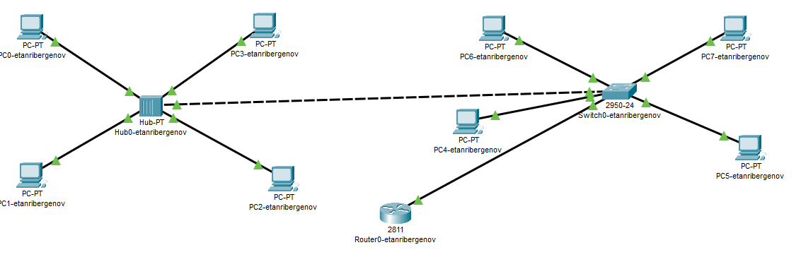{#fig:037}

Щёлкните на маршрутизаторе и на вкладке его конфигурации пропишите статический IP-адрес
192.168.1.254 с маской 255.255.255.0, активируйте порт, поставив галочку «On» напротив «Port Status».

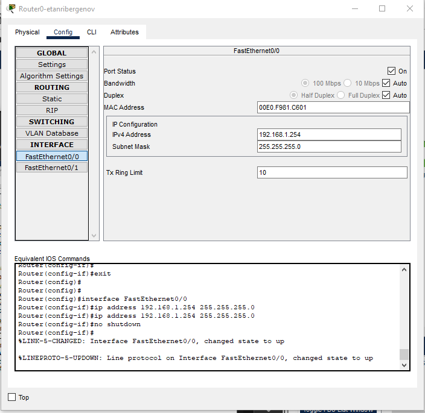{#fig:038}

14. Перейдите в режим моделирования (Simulation). Очистите список событий, удалив сценарий моделирования. 
Выберите на панели инструментов мышкой «Add Simple PDU (P)» и щёлкните сначала на PC3, затем на маршрутизаторе.

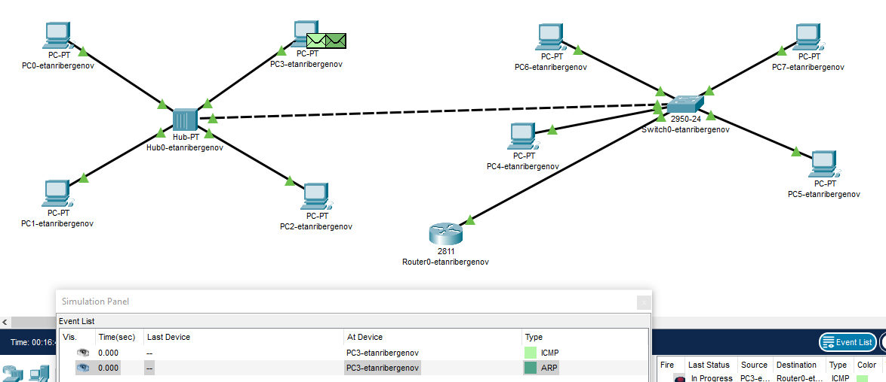{#fig:039}
 
На панели моделирования нажмите кнопку «Play» и проследите за движением пакетов ARP, ICMP, STP и CDP. 

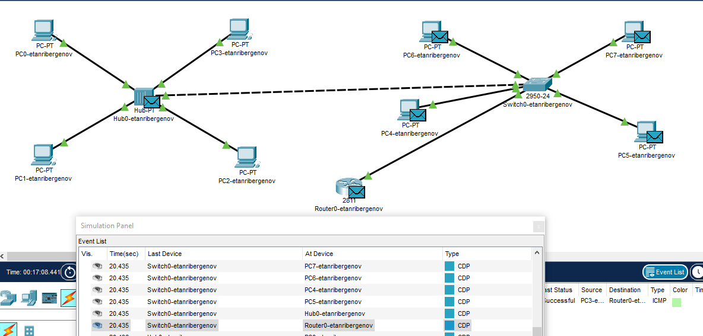{#fig:040}
 
Пакет CDP содержит заголовки: Ethernet 802.3, заголовок SNAP (используется для инкапсуляции дейтаграмм IP и запросов ARP в сетях IEEE 802),
CDP (где указаны: версия, время жизни пакета, контрольная сумма, длины адреса и сообщения и т.д.) и 
CDP TLV (идентификатор устройства, номер и тип локального интерфейса, время удержания информации, тип устройства, 
физическая платформа устройства (модель подключенного устройства), номер и тип удаленного интерфейса).

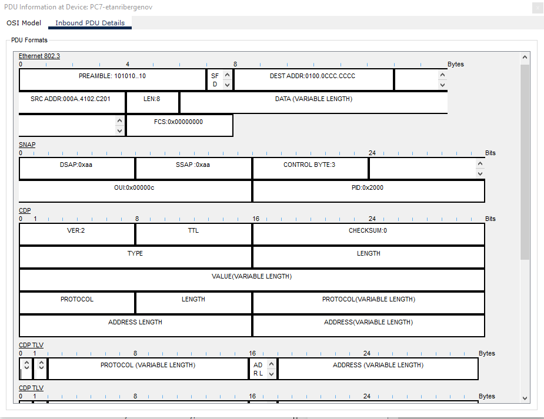{#fig:041}

# Ответы на контрольные вопросы

1. Концентратор - это просто разъём, соединяющий провода, идущие с разных сторон. 
Здесь нет обработки или регенерации сигнала. Это электронное устройство, которое работает только на физических уровнях модели OSI. 
Коммутатор - это устройство связи «точка-точка». Он работает на канальном уровне модели OSI. Он использует таблицу коммутаций для определения начальной точки назначения.
Маршрутизатор является многопортовым устройством и более сложным по сравнению с концентратором и коммутатором. 
Он содержит таблицу маршрутизации, которая позволяет ему принять решение о лучшем маршруте для конкретной передачи.
Он работает на сетевом уровне и используется в LAN, MAN и WAN, хранит IP-адрес и поддерживает адрес самостоятельно.
Концентратор нужен для широковещания, коммутатор - для точечной передачи (работает на основе MAC-адресов), а маршрутизатор - то же, что и коммутатор, но с маршрутизацией (работает на основе IP-адреса).

2. IP-адрес - это уникальный числовой идентификатор устройства в компьютерной сети;
 Сетевая маска - это битовая маска для определения по IP-адресу адреса подсети и адреса узла этой подсети.
 Broadcast-адрес (широковещательный адрес) - это адрес, используемый для передачи данных всем устройствам, подключенным к определённой сети.

3. Доступность узла сети можно проверить при помощи отправки эхо-запросов, например командой ping.

# Выводы

Я установил инструмент моделирования конфигурации сети Cisco Packet Tracer, ознакомился с его интерфейсом.

