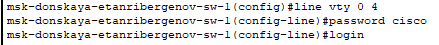

---
## Front matter
lang: ru-RU
title: "Лабораторная работа №2"
subtitle: "Предварительная настройка оборудования Cisco"
author:
  - "Танрибергенов Эльдар"
institute:
  - "Российский университет дружбы народов, Москва, Россия"
date: 2024 г.

## i18n babel
babel-lang: russian
babel-otherlangs: english

## Formatting pdf
toc: false
toc-title: Содержание
slide_level: 2
aspectratio: 169
section-titles: true
theme: metropolis
header-includes:
 - \metroset{progressbar=frametitle,sectionpage=progressbar,numbering=fraction}
 - '\makeatletter'
 - '\beamer@ignorenonframefalse'
 - '\makeatother'
---

# Цели и задачи

## Цель лабораторной работы

Получить основные навыки по начальному конфигурированию оборудования Cisco.

## Задачи

1. Сделать предварительную настройку маршрутизатора
2. Сделать предварительную настройку коммутатора
3. Сделать предварительную настройку оконечных устройств
4. Проверить работоспособность соединений
5. Проверить подключение

# Выполнение работы

## Размещение и соединение устройств

- Маршрутизатор Cisco 2811 соединён с оконечным устройством ПК (PC-PT) перекрёстным и консольным кабелями.
- Коммутатор Cisco 2960 соединён с с оконечным устройством ПК (PC-PT) прямым и консольным кабелями.

{#fig:001 width=70% height=70%}

# Конфигурация маршрутизатора

## Переход в привилегированный режим, а затем в режим глобального конфигурирования

{#fig:002 width=70% height=70%}

## Имя хоста

{#fig:003 width=70% height=70%}

## Интерфейс FastEthernet 0/0
 
- IP-адрес и маска
- Включение

{#fig:004 width=70% height=70%}

## Настройка виртуальных терминалов

{#fig:005 width=70% height=70%}

## Настройка подключения по консольному кабелю

{#fig:006 width=70% height=70%}

## Доступ подключаемого устройства к привилегированному режиму

- Для этого надо задать пароль

{#fig:007 width=70% height=70%}

## Шифрование паролей

{#fig:008 width=70% height=70%}

## Добавление пользователя для подключения по SSH

- Задание пароля и уровня привилегии

{#fig:009 width=70% height=70%}

## Доменное имя

{#fig:010 width=70% height=70%}

## Генерация rsa крипто-ключа для подключения по ssh

{#fig:011 width=70% height=70%}

## Транспорт для входящего подключения виртуальных терминалов

{#fig:012 width=70% height=70%}

# Конфигурация коммутатора

## Переход в привилегированный режим, а затем в режим глобального конфигурирования

{#fig:013 width=70% height=70%}

## Имя хоста

{#fig:014 width=70% height=70%}

## Интерфейс vlan2

- Создание нового интерфейса vlan2

{#fig:015 width=70% height=70%}

## Интерфейс FastEthernet 0/1
 
- Переключение режима работы портов

{#fig:016 width=70% height=70%}

## Настройка шлюза по умолчанию

- Присвоение IP-адреса коммутатору

{#fig:017 width=70% height=70%}

## Настройка виртуальных терминалов

{#fig:018 width=70% height=70%}

## Настройка подключения по консольному кабелю

{#fig:019 width=70% height=70%}

## Доступ подключаемого устройства к привилегированному режиму

- Для этого надо задать пароль

{#fig:020 width=70% height=70%}

## Шифрование паролей

{#fig:021 width=70% height=70%}

## Добавление пользователя для подключения по SSH

- Задание пароля и уровня привилегии

{#fig:022 width=70% height=70%}

## Доменное имя

{#fig:023 width=70% height=70%}

## Генерация rsa крипто-ключа для подключения по ssh

{#fig:024 width=70% height=70%}

## Транспорт для входящего подключения виртуальных терминалов

{#fig:025 width=70% height=70%}

# Настройка оконечных устройств (ПК)

## Настройка оконечных устройств (ПК)

- Присвоение IP-адресов с маской

### ПК-0

{#fig:026  width=60% height=60%}

## Настройка оконечных устройств (ПК)

### ПК-1

{#fig:027  width=70% height=70%}

# Результаты

## Проверка работоспособности соединений

- Использована команда ping

{#fig:028 width=70% height=70%}

## Проверка работоспособности соединений

{#fig:029}

## Подключение к маршрутизатору с оконечного устройства

### Консольный кабель

{#fig:030 width=70% height=70%}

## Подключение к маршрутизатору с оконечного устройства

### SSH

{#fig:031}

## Подключение к маршрутизатору с оконечного устройства

### Telnet

- Подключение неудачно, т.к. транспортом входящего подключения на маршрутизаторе был установлен протокол ssh.

{#fig:032}

## Подключение к коммутатору с оконечного устройства

### Консольный кабель

{#fig:033}

## Подключение к коммутатору с оконечного устройства

### SSH

{#fig:034}

## Подключение к коммутатору с оконечного устройства

### Telnet

- Подключение неудачно, т.к. транспортом входящего подключения на коммутаторе был установлен протокол ssh.

{#fig:035}

## Результат

- Проведена простейшая конфигурация сетевых устройств
- Проверена работоспособность соединений
- Проверена доступность подключения к сетевым устройствам 

# Вывод

## Вывод

Я получил навыки первичной (простейшей) конфигурации сетевого оборудования Cisco в симуляторе сети передачи данных Cisco Packet Tracer