---
## Front matter
lang: ru-RU
title: "Лабораторная работа №3"
subtitle: "Планирование локальной сети организации"
author:
  - "Танрибергенов Эльдар"
institute:
  - "Российский университет дружбы народов, Москва, Россия"
date: 2024 г.

## i18n babel
babel-lang: russian
babel-otherlangs: english

## Formatting pdf
toc: false
toc-title: Содержание
slide_level: 2
aspectratio: 169
section-titles: true
theme: metropolis
header-includes:
 - \metroset{progressbar=frametitle,sectionpage=progressbar,numbering=fraction}
 - '\makeatletter'
 - '\beamer@ignorenonframefalse'
 - '\makeatother'
---

# Цели и задачи

## Цель лабораторной работы

Познакомится с принципами планирования локальной сети организации.

## Постановка задачи

Предположим, что в некоторой учебной организации требуется спланировать сетевую инфраструктуру.
Особенности организации с точки зрения планирования локальной сети:
– организация располагается в одном городе (предположим — в Москве), но на двух территориях (назовём их «Донская» и «Павловская»);
– группы пользователей организации:
– администрация (А);
– преподавательский состав кафедр (К);
– пользователи дисплейных классов общего пользования (ДК);
– другие пользователи (Д);
– предполагается, что на территории «Донская» будут располагаться:
– устройства управления сетью;
– серверная инфраструктура;
– оборудование всех групп пользователей;
– предполагается, что на территории «Павловская» будет располагаться
оборудование групп пользователей «ДК» и «Д».

## Постановка задачи

Сеть организации должна соответствовать так называемой «иерархической
модели сети», т.е. оборудование сетевой инфраструктуры при планировании должно быть распределено по трём уровням:

1) уровень ядра (Core Layer) — высокопроизводительные сетевые устройства (коммутаторы, маршрутизаторы), обеспечивающие скоростную передачу трафика между сегментами уровня распределения;
2) уровень распределения (Distribution Layer) — устройства (коммутаторы, маршрутизаторы), обеспечивающие применение политик безопасности и качества обслуживания (QoS), агрегацию и маршрутизацию трафика посредством VLAN, определение широковещательных доменов;
3) уровень доступа (Access Layer) — устройства для подключения серверов и оконечного оборудования пользователей к сети организации.

## Задания

1. Используя графический редактор, повторить схемы L1, L2, L3, а также сопутствующие им таблицы VLAN, IP-адресов и портов подключения оборудования планируемой сети 10.128.0.0/16.
2. Cделать аналогичный план адресного пространства для сетей 172.16.0.0/12 и 192.168.0.0/16

# Выполнение работы

# Первая сеть 10.128.0.0/16

## Схема L1: физические устройства сети с номерами портов

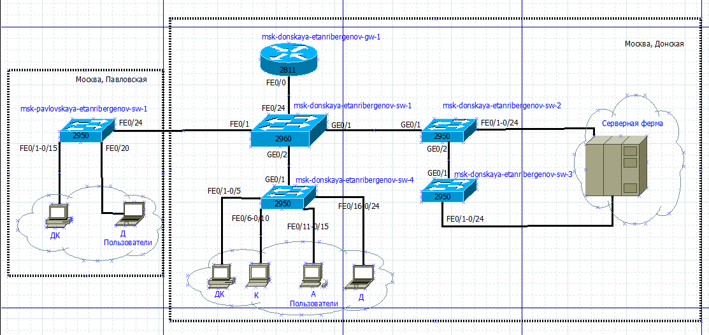{#fig:001 width=70% height=70%}

## Таблица VLAN

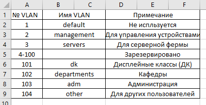{#fig:002}

## Схема L2: распределение VLAN по портам устройств в сети

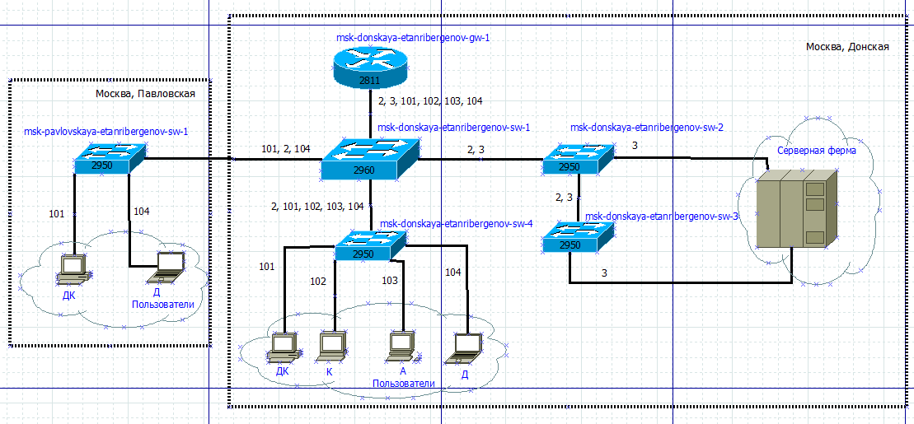{#fig:003}

## Схема L3: маршрутизация сети 10.128.0.0/16

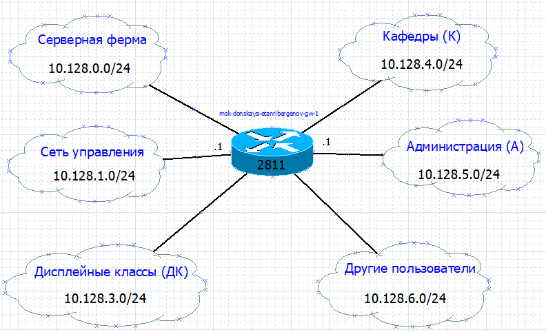{#fig:004}

## Таблица IP для сети 10.128.0.0/16

{#fig:005 width=70% height=70%}

## Таблица IP для сети 10.128.0.0/16

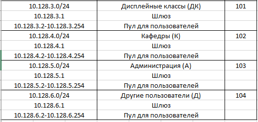{#fig:006}

## Таблица портов

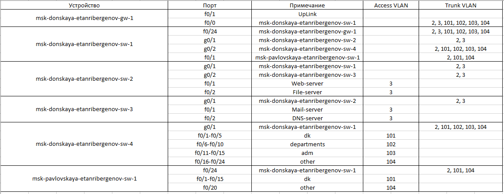{#fig:007}

## Регламент выделения IP-адресов для сети класса C - 10.128.0.0/16

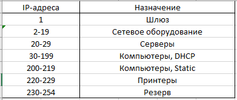{#fig:008}

# Сети 172.16.0.0/12 и 192.168.0.0/16 

## Примечание

- Схемы L1 и L2, а также таблицы VLAN и портов не меняются

## Схема L3 сети 172.16.0.0/12

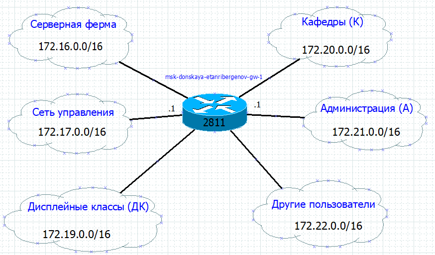{#fig:009}

## Таблица IP сети 172.16.0.0/12

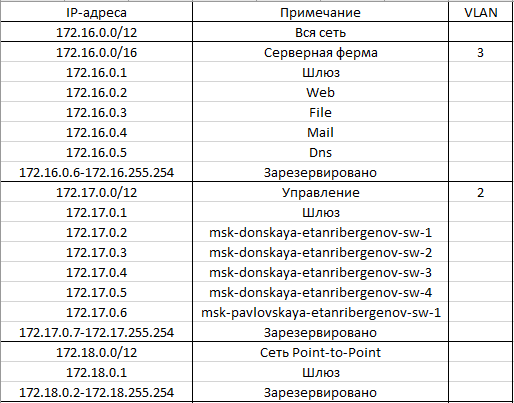{#fig:010 width=70% height=70%}

## Таблица IP сети 172.16.0.0/12

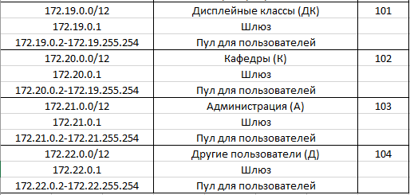{#fig:011}

##  Регламент выделения IP-адресов для сети класса B  -  172.16.0.0/12

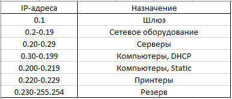{#fig:012}

## Схема L3 сети 192.168.0.0/16

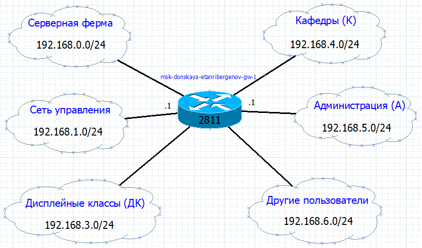{#fig:013}

## Таблица IP сети 192.168.0.0/16

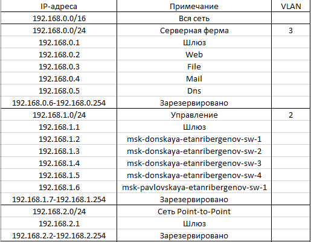{#fig:014 width=70% height=70%}

## Таблица IP сети 192.168.0.0/16

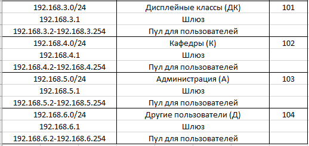{#fig:015}

## Регламент выделения IP-адресов для сети класса C  -  192.168.0.0/16

{#fig:016}

# Результаты

## Результат

- Спланирована сеть организации
- Созданы схемы распределения портов, VLAN-ов и маршрутизации для 3 сетей
- Созданые таблицы портов, VLAN, регламенты выделения IP-адресов и таблицы IP для 3 сетей

# Вывод

## Вывод

Я познакомится с принципами планирования локальной сети организации.