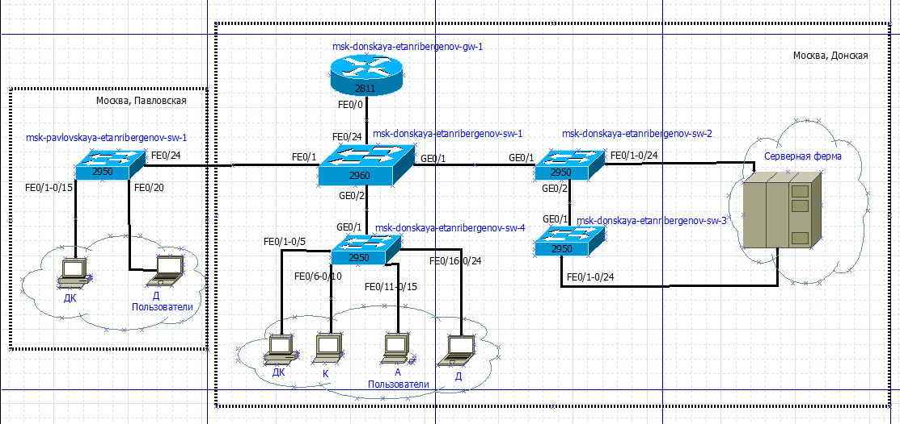
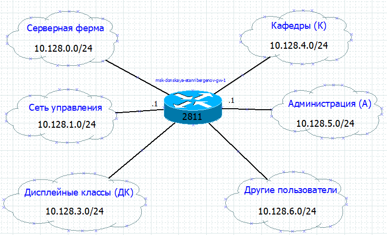
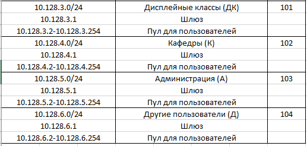
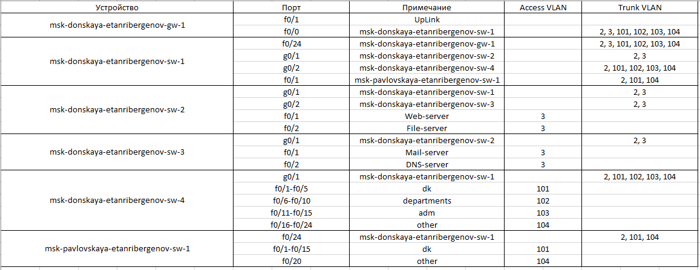
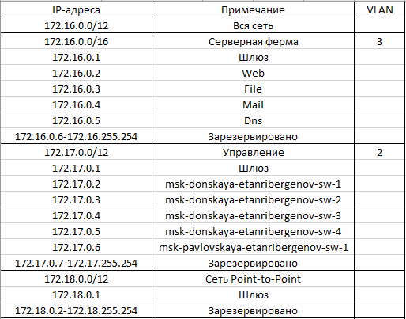
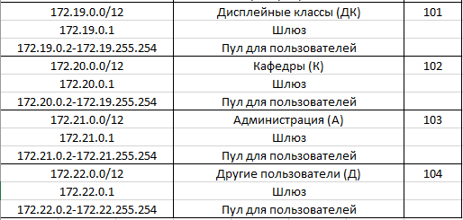
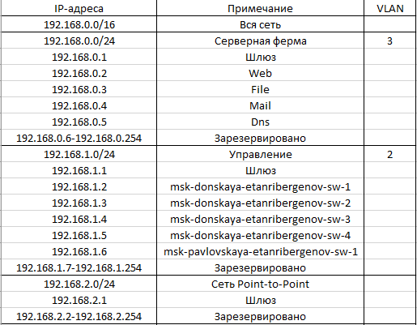
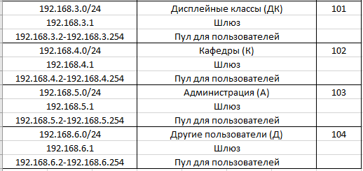

---
## Front matter
title: "Отчёт по лабораторной работе №3"
subtitle: "Дисциплина: Администрирование локальных сетей"
author: "Выполнил: Танрибергенов Эльдар"

## Generic options
lang: ru-RU
toc-title: "Содержание"

## Bibliography
bibliography: ../bib/cite.bib
csl: ../pandoc/csl/gost-r-7-0-5-2008-numeric.csl

## Pdf output format
toc: true # Table of contents
toc-depth: 2
lof: true # List of figures
lot: true # List of tables
fontsize: 12pt
linestretch: 1.5
papersize: a4
documentclass: scrreprt
## I18n polyglossia
polyglossia-lang:
  name: russian
  options:
	- spelling=modern
	- babelshorthands=true
polyglossia-otherlangs:
  name: english
## I18n babel
babel-lang: russian
babel-otherlangs: english
## Fonts
mainfont: PT Serif
romanfont: PT Serif
sansfont: PT Sans
monofont: PT Mono
mainfontoptions: Ligatures=TeX
romanfontoptions: Ligatures=TeX
sansfontoptions: Ligatures=TeX,Scale=MatchLowercase
monofontoptions: Scale=MatchLowercase,Scale=0.9
## Biblatex
biblatex: true
biblio-style: "gost-numeric"
biblatexoptions:
  - parentracker=true
  - backend=biber
  - hyperref=auto
  - language=auto
  - autolang=other*
  - citestyle=gost-numeric
## Pandoc-crossref LaTeX customization
figureTitle: "Рис."
tableTitle: "Таблица"
listingTitle: "Листинг"
lofTitle: "Список иллюстраций"
lotTitle: "Список таблиц"
lolTitle: "Листинги"
## Misc options
indent: true
header-includes:
  - \usepackage{indentfirst}
  - \usepackage{float} # keep figures where there are in the text
  - \floatplacement{figure}{H} # keep figures where there are in the text
---

# Цель работы

Познакомится с принципами планирования локальной сети организации

# Задание

1. Используя графический редактор, требуется повторить схемы L1, L2, L3, а также сопутствующие им таблицы VLAN, IP-адресов и портов подключения оборудования планируемой сети.
2. Рассмотренный выше пример планирования адресного пространства сети базируется на разбиении сети 10.128.0.0/16 на соответствующие подсети.
Требуется сделать аналогичный план адресного пространства для сетей 172.16.0.0/12 и 192.168.0.0/16 с соответствующими схемами сети и сопутствующими таблицами VLAN, IP-адресов и портов подключения оборудования.
3. При выполнении работы необходимо учитывать соглашение об именовании.

# Выполнение лабораторной работы

1.  Cхема L1:

{#fig:001}

Таблица VLAN:

{#fig:002}

Схема VLAN сети (Layer 2):

{#fig:003}

Схема маршрутизации (Layer 3) сети 10.128.0.0/16:

{#fig:004}

Таблица IP для сети 10.128.0.0/16 :

{#fig:005}

{#fig:006}

Таблица портов:

{#fig:007}

Регламент выделения IP-адресов для сети класса C - 10.128.0.0/16:

{#fig:008}

2.   Таблицы VLAN и портов, а также схемы L1 и L2 не изменятся от смены ip-адреса сети.

Схема маршрутизации (Layer 3) сети 172.16.0.0/12:

{#fig:009}

Таблица IP сети 172.16.0.0/12:

{#fig:010}

{#fig:011}

Регламент выделения IP-адресов для сети класса B  -  172.16.0.0/12:

{#fig:012}

Схема маршрутизации (Layer 3) сети 192.168.0.0/16:

{#fig:013}

Таблица IP сети 192.168.0.0/16:

{#fig:014}

{#fig:015}

Регламент выделения IP-адресов для сети класса C  -  192.168.0.0/16:

{#fig:016}

# Ответы на контрольные вопросы

1. Модель OSI (Open System Interconnection), или эталонная модель взаимодействия открытых систем описывает, как устройства в локальных и глобальных 
сетях обмениваются данными и что происходит с этими данными. Она имеет 7 уровней:
- Физический (способ передачи сигналов)
- Канальный (проверка целостности полученных данных и исправление ошибок)
- Сетевой (маршрутизация данных внутри сети между компьютерами)
- Транспортный (способ передачи данных - с гарантией (TCP) /без гарантии (UDP)
- Сеансовый (управление сессиями)
- Представления (кодирование, сжатие, шифрование)
- Прикладной (работа с сетевыми службами)
 
2. Коммутатор объединяет различные сетевые устройства в единый сегмент сети и позволяет передавать данные только от одного узла к другому, если сообщение не широковещательное и узел-получатель 
закреплён к порту коммутатора

3. Маршрутизатор ведёт таблицы маршрутизации, определяет маршруты, фильтрует пакеты, управляет очередями, преобразовывает сетевые адреса в локальные.

4. Коммутатор уровня 2 работает только с MAC-адресами, игнорируя IP-адреса и элементы более высоких уровней. Коммутатор уровня 3 выполняет все функции коммутатора уровня 2.
 Кроме того, он может осуществлять статическую и динамическую маршрутизацию.

5. Сетевой интерфейс - это точка подключения двух частей сетевого оборудования

6. Сетевые порты - это виртуальные конечные точки, которые соединяют передачу данных между несколькими приложениями, службами или устройствами в сети. 

7. Ethernet: скорость передачи данных - 10 мбит/c , максимальная длина сегмента - 3,6 км;
FastEthernet: скорость передачи данных - 100 мбит/c , максимальная длина сегмента - 10 км;
GigabitEthernet: скорость передачи данных - 1000 мбит/c , максимальная длина сегмента - 70 км;

8. IP-адрес - это 32-битный номер, уникально идентифицирующий хост в сети TCP/IP.
Сеть - это совокупность соединённых между собой узлов, которые обмениваются информацией.
Подсеть - это сеть меньшего размера, созданная путём деления более крупной сети.
Маска подсети - 32-битное число, служащее битовой маской для разделения сетевой части (адреса подсети) и части хоста IP-адреса.

9. VLAN - это логическая сеть, которая создается внутри более крупной физической сети. 
Виртуальные сети VLAN позволяют сегментировать сеть на более мелкие виртуальные подсети, которые можно использовать для изоляции трафика и повышения производительности сети.

10. Trunk Port в отличие от Access Port тегирует данные, позволяя передавать данные из одного порта в разные VLAN.

# Выводы

Я познакомится с принципами планирования локальной сети организации.

