---
## Front matter
title: "Отчёт по лабораторной работе №5"
subtitle: "Дисциплина: Администрирование локальных сетей"
author: "Выполнил: Танрибергенов Эльдар"

## Generic options
lang: ru-RU
toc-title: "Содержание"

## Bibliography
bibliography: ../bib/cite.bib
csl: ../pandoc/csl/gost-r-7-0-5-2008-numeric.csl

## Pdf output format
toc: true # Table of contents
toc-depth: 2
lof: true # List of figures
lot: true # List of tables
fontsize: 12pt
linestretch: 1.5
papersize: a4
documentclass: scrreprt
## I18n polyglossia
polyglossia-lang:
  name: russian
  options:
	- spelling=modern
	- babelshorthands=true
polyglossia-otherlangs:
  name: english
## I18n babel
babel-lang: russian
babel-otherlangs: english
## Fonts
mainfont: PT Serif
romanfont: PT Serif
sansfont: PT Sans
monofont: PT Mono
mainfontoptions: Ligatures=TeX
romanfontoptions: Ligatures=TeX
sansfontoptions: Ligatures=TeX,Scale=MatchLowercase
monofontoptions: Scale=MatchLowercase,Scale=0.9
## Biblatex
biblatex: true
biblio-style: "gost-numeric"
biblatexoptions:
  - parentracker=true
  - backend=biber
  - hyperref=auto
  - language=auto
  - autolang=other*
  - citestyle=gost-numeric
## Pandoc-crossref LaTeX customization
figureTitle: "Рис."
tableTitle: "Таблица"
listingTitle: "Листинг"
lofTitle: "Список иллюстраций"
lotTitle: "Список таблиц"
lolTitle: "Листинги"
## Misc options
indent: true
header-includes:
  - \usepackage{indentfirst}
  - \usepackage{float} # keep figures where there are in the text
  - \floatplacement{figure}{H} # keep figures where there are in the text
---

# Цель работы

Получить основные навыки по настройке VLAN на коммутаторах сети.

# Задание

1. На коммутаторах сети настроить Trunk-порты на соответствующих интерфейсах, связывающих коммутаторы между собой.
2. Коммутатор msk-donskaya-etanribergenov-sw-1 настроить как VTP-сервер и прописать на нём номера и названия VLAN.
3. Остальные коммутаторы настроить как VTP-клиенты, на интерфейсах указать принадлежность к соответствующему VLAN.
4. На серверах прописать IP-адреса.
5. На оконечных устройствах указать соответствующий адрес шлюза и прописать статические IP-адреса из диапазона соответствующей сети, следуя регламенту выделения ip-адресов из предыдущих ЛР.
6. Проверить доступность устройств, принадлежащих одному VLAN, и недоступность устройств, принадлежащих разным VLAN.
7. Используя режим симуляции в Packet Tracer, изучите процесс передвижения пакета ICMP по сети. Изучите содержимое передаваемого пакета и заголовки задействованных протоколов.

# Выполнение лабораторной работы

1. На коммутаторах сети на интерфейсах, связывающих коммутаторы между собой, перевёл режим работы портов в значение "Trunk"

{#fig:001}

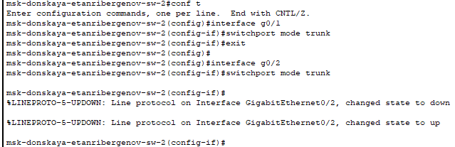{#fig:002}

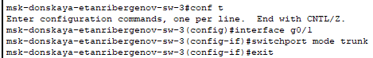{#fig:003}

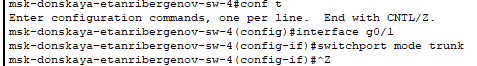{#fig:004}

{#fig:005}

2. Коммутатор msk-donskaya-etanribergenov-sw-1 настроил как VTP-сервер и прописал на нём номера и названия VLAN.

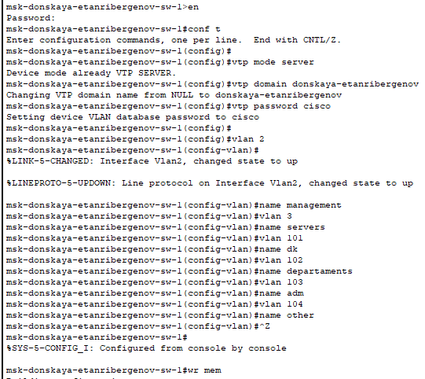{#fig:006}

3. Остальные коммутаторы настроил как VTP-клиенты, на интерфейсах указал принадлежность к соответствующему VLAN.

Коммутатор msk-donskaya-etanribergenov-sw-4:

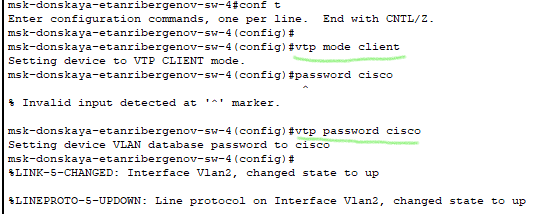{#fig:007}

{#fig:008}

Проверка получения списка VLAN от VTP-сервера и установки принадлежности интерфейсов к соответствующим VLAN

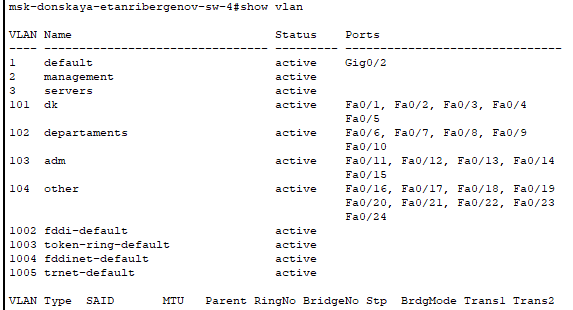{#fig:009}

Коммутатор msk-donskaya-etanribergenov-sw-2:

{#fig:010}

{#fig:011}

Проверка получения списка VLAN от VTP-сервера и установки принадлежности интерфейсов к соответствующим VLAN

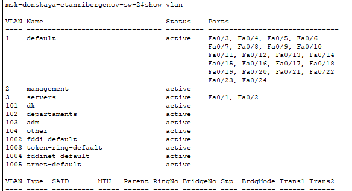{#fig:012}

Коммутатор msk-donskaya-etanribergenov-sw-3:

{#fig:013}

{#fig:014}

Проверка получения списка VLAN от VTP-сервера и установки принадлежности интерфейсов к соответствующим VLAN

{#fig:015}

Коммутатор msk-pavlovskaya-etanribergenov-sw-1:

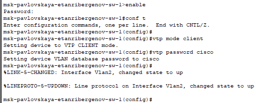{#fig:016}

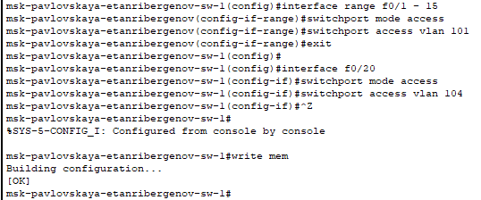{#fig:017}

Проверка получения списка VLAN от VTP-сервера и установки принадлежности интерфейсов к соответствующим VLAN

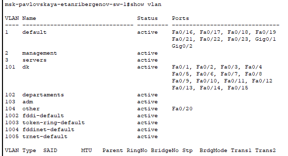{#fig:018}

4. На серверах прописал IP-адреса.

{#fig:019}

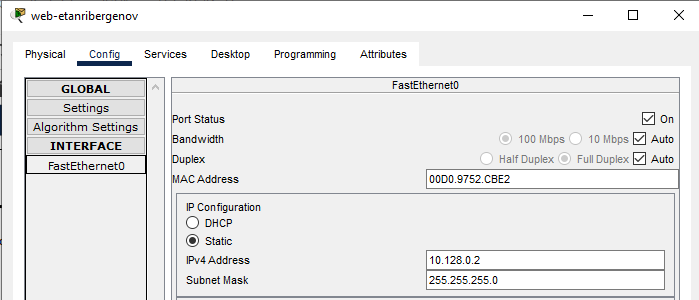{#fig:020}

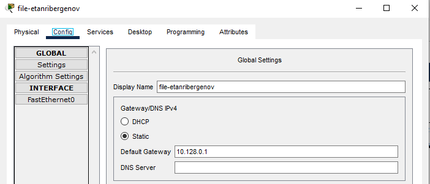{#fig:021}

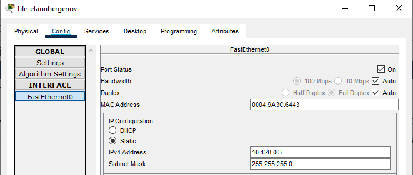{#fig:022}

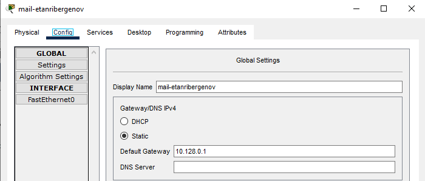{#fig:023}

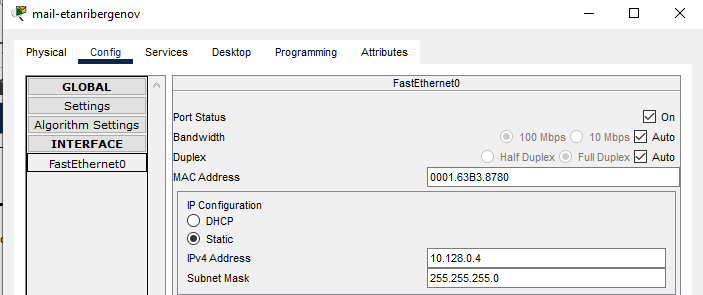{#fig:024}

5. На оконечных устройствах указал соответствующий адрес шлюза и прописал статические IP-адреса из диапазона соответствующей сети, следуя регламенту выделения ip-адресов:

На территории "Москва, Павловская":

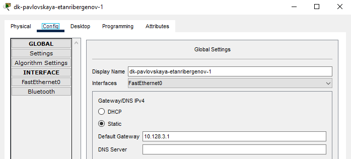{#fig:025}

{#fig:026}

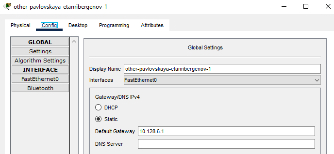{#fig:027}

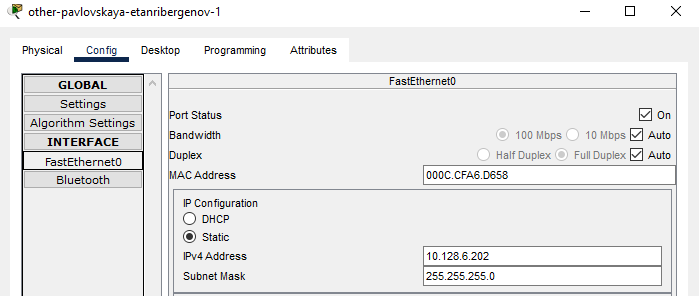{#fig:028}

На территории "Москва, Донская":

{#fig:029}

{#fig:030}

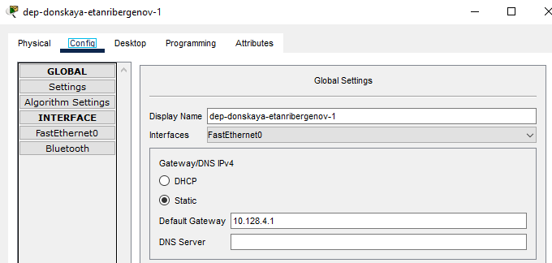{#fig:031}

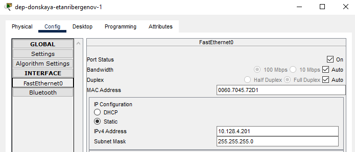{#fig:032}

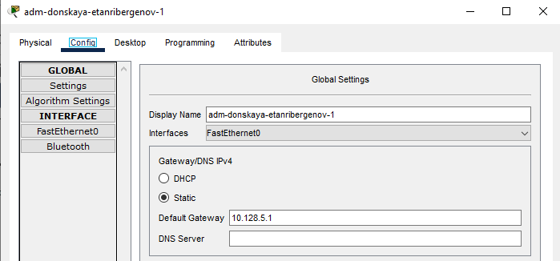{#fig:033}

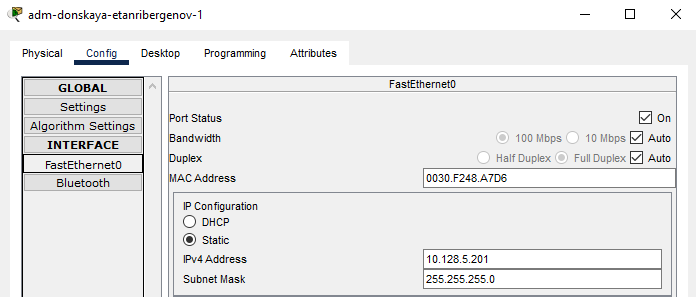{#fig:034}

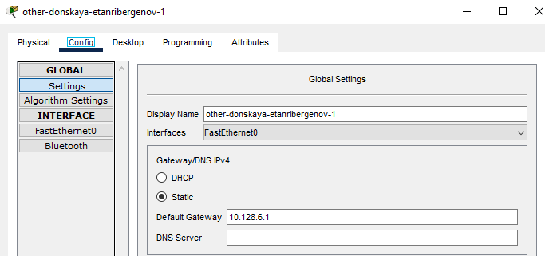{#fig:035}

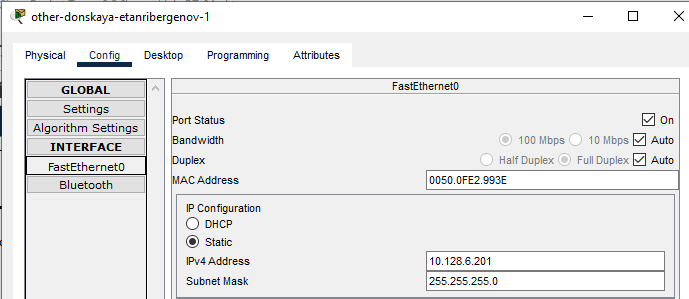{#fig:036}

6. Проверил доступность устройств, принадлежащих одному VLAN, и недоступность устройств, принадлежащих разным VLAN.

Использовал команду ping в Command Prompt:

Из одного VLAN:

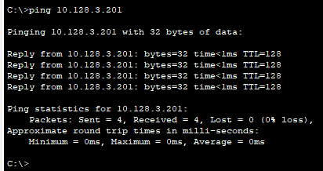{#fig:037}

Из разных VLAN:

{#fig:038}

7. Используя режим симуляции в Packet Tracer, изучил процесс передвижения пакета ICMP по сети.

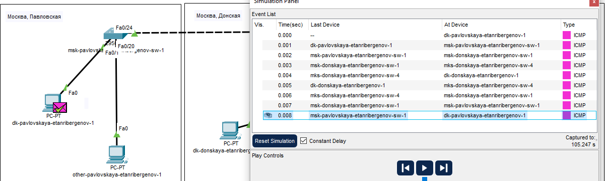{#fig:039}

Изучил содержимое передаваемого пакета и заголовки задействованных протоколов.

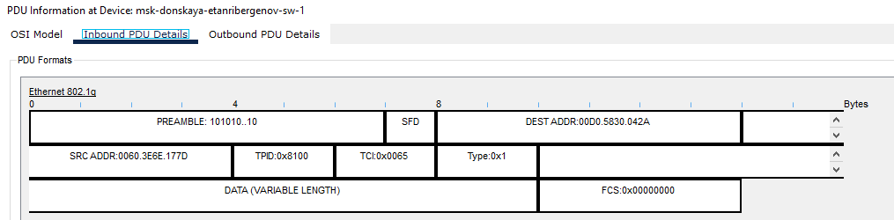{#fig:040}

В кадре Ethernet добавились поля, указывающие тег.

Отправка пакета устройству из разных VLAN:

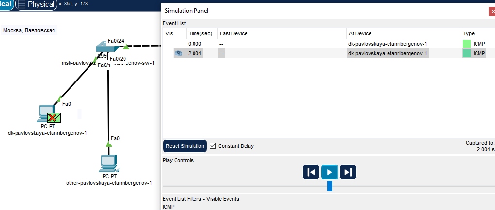{#fig:041}

# Ответы на контрольные вопросы

1. Команда *show vlan* используется для просмотра списка VLAN на сетевом устройстве.

2. VLAN Trunking Protocol (VTP) - это протокол передачи данных о VLAN. 
Команды: vtp mode \<server/client\> - переводит устройство в режим VTP-сервера/клиента;
vtp domain \<название\> - указание домена
vtp password \<пароль\> - установка пароля

3. Internet Control Message Protocol (ICMP) - сетевой протокол, входящий в стек протоколов TCP/IP.
В основном ICMP используется для передачи сообщений об ошибках и других исключительных ситуациях, возникших при передаче данных, например, запрашиваемая услуга недоступна или хост или маршрутизатор не отвечают. 
Также на ICMP возлагаются некоторые сервисные функции.
Формат пакета ICMP: Заголовок кадра Ethernet, заголовок IP, заголовок ICMP (тип, код, контрол.сумма), сообщение ICMP.

4. Address Resolution Protocol (ARP) - это сетевой протокол, предназначенный для определения MAC-адреса другого компьютера по известному IP-адресу.
Формат ARP-пакета: тип оборудования, тип протокола, MAC-адрес отправителя и получателя, IP-адрес отправителя и получателя.

5. MAC-адрес - это уникальный идентификатор, присвоенный сетевому адаптеру или сетевому интерфейсу устройства, подключённого к сети.
Он состоит из 6 шестнадцатеричных цифр (октетов), разделённых двоеточиями, и имеет длину 48 бит. 

# Выводы

Я получил основные навыки по настройке VLAN на коммутаторах сети.

