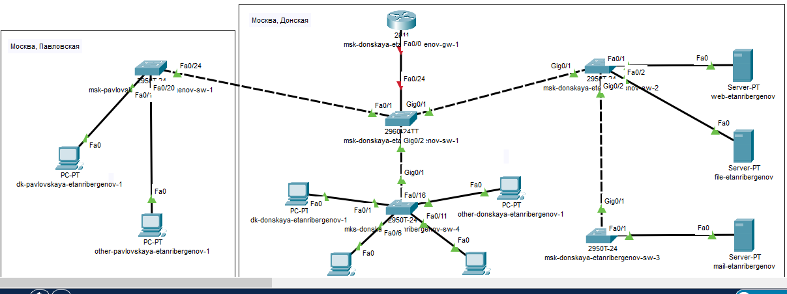
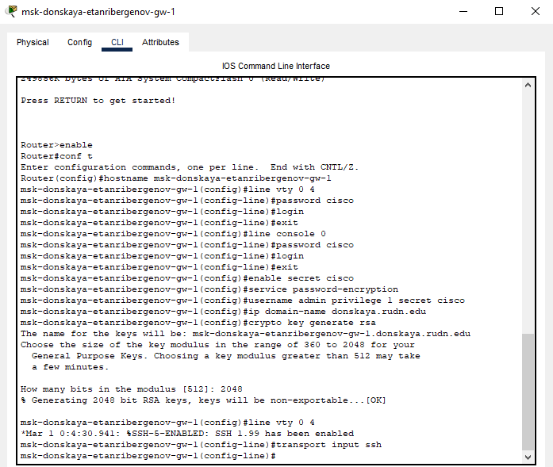
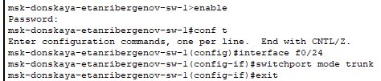
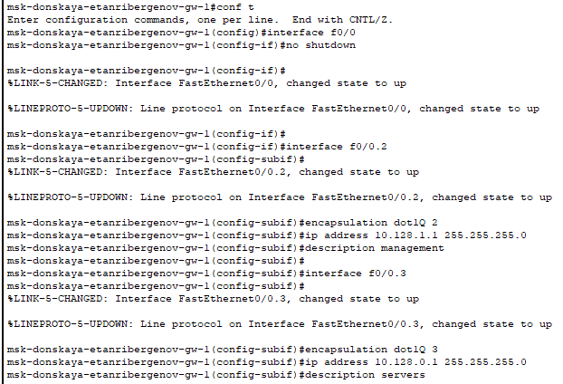
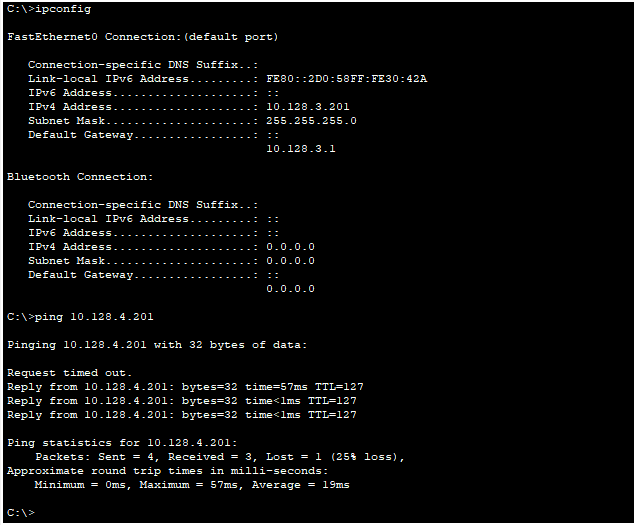

---
## Front matter
lang: ru-RU
title: "Лабораторная работа № 6"
subtitle: "Статическая маршрутизация VLAN"
author:
  - "Танрибергенов Эльдар"
institute:
  - "Российский университет дружбы народов, Москва, Россия"
date: 2024 г.

## i18n babel
babel-lang: russian
babel-otherlangs: english

## Formatting pdf
toc: false
toc-title: Содержание
slide_level: 2
aspectratio: 169
section-titles: true
theme: metropolis
header-includes:
 - \metroset{progressbar=frametitle,sectionpage=progressbar,numbering=fraction}
 - '\makeatletter'
 - '\beamer@ignorenonframefalse'
 - '\makeatother'
---

# Цели и задачи

## Цель лабораторной работы

Настроить статическую маршрутизацию VLAN в сети.

## Задачи

1. Добавить в локальную сеть маршрутизатор, провести его первоначальную настройку.
2. Настроить статическую маршрутизацию VLAN.

# Выполнение работы

## Добавление в сеть маршрутизатора

- Использовал маршрутизатор Cisco 2811
- Соединил порт FastEthernet 0/0 маршрутизатора с портом FastEthernet 0/24 коммутатора прямым кабелем

{#fig:001 width=70% height=70%}

## Первоначальное конфигурирование маршрутизатора

- Задал имя
- Установил пароль на доступ к виртуальным терминалам, консоли, а также привилегированному режиму
- Создал пользователя с уровнем привилегии 1, доменное имя и крипто-ключ
- Установил в качестве транспорта для входящих соединений вирт. терминалов протокол ssh

## Первоначальное конфигурирование маршрутизатора

{#fig:002 width=80% height=80%}

## Настройка порта коммутатора

- Командой *switchport mode trunk* настроил порт 24 коммутатора как тэгированный порт

{#fig:003 width=70% height=70%}

## Настройка статической маршрутизации VLAN

- Создал подынтерфейсы (виртуальные интерфейсы), указал им нужную инкапсуляцию, а также задал подынтерфейсам ip-адреса, соответствующие шлюзам устройств разных VLAN

{#fig:004 width=70% height=70%}

# Результаты

## Проверка доступности устройств из разных VLAN

{#fig:005 width=90% height=80%}

## Результат

- Добавлен в сеть и сконфигурирован маршрутизатор
- Настроена статическая маршрутизация

# Вывод

## Вывод

Я получил навыки по настройке статической маршрутизации VLAN в сети.