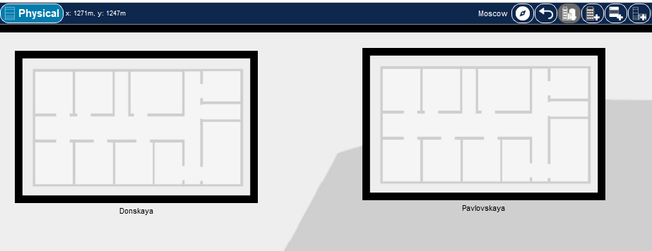
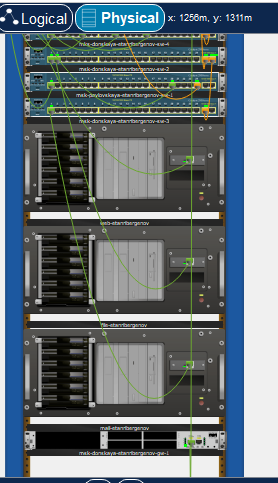
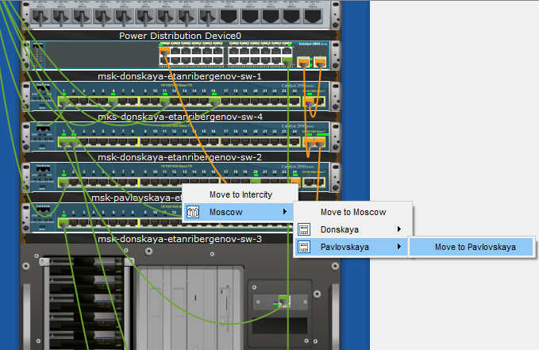
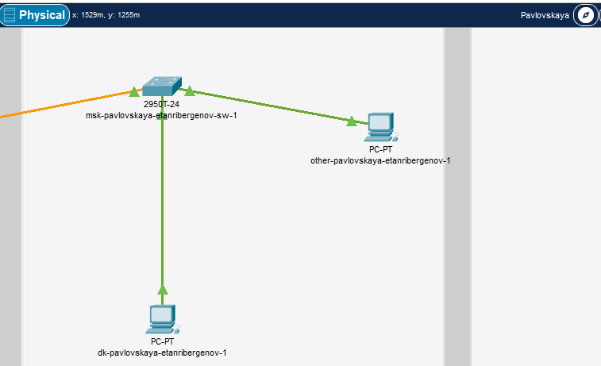
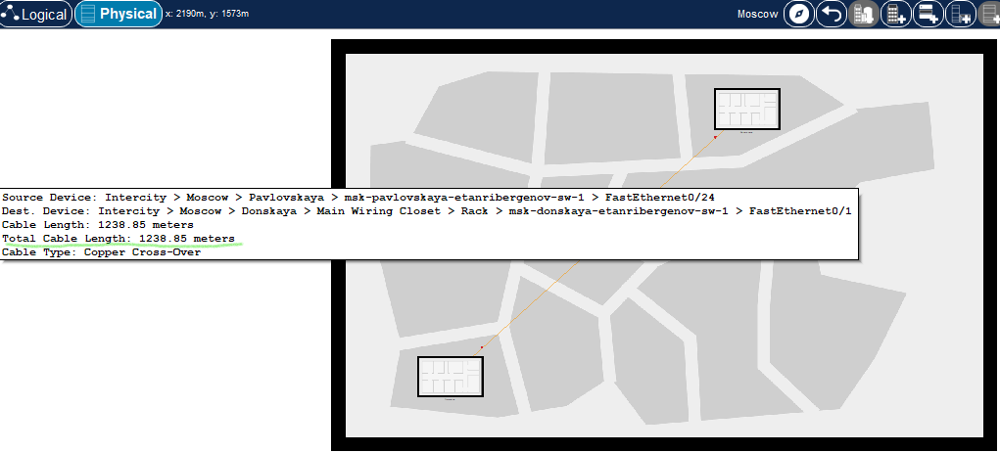
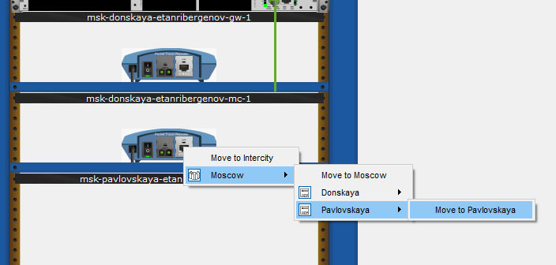
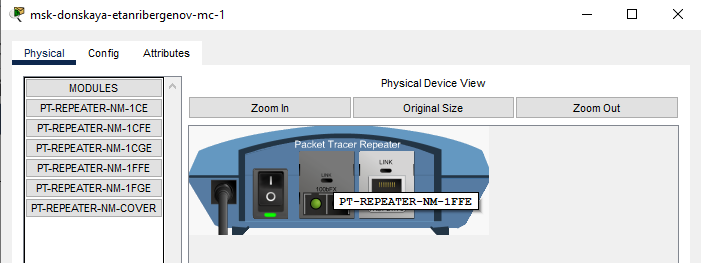

---
## Front matter
lang: ru-RU
title: "Лабораторная работа № 7"
subtitle: "Учёт физических параметров сети"
author:
  - "Танрибергенов Эльдар"
institute:
  - "Российский университет дружбы народов, Москва, Россия"
date: 2024 г.

## i18n babel
babel-lang: russian
babel-otherlangs: english

## Formatting pdf
toc: false
toc-title: Содержание
slide_level: 2
aspectratio: 169
section-titles: true
theme: metropolis
header-includes:
 - \metroset{progressbar=frametitle,sectionpage=progressbar,numbering=fraction}
 - '\makeatletter'
 - '\beamer@ignorenonframefalse'
 - '\makeatother'
---

# Цели и задачи

## Цель лабораторной работы

Получить навыки работы с физической рабочей областью Packet Tracer, а также учесть физические параметры сети.

## Задачи

Требуется заменить соединение между коммутаторами двух территорий на соединение, учитывающее физические параметры сети, а именно - расстояние между двумя территориями.

# Выполнение работы

## Размещение территорий в физической рабочей области

- Название города: Moscow
- Название территорий: Donskaya и Pavlovskaya

{#fig:001 width=70% height=70%}

## Отображение серверных стоек

{#fig:002 width=90% height=80%}

## Перемещение устройств

- Переместил коммутатор и 2 оконечных устройства с территории Donskaya на территорию Pavlovskaya

{#fig:003 width=70% height=70%}

## Перемещение устройств

{#fig:004 width=80% height=80%}

## Учёт расстояния между коммутаторами при передаче данных

Требуется:

1. Проверить работоспособность соединения коммутаторов до учёта расстояния
2. В настройках Cisco Packet Tracer активировать разрешение на учёт физических характеристик среды передачи
3. В физической рабочей области разместить иконки территорий, создав расстояние между ними более 1000 м
4. Убедиться в неработоспособности соединения после проделанных действий

## Учёт расстояния между коммутаторами при передаче данных

- Проверка работоспособности соединения коммутаторов (команда *ping*)

{#fig:005 width=80% height=80%}

## Учёт расстояния между коммутаторами при передаче данных

- Включение параметра в настройках Cisco Packet Tracer

{#fig:006 width=80% height=80%}

## ## Учёт расстояния между коммутаторами при передаче данных

- Создание расстояния между устройствами более 1000 м

{#fig:007 width=80% height=80%}

## Учёт расстояния между коммутаторами при передаче данных

- Проверка неработоспособности соединения коммутаторов после проделанных действий (команда *ping*)

{#fig:008}

## Добавление повторителей в сеть

Требуется: 

- В сеть добавить 2 повторителя Repeater-PT
- Заменить имеющиеся модули на модули для подключения оптоволокна и витой пары по технологии FastEthernet
- Соединить коммутаторы с повторителями и повторители друг с другом

## Добавление повторителей в сеть

- Размещение 2 повторителей Repeater-PT в логической рабочей области Cisco Packet Tracer

{#fig:009 width=80% height=80%}

## Добавление повторителей в сеть

- Перемещение повторителя msk-pavlovskaya-etanribergenov-mc-1 на территорию Pavlovskaya в физической рабочей области

{#fig:010 width=80% height=80%}

## Добавление повторителей в сеть

- Замена имеющихся модулей на модули PT-REPEATERNM-1FFE и PT-REPEATER-NM-1CFE для подключения оптоволокна и витой пары по технологии Fast Ethernet

{#fig:011 width=80% height=80%}

## Добавление повторителей в сеть

- Соединение коммутаторов с повторителями кабелем "витая пара" и повторителей друг с другом оптоволоконным кабелем 

{#fig:012 width=80% height=80%}

# Результаты

## Проверка работоспособности соединения коммутаторов после добавления повторителей в сеть

{#fig:013}

## Результат

- Учтены физические характеристики среды передачи в сети
- Добавлены в сеть повторители для работоспособности соединения устройств на расстоянии

# Вывод

## Вывод

Я получил навыки работы с физической рабочей областью Packet Tracer, а также учёл физические параметры сети.