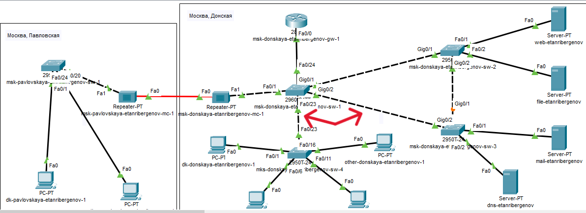
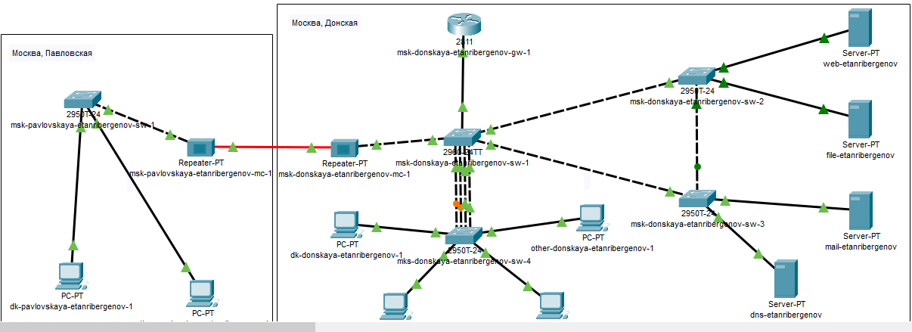
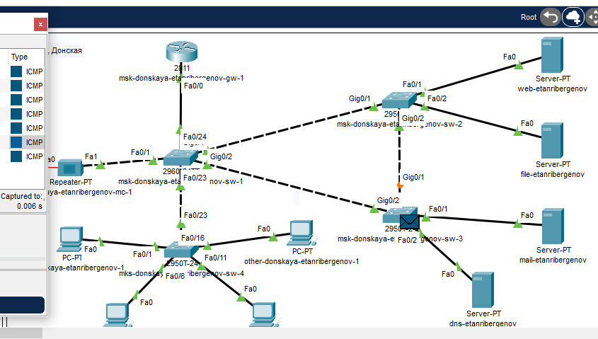
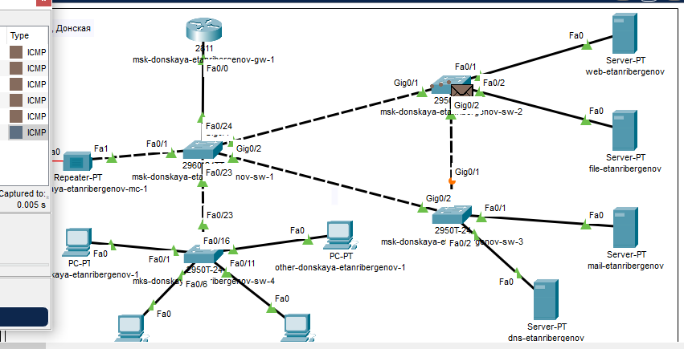
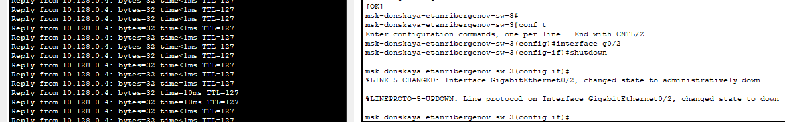

---
## Front matter
lang: ru-RU
title: "Лабораторная работа № 9"
subtitle: "Использование протокола STP. Агрегирование каналов"
author:
  - "Танрибергенов Эльдар"
institute:
  - "Российский университет дружбы народов, Москва, Россия"
date: 2024 г.

## i18n babel
babel-lang: russian
babel-otherlangs: english

## Formatting pdf
toc: false
toc-title: Содержание
slide_level: 2
aspectratio: 169
section-titles: true
theme: metropolis
header-includes:
 - \metroset{progressbar=frametitle,sectionpage=progressbar,numbering=fraction}
 - '\makeatletter'
 - '\beamer@ignorenonframefalse'
 - '\makeatother'
---

# Цели и задачи

## Цель лабораторной работы

Изучение возможностей протокола STP и его модификаций по обеспечению отказоустойчивости сети, агрегированию интерфейсов и перераспределению нагрузки между ними.

## Задачи

1. Создать резервное соединение между коммутаторами msk-donskaya-etanribergenov-sw-1 и msk-donskaya-etanribergenov-sw-3.
2. Настроить балансировку нагрузки между резервными соединениями.
3. Настроить режим Portfast на тех интерфейсах коммутаторов, к которым подключены серверы.
4. Повысить отказоустойчивость резервного соединения.
5. Сформировать и настроить агрегированное соединение интерфейсов Fa0/20 – Fa0/23 между коммутаторами msk-donskaya-etanribergenov-sw-1 и msk-donskaya-etanribergenov-sw-4.

# Выполнение работы

# Создание резервного соединения между коммутаторами

## Создание резервного соединения между коммутаторами

### Для этого требуется:

- Замена соединения между коммутаторами msk-donskaya-etanribergenov-sw-1 (Gig0/2) и msk-donskaya-etanribergenov-sw-4 (Gig0/1) на соединение между
 коммутаторами msk-donskaya-etanribergenov-sw-1 (Gig0/2) и msk-donskaya-etanribergenov-sw-3 (Gig0/2)
- Cоединение между коммутаторами msk-donskaya-etanribergenov-sw-1 и msk-donskaya-etanribergenov-sw-4 через интерфейсы Fa0/23
- Перевод портов в тэгированный режим

## Создание резервного соединения между коммутаторами

### Новое соединение коммутаторов

{#fig:001 witdh=75% height=75%}

## Создание резервного соединения между коммутаторами

### Перевод режима работы портов в тэгированный режим

{#fig:002 witdh=75% height=75%}

# Настройка балансировки нагрузки между резервными соединениями

## Настройка балансировки нагрузки между резервными соединениями

### Требуется:

- Настроить в качестве корневого коммутатора протокола STP коммутатор msk-donskaya-etanribergenov-sw-1 

## Настройка балансировки нагрузки между резервными соединениями

### Настройка коммутатора msk-donskaya-etanribergenov-sw-1 как корневого коммутатора STP

- команда *spanning-tree vlan 3 root primary*

{#fig:003 witdh=85% height=85%}

# Настройка режима Portfast на интерфейсах коммутаторов, к которым подключены серверы

## Сведения

***PortFast** - это функция, которая позволяет порту пропустить состояния listening и learning и сразу же перейти в состояние forwarding.* 
*Она настраивается на портах уровня доступа, к которым подключены пользователи или сервера.*
*Цель - избавить коммутаторы от лишней нагрузки.*

## Настройка режима Portfast на интерфейсах коммутаторов, к которым подключены серверы

{#fig:006 witdh=75% height=75%}

# Повышение отказоустойчивости резервного соединения

## Повышение отказоустойчивости резервного соединения

### Требуется:

- Переключить коммутаторы в режим работы по протоколу Rapid PVST+

## Сведения

***Rapid PVST+**  -  это усовершенствование протокола Spanning Tree (STP) от Cisco.*
*Важным преимуществом данной реализации является то, что данный протокол предоставляет отдельный экземпляр RSTP (ранняя модификация протокола) для каждой сети VLAN. Т.е, в каждой настроенной VLAN выполняется один экземпляр протокола связующего дерева. Каждый экземпляр Rapid PVST +  в VLAN имеет один корневой коммутатор.*
*Принципы работы этого протокола аналогичны RSTP, и соответственно скорость сходимости также измеряется секундами.*
*Относительным недостатком Rapid PVST+ являются повышенные требования к аппаратным мощностям участвующих в работе коммутаторов.*

## Повышение отказоустойчивости резервного соединения

- Переключение коммутаторов в режим работы по протоколу Rapid PVST+

{#fig:007 witdh=75% height=75%}

# Формирование и настройка агрегированного соединения интерфейсов между коммутаторами

## Формирование и настройка агрегированного соединения интерфейсов Fa0/20 – Fa0/23 между коммутаторами msk-donskaya-etanribergenov-sw-1 и msk-donskaya-etanribergenov-sw-4

### Требуется:

- Соединение кроссовыми кабелями интерфейсов коммутаторов
- Настройка агрегирования каналов на коммутаторах

## Формирование и настройка агрегированного соединения интерфейсов Fa0/20 – Fa0/23 между коммутаторами msk-donskaya-etanribergenov-sw-1 и msk-donskaya-etanribergenov-sw-4

- Соединение кроссовыми кабелями интерфейсов коммутаторов

{#fig:008 witdh=70% height=70%}

## Формирование и настройка агрегированного соединения интерфейсов Fa0/20 – Fa0/23 между коммутаторами msk-donskaya-etanribergenov-sw-1 и msk-donskaya-etanribergenov-sw-4

- Настройка агрегирования каналов на коммутаторах
 - команда "*channel-group 1 mode on*" - агрегирование интерфейсов в один канал (режим EtherChannel)

{#fig:009 witdh=75% height=75%}

## Формирование и настройка агрегированного соединения интерфейсов Fa0/20 – Fa0/23 между коммутаторами msk-donskaya-etanribergenov-sw-1 и msk-donskaya-etanribergenov-sw-4

- Настройка агрегирования каналов на коммутаторах
 - Перевод канала "*port-channel 1*" в тэгированный режим работы

{#fig:010 witdh=75% height=75%}

# Результаты

## Проверка работоспособности резервного соединения

+ команда "*ping*" для проверки соединения

{#fig:011 witdh=75% height=75%}

## Проверка балансировки нагрузки между резервными соединениями

- Используя режим симуляции, убедиться, что пакеты ICMP пойдут от хоста dk-donskaya-etanribergenov-1 до mail-etanribergenov через коммутаторы msk-donskaya-etanribergenov-sw-1 и msk-donskaya-etanribergenov-sw-3, 
а от хоста dk-donskaya-etanribergenov-1 до web-etanribergenov через коммутаторы msk-donskaya-etanribergenov-sw-1 и msk-donskaya-etanribergenov-sw-2

## Проверка балансировки нагрузки между резервными соединениями

### Движение пакета ICMP от хоста dk-donskaya-etanribergenov-1  до  mail-etanribergenov в режиме симуляции

{#fig:004 witdh=75% height=75%}

## Проверка балансировки нагрузки между резервными соединениями

### Движение пакета ICMP от хоста dk-donskaya-etanribergenov-1  до  web-etanribergenov в режиме симуляции

{#fig:005 witdh=75% height=75%}

## Проверка отказоустойчивости резервного соединения

+ команда "*ping -n 1000*" для отправки 1000 эхо-запросов
+ перевод интерфейса коммутатора в состояние "**shutdown**" для изучения времени восстановления соединения после разрыва

## Проверка отказоустойчивости резервного соединения

- До повышения отказоустойчивости:

{#fig:012 witdh=90% height=90%}

## Проверка отказоустойчивости резервного соединения

- После повышения отказоустойчивости:

{#fig:013 witdh=75% height=75%}

## Результат

- Создано резервное соединение между коммутаторами msk-donskaya-etanribergenov-sw-1 и msk-donskaya-etanribergenov-sw-3.
- Настроена балансировка нагрузки между резервными соединениями.
- Настроен режим Portfast на тех интерфейсах коммутаторов, к которым подключены серверы.
- Повышена отказоустойчивость резервного соединения.
- Сформировано и настроено агрегированное соединение интерфейсов Fa0/20 – Fa0/23 между коммутаторами msk-donskaya-etanribergenov-sw-1 и msk-donskaya-etanribergenov-sw-4.

# Вывод

## Вывод

Я изучил возможности протокола STP и его модификаций по обеспечению отказоустойчивости сети, агрегированию интерфейсов и перераспределению нагрузки между ними.
