---
## Front matter
title: "Отчёт по лабораторной работе №9"
subtitle: "Дисциплина: Администрирование локальных сетей"
author: "Выполнил: Танрибергенов Эльдар"

## Generic options
lang: ru-RU
toc-title: "Содержание"

## Bibliography
bibliography: ../bib/cite.bib
csl: ../pandoc/csl/gost-r-7-0-5-2008-numeric.csl

## Pdf output format
toc: true # Table of contents
toc-depth: 2
lof: true # List of figures
lot: true # List of tables
fontsize: 12pt
linestretch: 1.5
papersize: a4
documentclass: scrreprt
## I18n polyglossia
polyglossia-lang:
  name: russian
  options:
	- spelling=modern
	- babelshorthands=true
polyglossia-otherlangs:
  name: english
## I18n babel
babel-lang: russian
babel-otherlangs: english
## Fonts
mainfont: PT Serif
romanfont: PT Serif
sansfont: PT Sans
monofont: PT Mono
mainfontoptions: Ligatures=TeX
romanfontoptions: Ligatures=TeX
sansfontoptions: Ligatures=TeX,Scale=MatchLowercase
monofontoptions: Scale=MatchLowercase,Scale=0.9
## Biblatex
biblatex: true
biblio-style: "gost-numeric"
biblatexoptions:
  - parentracker=true
  - backend=biber
  - hyperref=auto
  - language=auto
  - autolang=other*
  - citestyle=gost-numeric
## Pandoc-crossref LaTeX customization
figureTitle: "Рис."
tableTitle: "Таблица"
listingTitle: "Листинг"
lofTitle: "Список иллюстраций"
lotTitle: "Список таблиц"
lolTitle: "Листинги"
## Misc options
indent: true
header-includes:
  - \usepackage{indentfirst}
  - \usepackage{float} # keep figures where there are in the text
  - \floatplacement{figure}{H} # keep figures where there are in the text
---

# Цель работы

Изучение возможностей протокола STP и его модификаций по обеспечению отказоустойчивости сети, агрегированию интерфейсов и перераспределению нагрузки между ними.

# Задание

1. Сформировать резервное соединение между коммутаторами msk-donskaya-etanribergenov-sw-1 и msk-donskaya-etanribergenov-sw-3.
2. Настроить балансировку нагрузки между резервными соединениями.
3. Настроить режим Portfast на тех интерфейсах коммутаторов, к которым подключены серверы.
4. Изучить отказоустойчивость резервного соединения.
5. Сформировать и настроить агрегированное соединение интерфейсов Fa0/20 – Fa0/23 между коммутаторами msk-donskaya-etanribergenov-sw-1 и msk-donskaya-etanribergenov-sw-4.

# Выполнение лабораторной работы

1. Сформировал резервное соединение между коммутаторами msk-donskaya-etanribergenov-sw-1 и msk-donskaya-etanribergenov-sw-3. 

Для этого:

– замениил соединение между коммутаторами msk-donskaya-etanribergenov-sw-1 (Gig0/2) и msk-donskaya-etanribergenov-sw-4 (Gig0/1) на соединение между
 коммутаторами msk-donskaya-etanribergenov-sw-1 (Gig0/2) и msk-donskaya-etanribergenov-sw-3 (Gig0/2) (рис. [-@fig:001]).

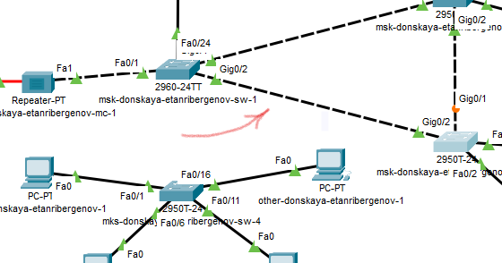{#fig:001}

– сделал порт на интерфейсе Gig0/2 коммутатора msk-donskaya-etanribergenov-sw-3 тэгированным (рис. [-@fig:002]).

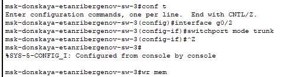{#fig:002}

– соединение между коммутаторами msk-donskaya-etanribergenov-sw-1 и msk-donskaya-etanribergenov-sw-4 сделал через интерфейсы Fa0/23 (рис. [-@fig:003]). 
Активировал их в транковом режиме (рис. [-@fig:004] - [-@fig:005]).

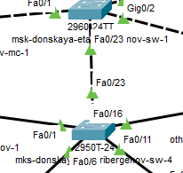{#fig:003}

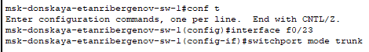{#fig:004}

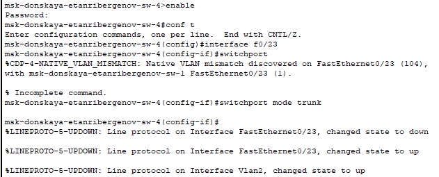{#fig:005}

2. С оконечного устройства dk-donskaya-1 пропинговал серверы mail (рис. [-@fig:006])  и  web (рис. [-@fig:007]).

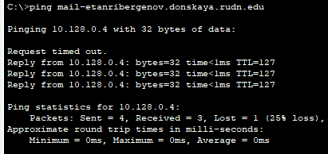{#fig:006}

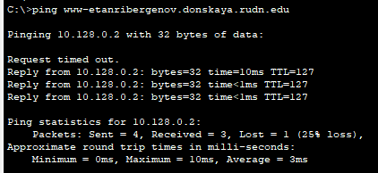{#fig:007}

В режиме симуляции проследил движение пакетов ICMP. Убедился, что движение пакетов происходит через коммутатор msk-donskaya-etanribergenov-sw-2 (рис. [-@fig:008]).

{#fig:008}

3. На коммутаторе msk-donskaya-etanribergenov-sw-2 посмотрел состояние протокола STP для vlan 3 (рис. [-@fig:009]).

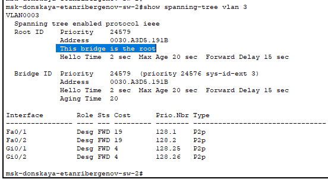{#fig:009}

Здесь, в частности, указывается, что данное устройство является корневым (строка "*This bridge is the root*").

4. В качестве корневого коммутатора STP настроил коммутатор msk-donskaya-etanribergenov-sw-1 (рис. [-@fig:010]).

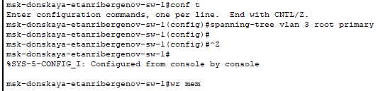{#fig:010}

5. Используя режим симуляции, убедился, что пакеты ICMP пойдут от хоста dk-donskaya-etanribergenov-1 до mail-etanribergenov через коммутаторы msk-donskaya-etanribergenov-sw-1 и msk-donskaya-etanribergenov-sw-3 (рис. [-@fig:011]), 
а от хоста dk-donskaya-etanribergenov-1 до web-etanribergenov через коммутаторы msk-donskaya-etanribergenov-sw-1 и msk-donskaya-etanribergenov-sw-2 (рис. [-@fig:012]).

{#fig:011}

{#fig:012}

6. Настроил режим Portfast на тех интерфейсах коммутаторов, к которым подключены серверы (рис. [-@fig:013] - [-@fig:014]):

{#fig:013}

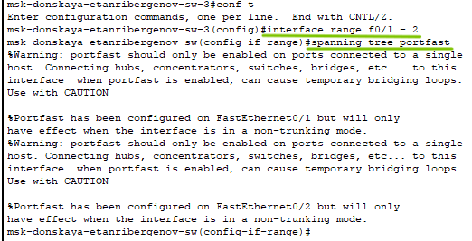{#fig:014}

7. Изучил отказоустойчивость протокола STP и время восстановления соединения при переключении на резервное соединение. 
Для этого на хосте dk-donskaya-etanribergenov-1 запустил 1000 эхо-запросов на сервер mail, использовав команду  *ping -n 1000 mail-etanribergenov.donskaya.rudn.ru* , 
а разрыв соединения обеспечил переводом соответствующего интерфейса коммутатора в состояние "*shutdown*" (рис. [-@fig:015]).

{#fig:015}

Прошло 5 безуспешных пингов прежде чем маршрут движения пакетов перестроился.

Далее снова поднял интерфейс коммутатора, чтобы вновь проверить время восстановления соединения после обратного изменения маршрута (рис. [-@fig:016]).

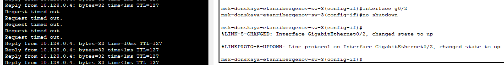{#fig:016}

После включения интерфейса коммутатора, прошло также 5 безуспешных пингов прежде чем соединение восстановится.

8. Переключил коммутаторы режим работы по протоколу Rapid PVST+ (рис. [-@fig:017] - [-@fig:021]).

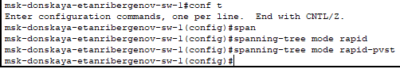{#fig:017}

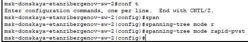{#fig:018}

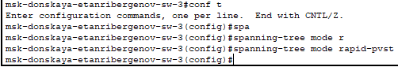{#fig:019}

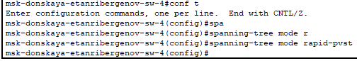{#fig:020}

{#fig:021}

9. Изучил отказоустойчивость протокола Rapid PVST+ и время восстановления соединения при переключении на резервное соединение (рис. [-@fig:022]).

{#fig:022}

Как видно на снимке, соединение быстро восстановилось (маршрут перестроился почти мгновенно): безуспешных пингов нет.

После включения интерфейса был потерян лишь 1 эхо-запрос (рис. [-@fig:023])

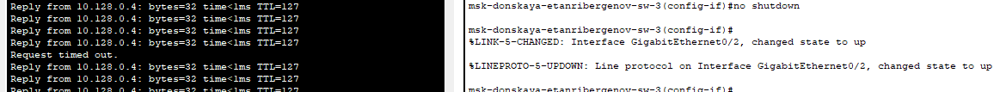{#fig:023}

10. Сформировал агрегированное соединение интерфейсов Fa0/20 – Fa0/23 между коммутаторами msk-donskaya-etanribergenov-sw-1 и msk-donskaya-etanribergenov-sw-4 (рис. [-@fig:024]).

{#fig:024}

11. Настроил агрегирование каналов (режим EtherChannel) на коммутаторе msk-donskaya-etanribergenov-sw-1 (рис. [-@fig:025] - [-@fig:026]).

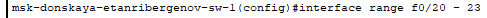{#fig:025}

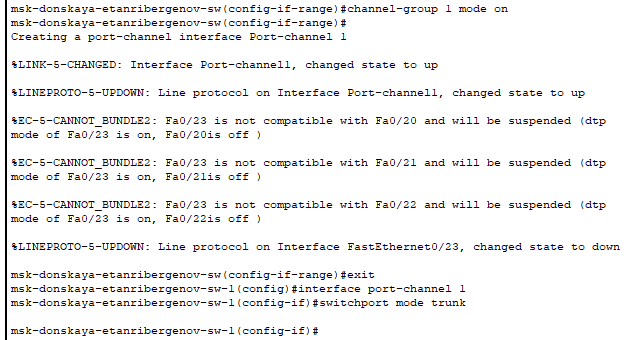{#fig:026}

Настроил агрегирование каналов (режим EtherChannel) на коммутаторе msk-donskaya-etanribergenov-sw-4 (рис. [-@fig:027] - [-@fig:029]).

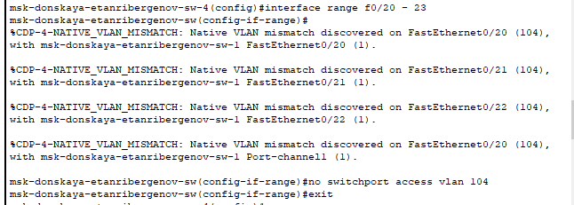{#fig:027}

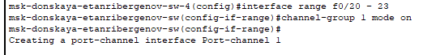{#fig:028}

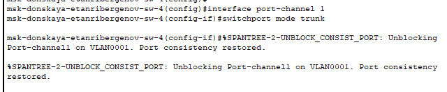{#fig:029}

Проверил настройку интерфейсов (рис. [-@fig:030]):

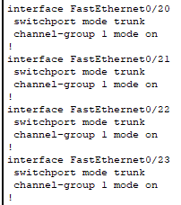{#fig:030}

# Ответы на контрольные вопросы

1. Воспользовавшись командой определения состояния протокола STP для VLAN, можно получить инфорацию о приоритете моста, является ли устройство корневым, а также об интерфейсах, соединяющих с другими устройствами (их роль (root/desg), статус, тип)

2. Узнать, в каком режиме, STP или Rapid PVST+, работает устройство можно командами  *show startup-config*  и  *show running-config*.

3. Настраивается режим Portfast на портах уровня доступа, к которым подключены пользователи или серверы. Цель функции PortFast минимизировать время, которое необходимо для того чтобы порт перешёл в состояние forward.

4. Принцип работы агрегированного интерфейса - объединение нескольких физических портов в один логический. Нужно для повышения скорости передачи данных и отказоустойчивости.

5. Т.к. LACP и PAgP решают одни и те же задачи (с небольшими отличиями по возможностям), то лучше использовать стандартный протокол. Поэтому сравнение лишь между LACP и статическим агрегированием. 

Статическое агрегирование. Преимущества: 

- Не вносит дополнительную задержку при поднятии агрегированного канала или изменении его настроек
- Вариант, который рекомендует использовать Cisco

Недостатки:

- Нет согласования настроек с удалённой стороной. Ошибки в настройке могут привести к образованию петель

Агрегирование с помощью LACP. Преимущества:

- Согласование настроек с удалённой стороной позволяет избежать ошибок и петель в сети.
- Поддержка standby-интерфейсов позволяет агрегировать до 16ти портов, 8 из которых будут активными, а остальные в режиме standby

Недостатки:

- Вносит дополнительную задержку при поднятии агрегированного канала или изменении его настроек.

6. Состояние агрегированного канала можно узнать командами: *show etherchannel port-channel* и *show etherchannel summary*.

# Выводы

Я изучил возможности протокола STP и его модификаций по обеспечению отказоустойчивости сети, агрегированию интерфейсов и перераспределению нагрузки между ними.

